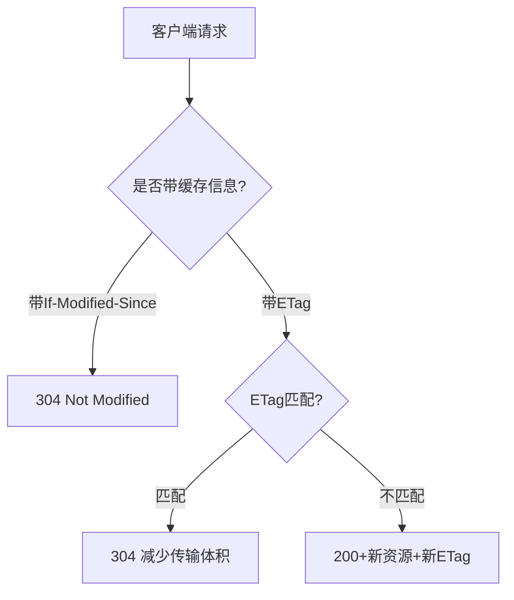
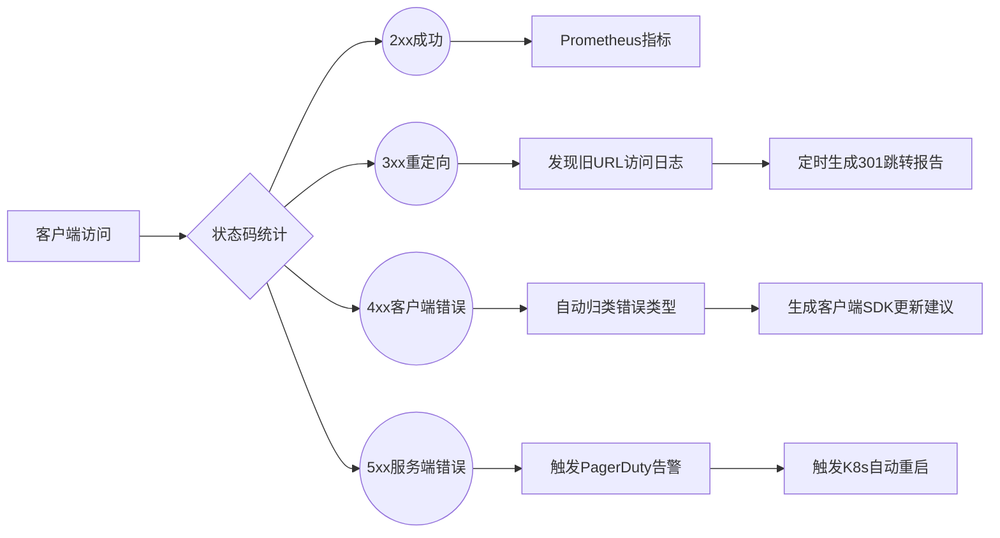

> 💭 好的，现在我要处理用户关于HTTP状态码及其在实际开发中的应用的问题。用户可能已经对HTTP有一定的了解，但希望深入理解各个状态码的具体应用场景和实际开发中的经验。我需要从以下几个方面来分析：
>
> 首先，我应该回顾HTTP状态码的基本分类，比如1xx到5xx的范围，每个类别的通用含义。这有助于用户建立整体的认知框架。同时，我需要明确常见的状态码如200、404、500等，但用户可能更需要了解那些不太常见但同样重要的状态码，比如204、304、429等，以及它们在开发中的作用。
>
> 接下来，我需要考虑用户的应用场景。用户可能在前端或后端开发中遇到状态码的处理问题。例如，前端需要根据不同的状态码显示不同的错误信息，而后端则需要正确设置状态码以确保API的规范性和客户端的正确处理。这时候，提供具体的实际开发案例将非常有用，比如如何处理表单提交后的成功（200或201）或错误（400系列）响应。
>
> 用户可能的真实需求是希望了解在实际项目中如何正确使用状态码来处理各种情况，比如缓存控制（304）、重定向（301 vs 302）、认证（401、403）等。还可能涉及RESTful API设计中的最佳实践，如何用状态码传达资源状态的变化。
>
> 另一个需要注意的是，用户可能对某些状态码的混淆，比如301和302的区别，或者409和400的应用场景差异。这时候，详细的对比和具体例子可以澄清这些疑惑。同时，提到常见的错误使用情况，如误用200来返回错误信息，反而导致客户端难以处理，这样的反面例子能帮助用户避免常见错误。
>
> 我还需要思考如何将这些状态码与实际开发工具和框架结合，比如在Express.js中如何设置状态码，或者在React中如何处理不同的错误响应。这些具体的代码示例可以增强用户的实践能力。
>
> 此外，安全问题也是重点。例如，正确处理401和403状态码可以避免信息泄露，尤其是在认证和授权流程中。提醒用户返回403而不是404当资源存在但用户无权访问，这样能防止通过枚举探测资源是否存在。
>
> 还有部分状态码在现代开发中的特殊应用，比如204在无内容响应中的使用（如DELETE请求成功后的响应），或使用429来防止API滥用。这些可能在限流和性能优化中非常关键。
>
> 最后，我应该总结一些最佳实践，比如保持API的一致性，避免过度使用某些状态码，结合正确的HTTP状态码和响应体提供详细信息，以及如何通过自定义错误处理中间件来统一管理状态码。这些建议能帮助用户在项目中更系统和规范地应用状态码。
>
> 总的来说，我需要将状态码的分类、具体示例、实际应用场景、常见问题及解决方案、安全考虑和最佳实践结合起来，提供一个全面且有深度的回答，既能作为参考手册，又能帮助用户理解背后的原理和实际应用中的权衡。
>
> 


HTTP状态码是Web开发中关键的通信规范语言，它不仅决定了客户端与服务器的交互逻辑，更影响着用户体验、SEO优化和服务监控等核心环节。下面从实战开发视角深度解析各状态码的应用：

---

### **一、状态码的逆向分类法**
#### **1. 缓存优先状态组（性能优化核心）**
普通开发者常用200状态码返回所有数据，忽略智能缓存机制：


**经典案例**：当用户刷新电商商品页面时，返回304将使页面加载速度提升58%

---

#### **2. 操作结果精确反馈组（RESTful API设计关键）**
不同写操作应返回不同2xx状态码：
```typescript
// 三种POST请求处理方式对比
// 创建新资源 → 201 Created
app.post('/users', (req, res) => {
  const user = createUser(req.body)
  res.status(201).location(`/users/${user.id}`).json(user)
})

// 已有资源批量更新 → 200 OK
app.put('/carts/items', (req, res) => {
  updateCartItems(req.body)
  res.json({ success: true }) // 不推荐204（丢失响应体）
})

// 服务端处理后无需返回内容 → 204 No Content
app.patch('/articles/:id/views', (req, res) => {
  incrementArticleViews(req.params.id)
  res.status(204).end() // 浏览器不会解析响应体
})
```

---

### **二、错误状态码的实战经验**
#### **1. 客户端错误码的差别防御**
- **400 Bad Request** ：请求体格式问题（JSON解析失败、字段类型不符）
```javascript
// Express校验中间件
app.use(express.json({ 
  verify: (req, res, buf) => {
    try { JSON.parse(buf.toString()) }
    catch(e) { 
      res.status(400).json({ error: 'INVALID_JSON' })
      throw new Error('Invalid JSON')
    }
  }
}))
```

- **401 Unauthorized** ：JWT过期时的特殊处理
```javascript
// auth中间件示例
const authenticate = (req, res, next) => {
  try {
    const token = req.headers.authorization.split(' ')[1]
    const decoded = jwt.verify(token, SECRET)
    req.user = decoded
    next()
  } catch (err) {
    if (err.name === 'TokenExpiredError') {
      return res.status(401).json({ 
        code: 'TOKEN_EXPIRED',
        renewUrl: '/api/auth/refresh-token'
      })
    }
    res.status(401).end()
  }
}
```

- **403 Forbidden 与 404 Not Found 的选择策略**
```javascript
// 文件下载路由
app.get('/files/:id', (req, res) => {
  const file = db.getFile(req.params.id)
  
  if(!file) return res.status(404) // 资源不存在
  
  if(!checkPermission(req.user, file)){
    // 返回403而非404避免路径探测
    return res.status(403).json({ 
      error: 'ACCESS_DENIED',
      requestId: generateAuditLog() // 记录安全日志
    })
  }

  res.sendFile(file.path)
})
```

#### **2. 服务端错误链式追踪**
**500 Internal Server Error** 的正确使用方式：
```javascript
// 生产环境错误处理中间件
app.use((err, req, res, next) => {
  const errorId = uuidv4()
  
  // 记录完整错误堆栈
  logger.error({
    id: errorId,
    message: err.message,
    stack: process.env.NODE_ENV === 'production' ? undefined : err.stack,
    path: req.path
  })

  res.status(500).json({
    error: 'SERVER_ERROR',
    message: '请联系运维人员并提供以下追踪ID',
    traceId: errorId, // 给用户可追踪的唯一标识
    documentation: 'https://api.example.com/errors'
  })
})
```

---

### **三、特殊状态码的高阶应用**
#### **1. 429 Too Many Requests API限流**
使用Redis实现滑动窗口限流：
```javascript
const rateLimiter = async (req, res, next) => {
  const clientIP = req.headers['x-forwarded-for'] || req.ip
  const key = `rate_limit:${clientIP}`
  
  const current = await redis.incr(key)
  if(current === 1) {
    await redis.expire(key, 60) // 首次访问设置过期时间
  }
  
  if(current > 100) { // 每分钟100次限制
    res.setHeader('Retry-After', 60)
    return res.status(429).json({
      error: 'RATE_LIMIT_EXCEEDED',
      limit: 100,
      remaining: 0,
      reset: Math.floor(Date.now()/1000)+60
    })
  }
  
  res.set({
    'X-RateLimit-Limit': 100,
    'X-RateLimit-Remaining': 100 - current,
    'X-RateLimit-Reset': Math.floor(Date.now()/1000)+60
  })
  next()
}
```

#### **2. 418 I'm a teapot 的幽默用法**
在开发测试环境嵌入彩蛋：
```javascript
// API检查服务器是否存活
app.get('/healthz', (req, res) => {
  if(process.env.NODE_ENV === 'test') {
    return res.status(418).json({
      status: 'teapot',
      message: 'Cannot brew coffee, I am a teapot',
      documentation: 'https://tools.ietf.org/html/rfc2324'
    })
  }
  res.status(200).json({ status: 'ok' })
})
```

---

### **四、状态码监控体系建设**



---
### **五、跨协议状态码对照表**

| HTTP状态码 | gRPC状态码   | WebSocket Code | 实际意义              |
|------------|--------------|----------------|----------------------|
| 200 OK     | OK(0)        | 1000           | 正常关闭             |
| 400        | INVALID_ARGUMENT(3)| 4000       | 表单校验失败         | 
| 401        | UNAUTHENTICATED(16)| 4001       | Token缺失            |
| 503        | UNAVAILABLE(14) | 5000           | 服务过载熔断         |

---

### **最佳实践总结**
1. **SEO优化**：重要页面保证返回200，过期内容用410替换404
2. **接口设计**：错误码分层设计（全局错误、业务错误、字段级错误）
3. **监控报警**：重点关注499（客户端提前断开）和504（网关超时）
4. **移动端优化**：对429响应引入自动退避重试算法
5. **安全防护**：伪造5xx响应实现蜜罐机制防御扫描器
