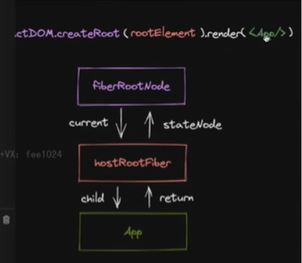

ReactDOM.createRoot().render
this.setState
useState的dispatch的方法
兼容上述触发更新的方式
方便后续扩展，触发更新的方式对接到这一套机制当中
更新机制的组成部分
代表更新的数据结构Update
消费update的数据结构
UpdateQueue->shared.pending->update
状态变化的原理
接下来的工作包括：
实现mount的时候调用它的api,将该api接入到上述更新机制
需要考虑的事情：
更新可能发生在任意的组件，而更新流程从根节点递归的，
需要一个统一的根节点保存通用的信息
ReactDOM.createRoot创建当前的FiberRootNode
同一个的根节点，rootElmenet，
# 为什么有shared:pengding
因为这样是workingProgress Tree和current Fiber共用同一个updateQueue,sharedPngeidng


```js
function scheduleUpdateOnFiber(fiber：FiberNode) {
    //在fiber当中调度update,//调度功能
    //hostrootfiber,this.setState,classComponent对应的fiber,

}
function prepareFreshStack(fiber:FiberRootNode) {
    workInProgress= fiber;

}
export const createWorkInProgress=(current:FiberRootNode,pendingProps:Props):FiberNode=>{
    let wip = current.alternate;
    if(wip===null){
        //对应的mount
        wip =new FiberRootNode(current.tag,pendingProps,current.container)
        wip.type = current.type;
        wip.stateNode=current.stateNode;
         wip.alternae=current;
         current.alternate=wip;

    }else {
        //update
        wip.pendingProps=pendingProps;
        wip.flags=NoFlags;

        wip.child=null;

    }
    wip.type=current.type;
    wip.updateQueue = current.updateQueue;

    return wip;

}
function markUpdateFromFiberToRoot(fiber:FiberNode) {
    //调度功能
    let node = fiber ;
    let parent = node.return;
    while(parent!==null) {
        node=parent ;
        parent = node.return;
    }
    if(node.tag === HostRoot) {
        return node.stateNode ;
    }
    return null;
    const root=markUpdateFromFiberToRoot(fiber);
    renderRoot(root);

}
export interface Update<State> {
    action: Action<State>;
    //两种触发更新的方式
}
export interface UpdateQueue<State> {
    shared: {
        pending:Update<State> |null;
    }
}

export const createUpdate=<State > (action:Action<State>){
    return {
        action
    }
}
export type Action<State> = State | ((preState:State)=> State)
this.setState({xx:1})
this.setState(({xxx:1}))
export const createUpdateQueue =<Action>()=>{
    return {
        shared:{
            pending:null
        }
    } as UpdateQueue<Action>;
}
export enqueueUpdate = <Action> {
    updateQueue:UpdateQueue<Action>,
    update:Update<Action>
}=> {
    updateQueue.shared.pending = update;
}
//消费update的方法
export const processUpdateQueue = <State> {
    baseState:State,
    pendingUpdate:Update<State> | null

}:{memoizedState:State} =>  {
    const result:ReturnType<typeof processUpdateQueue<State>>={memoizedState:baseState}''
    if(pendingUpdate!==null) {
        //baseState! update2 ->memoizedState2
        //baseState1 update(x)=>2x->memoizedState2
         const action = pendingUpdate.action;
         if(action instanceof Function) {
            result.memoizedState=action(baseState)
         }else {
            result.memoizedState=action;

         }

    }
    return result
}
export class FiberRootNode { 
    container :Container 
    //不同的宿主环境，DomElement
    //描述宿主环境方法的文件
//实现mount的时候调用的api,将该api接入到上述的更新机制当中
//更新可能发生在任意的组件，而更新流程是从根节点开始递归的，需要一个统一的节点来保存通用的信息

}
export type Container =any ;
paths:["hosts-config":"./packages/react-reconciler"]
export class FiberRootNode {
    container:Container;
    current:FiberRootNode;
    finishedWrok:FiberNode | null;
    constructor(contianer:Container,hostRootFiber:FiberNode) {
        this.container=contianer;
        this.current=hostRootFiber;
        hostRootFiber.stateNode=this;

        this.finishedWrok=null;

    }

}
//fiberreconciler
export function createContainer(container:Container) {
    const hostRootFilver =new FiberNode(HostRoot,{},null)
    const root =new FiberRootNode(container,hostRootFilver)
    hostRootFilver.stateNode=root;
    hostRootFilver.updateQueue=createUpdateQueue();

    return root;
}

//ReactDOM.createRoot
}
export function updateContainer(element:ReactElementTyoe | null) {
    //ReactDOM.createRoot.render方法之后
    const hostRootFiber = root.current ;
    const update = createUpdate<ReactElementType|null>(element);
    //更新和element相关的,beginWork和completework处理element
    enqueueUpdate(hostRootFiber.updateQueue) as  UpdateQueue<ReactElementType|null>;

    return element;

}
//实现mount的时候调用的api
//将该api接入到上述的更新机制当中

```

先是createContainer然后就是创建应用的根节点，然后将fiberRootNode和hostRootFiber连接起来
updateContainer会创建update然后enqueueUpdate放到updateQueue当中，这样就将首屏渲染和触发更新的机制连接起来
