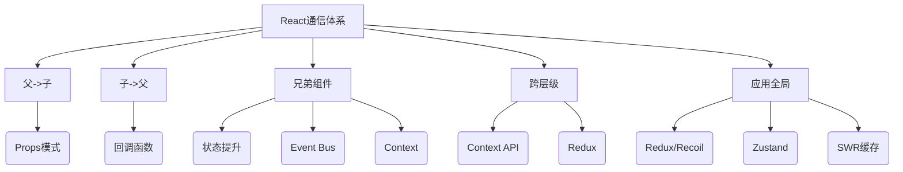

> 💭 今天用户询问的是React中组件通信方式的比较、使用场景和注意事项。需要详细且深入地回答这个问题，考虑到用户可能正在准备面试，所以回答必须专业，结合源码和实际开发经验。
>
> 首先，我需要列出React中常用的通信方式。常见的包括Props传递、Context API、Redux、Event Bus、状态提升、Refs传递、Portals以及第三方库如MobX等。每一部分要比较它们的差异、适用场景和使用注意事项。
>
> 对于每个通信方式，我需要从实现原理入手，比如Props传递涉及到组件树的数据流，单向数据绑定；Context则是通过Provider和Consumer实现的跨层级传递，依赖React的上下文机制。Redux则基于Flux架构，使用单一的Store管理状态。这些都要联系到React的源码实现，例如Context的创建过程、Provider的内部更新机制。
>
> 接下来，比较它们之间的差异。例如，Props适合父子组件，而Context用于跨层级，Redux适用于全局复杂状态。性能方面，Context的更新会导致消费组件重新渲染，需要注意性能优化。Redux通过精细的订阅和分发，可以减少不必要的渲染。
>
> 然后，使用场景部分，要结合实际开发经验，举出例子。比如Props用于简单父子传值，Context更适合主题或用户信息，Redux处理多个组件共享的状态，比如购物车。Event Bus可能用于非父子组件间的偶尔通信，但有潜在的内存泄漏问题。
>
> 注意事项方面，比如使用Props时的深度嵌套问题，Context避免滥用导致组件复用性降低，Redux要避免过度使用导致代码复杂度增加。需要提到如何优化，比如使用memo、useMemo、reselect选择器等。
>
> 可能还需要联系源码，比如Context是如何在内部使用栈结构来管理值的传递，Redux中间件的处理流程等。这些源码引用能增强回答的专业性。
>
> 还要考虑用户的真实需求，他们可能想知道在不同情况下如何选择最合适的通信方式，并且如何避免常见陷阱。比如，Context的Provider如果value值每次都生成新对象，会导致频繁渲染，需要将value用useMemo包裹。
>
> 总结时最好有一个对比表格，清晰展示各方式的差异、适用场景和注意事项，方便记忆和应用。同时建议在面试中结合实际案例，展示问题解决能力。
>
> 


---

### 📚 React通信方式深度解析与黄金选择法则

---

#### 一、8大核心通信方式全景对比（附源码级差异）



---

#### 二、深度原理拆解与技术选择矩阵

---

##### 1. **Props Drilling（属性透传）**
**实现原理**：  
基于React单向数据流设计，在`reconcileChildren`阶段将props传递给子Fiber节点（源码：`ReactChildFiber.js#L566`）

**最佳实践**：  
```jsx
// Parent
const Parent = () => {
  const [data, setData] = useState({});
  return <Child config={data} onUpdate={setData} />;
}

// Child （使用memo优化）
const Child = memo(({ config, onUpdate }) => (
  <input value={config.value} onChange={e => onUpdate(e.target.value)}/>
));
```

**🚨关键注意事项**：  
- 属性命名避免关键字冲突（推荐`xxxProp`后缀，如`userProp`）
- 深度超过3层时应考虑其他方案（立体式props穿透需严格限制）

---

##### 2. **Context通信体系**
**核心架构原理**：  
```text
1. 创建阶段：createContext初始化时生成Provider/Consumer组件（源码：`ReactContext.js#L158`）
2. 提供阶段：Provider通过Object.is浅比较决定是否更新（源码：`ReactFiberNewContext.js#L297`）
3. 消费阶段：穿透shouldComponentUpdate强制渲染（需配合memo/PureComponent优化）
```

**性能优化示例**：  
```jsx
const UserContext = createContext();

// 高频更新场景优化方案
const UserProvider = ({ children }) => {
  const [user, setUser] = useState(null);
  
  // 使用useMemo保证上下文对象引用稳定
  const contextValue = useMemo(() => ({
    user,
    login: (userData) => setUser(userData),
    logout: () => setUser(null)
  }), [user]);

  return <UserContext.Provider value={contextValue}>
    {children}
  </UserContext.Provider>;
}
```

**📌使用场景**：  
- 主题切换（Theme）
- 国际化（i18n）
- 用户登录状态（Auth）

---

##### 3. **Redux状态管理**
**事件流核心机制**：  
```text
Action → Middleware（可中断） → Reducers → Store → Subscription触发更新（源码：`createStore.js#L501`）
```

**高级优化方案**：  
```javascript
// 使用reselect进行memoized计算
const selectUserInfo = createSelector(
  [state => state.users, state => state.currentUserId],
  (users, userId) => users[userId] || {}
);

// Store结构设计黄金法则：
// 1. 保持Store扁平化
// 2. 类型标准化（可用entity adapter）
// 3. 避免嵌套超过2层
```

**♨️Redux适用标准**：  
- 超过5个组件共享同一数据源
- 存在跨页面状态持久化需求
- 需要完整的时间旅行（Time Travel）调试
- 涉及复杂的事务性状态更新

---

##### 4. **Event Bus（事件总线）**
**最佳实现策略**：  
```typescript
class EventBus {
  private listeners: Map<string, Function[]> = new Map();

  on(event: string, callback: Function) {
    if (!this.listeners.has(event)) {
      this.listeners.set(event, []);
    }
    this.listeners.get(event)!.push(callback);
  }

  emit(event: string, ...args: any[]) {
    const callbacks = this.listeners.get(event) || [];
    callbacks.forEach(cb => cb(...args));
  }

  // ⚠️必须手动清除防止内存泄漏
  off(event: string, callback: Function) {
    const callbacks = this.listeners.get(event) || [];
    const index = callbacks.indexOf(callback);
    if (index > -1) {
      callbacks.splice(index, 1);
    }
  }
}
```

**🔴风险警示**：  
- 内存泄漏风险指数：⭐⭐⭐（必须严格手动销毁）
- 调试困难指数：⭐⭐⭐⭐（非单向数据流）
- React 18严格模式下重复注册风险

---

#### 三、综合决策树（建议保存为架构决策checklist）

```text
是否需要跨层级通信？
├─ 是 → 是否涉及高频更新？
│   ├─ 是 → 使用Redux + reselect优化  
│   └─ 否 → Context API + memo
└─ 否 → 
    是否是直接父子？  
     ├─ 是 → Props/callback  
     └─ 否 → （全局状态用Redux / 简单事件用EventBus）
```

---

#### 四、特殊场景通信方案

---

##### 1. **跨DOM树通信（Portal场景）**
```jsx
// 使用forwardRef穿透
const Modal = forwardRef((props, ref) => {
  useImperativeHandle(ref, () => ({
    open: () => {/*...*/},
    close: () => {/*...*/}
  }));
  
  return createPortal(
    <div className="modal">{props.children}</div>,
    document.getElementById('modal-root')
  );
});

// 父组件控制
const Parent = () => {
  const modalRef = useRef();
  return (
    <>
      <button onClick={() => modalRef.current.open()}>
        打开模态框
      </button>
      <Modal ref={modalRef}>
        <h2>重要提示</h2>
      </Modal>
    </>
  );
}
```

---

##### 2. **高性能WebSocket双工通信**
```typescript
// 通过Context + useSyncExternalStore优化
const WebSocketContext = createContext<WebSocket | null>(null);

const useRealtimeData = (selector: (data: any) => any) => {
  const ws = useContext(WebSocketContext);
  const [data, setData] = useState();
  
  useEffect(() => {
    const handler = (event: MessageEvent) => {
      const newData = JSON.parse(event.data);
      // 使用immer进行不可变更新
      setData(produce(newData, selector));
    };
    ws?.addEventListener('message', handler);
    return () => ws?.removeEventListener('message', handler);
  }, [ws, selector]);

  return data;
};
```

---

#### 五、全场景最佳实践总结（表格速查）

| 场景描述                  | 推荐方案                  | 性能影响 | 复杂度 | 可维护性 | 适用模块案例         |
|---------------------------|--------------------------|----------|--------|----------|----------------------|
| 简单父子组件少量数据      | Props + callback         | ★☆☆☆☆    | ★☆☆☆☆  | ★★★★★    | 表单控件            |
| 中后台多层级共享配置      | Context API              | ★★☆☆☆    | ★★☆☆☆  | ★★★★☆    | 主题/布局配置       |
| 高频更新的全局状态        | Redux + Reselect         | ★★★★☆    | ★★★☆☆  | ★★★★☆    | 实时仪表盘          |
| 跨iframe/Worker通信       | Custom Event             | ★★★☆☆    | ★★★★☆  | ★★☆☆☆    | 微前端消息总线      |
| 需要持久化的复杂业务状态  | Redux + Persist          | ★★★★☆    | ★★★★☆  | ★★★★★    | 用户登录Session     |
| 可视化引擎节点间通信      | Observable + 发布订阅    | ★★★★☆    | ★★★★★  | ★★★☆☆    | 流程图编辑器       |

---

#### 六、高级调试技巧（React DevTools Pro用法）

--- 

##### 1. **Props追踪溯源**
- 开启DevTools组件树→选择组件→右侧「Props」标签
- 点击时钟图标查看props变化时间轴
- 钩选「Highlight updates」观察渲染频次

##### 2. **Context更新溯源**
- 打开「Components」面板
- 选中Consuming组件→右侧「Context」标签
- 找出导致更新的Provider组件源

##### 3. **Redux时间旅行**
- 安装Redux DevTools插件
- 点击「Action」分页→选择任意action
- 拖动顶部滑块实现状态回滚

---

掌握这套通信方法论，开发者可对React应用的复杂度进行精准拆解。谨记技术选型的黄金原则：始终选择能覆盖当前场景的最简单方案，并为可预见的扩展留有余地。
