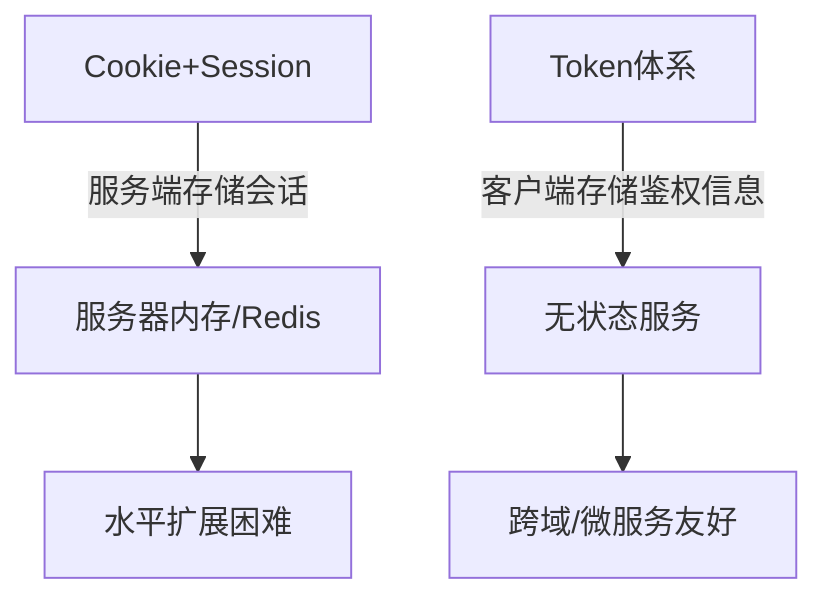
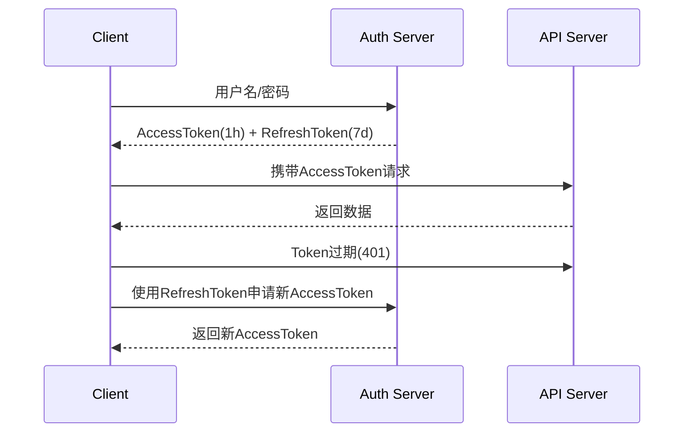
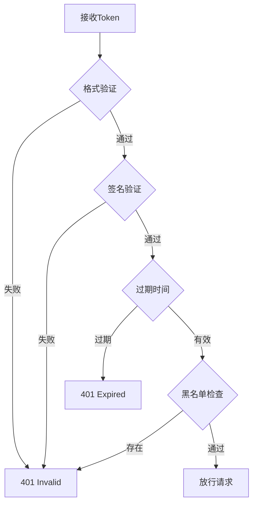

> 💭 嗯，用户问的问题是关于Token的各个方面，包括它的原理、过期处理、存储位置以及存储内容。首先，我需要确定用户可能的背景，可能是刚开始学习Web开发或者对身份验证机制不够熟悉。他们的需求是要全面了解Token的作用机制，特别是JWT（JSON Web Token），因为这在现代应用中非常普遍。
>
> 接下来，考虑用户可能没直接问到的点。比如安全性的问题，如何防止Token被窃取，或是Token在不同应用场景中的使用差异。然后，用户提到存储位置，这里必须谨慎处理，因为不同的存储方式（如localStorage、cookie、内存）有不同的安全性和优缺点。需要对比这些方法的利弊，给用户一个清晰的指导。
>
> 关于Token的原理，应该从传统的Session认证讲起，说明为什么Token机制（尤其是无状态的JWT）会成为主流。需要解释Token的结构，头部、载荷和签名的部分，以及签名的生成和验证过程。这时候可能会涉及加密算法如HMAC或RSA，但用户可能不需要太深入的密码学知识，只需要知道这是用来保证Token不被篡改的。
>
> Token过期处理是另一个重点。需要解释为什么有过期时间，以及如何通过Refresh Token来更新过期的Access Token。这时候可能需要画一个流程图，或者分步骤说明客户端和服务端的交互过程。同时，要提到安全措施，比如Refresh Token的存储必须更安全，并且服务端需要有机制来撤销已经泄露的Token。
>
> 存储位置方面，要讨论不同客户端环境的选择。如果是浏览器，可能比较localStorage、sessionStorage、cookie，甚至HttpOnly cookie的安全性。对于移动应用，可能使用Secure Storage或者Keychain。同时，需要提到XSS和CSRF攻击的风险，以及如何根据存储方式来防御这些攻击。比如，HttpOnly cookie可以防止XSS窃取Token，但可能面临CSRF的风险，需要配合其他措施如SameSite属性。
>
> 存储内容方面，用户需要了解Token本身是否包含敏感信息。虽然JWT的载荷部分是Base64编码的，但并不是加密的，所以不能存储密码等敏感数据。此外，需要提醒开发者不要在客户端存储过多信息，特别是可以被篡改的信息，因为签名虽然能防止篡改，但载荷部分仍然可以被解码查看。
>
> 实际应用场景中，还要说明前后端分离的架构下，如何通过Token实现无状态认证，以及如何与OAuth 2.0等授权框架结合使用。最后，安全问题是最关键的，必须强调Token的传输必须使用HTTPS，避免中间人攻击，以及服务器端如何验证Token的有效性，包括签名、过期时间和颁发者等。
>
> 需要确保回答结构清晰，涵盖用户提到的所有方面，同时预判可能的相关问题并提前解答。比如在讨论Storage时，自动覆盖到XSS和CSRF的防护建议。通过这样的思考过程，确保用户能够全面理解Token的机制和最佳实践。
>
> 


### Token全面解析指南（含JWT/REST架构实践）

---

#### 一、Token核心原理深度剖析

##### 1. **认证机制演进史**


**Killer Feature对比**：
- 服务器资源：Session需要O(n)存储空间 vs Token只需O(1)验证时间
- 移动端兼容性：Cookie在Native App中的同步问题 vs Token标准Header传递
- 跨域支持：Cookie受Same-Origin限制 vs Token自由跨子域

---

##### 2. **JWT技术规范详解**
**Token结构示意图**：
```bash
eyJhbGciOiJIUzI1NiIsInR5cCI6IkpXVCJ9.    # Header (算法和类型)
eyJzdWIiOiIxMjM0NTY3ODkwIiwibmFtZSI6Ikpva...   # Payload (声明集)
SflKxwRJSMeKKF2QT4fwpMeJf36POk6yJV_adQssw5c    # Signature (HMAC验证)
```

**关键加密流程**：
```python
# PyJWT实现示例
import jwt

encoded = jwt.encode(
    {"user_id": 123, "exp": datetime.utcnow() + timedelta(minutes=30)},
    "secret_key",
    algorithm="HS256"
)

decoded = jwt.decode(encoded, "secret_key", algorithms=["HS256"])
```

**误区警示**：
- JWT默认不加密载荷内容（仅Base64编码）
- 敏感数据必须二次加密（如用户邮箱、手机号）
- HS256与RS256算法选择：后者需要公私钥体系

---

#### 二、Token生命周期管理

##### 1. 过期策略中的三个角色


**Key Parameters**：
```json
{
  "access_token": "eyJ...",
  "refresh_token": "def...",
  "expires_in": 3600,
  "token_type": "Bearer"
}
```

---

##### 2. **黑名单与失效控制**
**核心场景**：
- 用户主动注销
- 检测到异常登录行为
- 密码重置操作

**Redis黑名单方案**：
```java
// Spring Security示例
public void logout(String token) {
    Date expiration = jwtUtils.getExpiration(token);
    long ttl = expiration.getTime() - System.currentTimeMillis();
    
    redisTemplate.opsForValue().set(
        "bl_"+token, 
        "revoked", 
        ttl, 
        TimeUnit.MILLISECONDS
    );
}

// 校验时增加检查
if (redisTemplate.hasKey("bl_"+token)) {
    throw new TokenRevokedException();
}
```

---

#### 三、客户端存储安全深度指南

##### 1. **浏览器端存储方案对比**
| 存储位置         | 防御XSS | 防御CSRF | 持久性     | 容量限制 |
|------------------|---------|----------|------------|----------|
| localStorage     | ×       | √        | 永久       | 5MB      |
| sessionStorage   | ×       | √        | 页面关闭   | 5MB      |
| HttpOnly Cookie  | √       | ×        | 自动管理   | 4KB      |
| JavaScript内存   | √       | √        | 页面刷新后消失 | 无限制 |

**移动端最佳实践**：
- Android：EncryptedSharedPreferences + Biometric API
- iOS：Keychain Services + LocalAuthentication

---

##### 2. **现代防御方案实例**
```javascript
// 使用httpOnly + SameSite Strict
app.post('/login', (req, res) => {
    res.cookie('access_token', token, {
        httpOnly: true,
        secure: true,
        sameSite: 'Strict',
        maxAge: 3600 * 1000
    });
})

// 前端的内存存储
let inMemoryToken = null;

function setToken(token) {
    inMemoryToken = token;
    window.addEventListener('beforeunload', () => {
        inMemoryToken = null;
    });
}
```

---

#### 四、服务端多维度校验体系

##### 1. **校验决策矩阵**


---

##### 2. **高性能校验实现**
```go
// Golang JWT中间件示例
func JWTAuthMiddleware(next http.Handler) http.Handler {
    return http.HandlerFunc(func(w http.ResponseWriter, r *http.Request) {
        tokenString := extractToken(r)
        token, err := jwt.Parse(tokenString, func(token *jwt.Token) (interface{}, error) {
            if _, ok := token.Method.(*jwt.SigningMethodHMAC); !ok {
                return nil, fmt.Errorf("unexpected signing method: %v", token.Header["alg"])
            }
            return []byte(os.Getenv("JWT_SECRET")), nil
        })

        if err != nil || !token.Valid || isRevoked(token) {
            http.Error(w, "Unauthorized", http.StatusUnauthorized)
            return
        }

        // 注入用户上下文
        ctx := context.WithValue(r.Context(), "user", token.Claims)
        next.ServeHTTP(w, r.WithContext(ctx))
    })
}
```

---

#### 五、安全警戒线与最佳实践

##### 1. **高危场景处理**
- **并发请求场景**：使用排队机制防重复刷新
```javascript
let isRefreshing = false;
let refreshSubscribers = [];

function refreshToken() {
    if (!isRefreshing) {
        isRefreshing = true;
        axios.post('/refresh', {refresh_token})
            .then(res => {
                isRefreshing = false;
                refreshSubscribers.forEach(cb => cb(res.access_token));
                refreshSubscribers = [];
            })
    }
    return new Promise(resolve => {
        refreshSubscribers.push(newToken => {
            resolve(newToken);
        });
    });
}
```

- **多终端登陆**：设备指纹识别 + 签发差异化Token

---

##### 2. **安全审计清单**
```markdown
1. [ ] 所有Token请求强制HTTPS加密
2. [ ] 设置合理有效期（访问令牌≤1小时）
3. [ ] RefreshToken需绑定设备指纹
4. [ ] 敏感操作要求二次认证
5. [ ] 定期轮换签名密钥
6. [ ] 实施全网注销终结点
7. [ ] 监控异常Token请求频率
```

**真实世界案例**：
- 2021年某金融平台漏洞：未验证JWT算法类型导致密钥替换攻击
- 解决方案：在解码时主动限制允许的算法列表
```java
// 正确的防御写法
Jwts.parser()
    .require("alg", "HS256") // 明确指定算法
    .setSigningKey(key)
    .parseClaimsJws(token);
```

---

#### 六、新一代Token演进方向
1. **PASETO**: 更安全的标准化替代方案（无算法选择陷阱）
2. **Biscuit**: 支持离线授权的权能型令牌
3. **Opaque Token**: 全面无内容的金库式令牌
4. **DPoP**: 防重放攻击的密码学Token（RFC 9449）

```rust
// Biscuit示例
let biscuit = Biscuit::builder()
    .add_authority_fact("right(#authority, \"file1\", #read)")
    .build();

let attenuated = biscuit.attenuate()
    .add_block_fact("right(#ambient, \"file1\", #read)")
    .finalize();
```

---

**性能优化Tips**：
- 使用非对称加密算法时，优先选择EdDSA而不是RSA
- 高频校验服务预加载公钥到内存
- JWT payload压缩（特别是大规模声明时）
