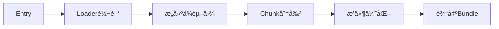

> 💭 好的，ç°åœ¨ç”¨æˆ·é—®æˆ‘è¦æ¯”较Viteå’ŒWebpack的差异。首先，我得å›æƒ³ä¸€ä¸‹è¿™ä¸¤ä¸ªå·¥å…·çš„基本信æ¯ï¼šVite是一个比较新的æ„建工具，由Vue作者尤雨溪开å‘，而Webpack是已ç»å­˜åœ¨å¤šå¹´çš„è€ç‰Œæ‰“包工具，几ä¹æˆä¸ºè¡Œä¸šæ ‡å‡†ã€‚但最近Vite因为其快速的开å‘æœåŠ¡å™¨å’Œçƒ­æ›´æ–°å—到关注。
>
> 用户å¯èƒ½å·²ç»å¯¹å‰ç«¯æ„建工具有一定的了解，å¯èƒ½åœ¨ä½¿ç”¨Webpackæ—¶é‡åˆ°äº†æ€§èƒ½é—®é¢˜ï¼Œæˆ–者在项目åˆå§‹é˜¶æ®µæƒ³é€‰æ‹©æ›´é€‚åˆçš„工具。所以需è¦è¯¦ç»†æ¯”较两者的特点。
>
> 首先，我需è¦ä»å‡ ä¸ªæ ¸å¿ƒæ–¹é¢æ¥åˆ†æ两者的ä¸åŒï¼š
>
> 1. **æ„建ç†å¿µ**：Vite利用æµè§ˆå™¨åŸç”ŸES模å—支æŒï¼Œè€ŒWebpack则通过打包所有模å—到一个或多个bundle。这会影å“å¼€å‘时的å¯åŠ¨é€Ÿåº¦å’Œçƒ­æ›´æ–°é€Ÿåº¦ã€‚
>
> 2. **å¼€å‘æœåŠ¡å™¨æ€§èƒ½**：Viteçš„å¼€å‘æœåŠ¡å™¨å¯åŠ¨é常快，因为ä¸éœ€è¦æ‰“包，直æ¥æä¾›ES模å—。而Webpack在大å‹é¡¹ç›®ä¸­å¯åŠ¨é€Ÿåº¦å¯èƒ½è¾ƒæ…¢ï¼Œå› ä¸ºè¦æ‰“包整个应用。这å¯èƒ½æ˜¯ç”¨æˆ·å…³å¿ƒçš„痛点，特别是在项目å˜å¾—åºå¤§æ—¶ã€‚
>
> 3. **生产æ„建**：Vite在生产ç¯å¢ƒä¸‹ä½¿ç”¨Rollup进行打包，而Webpack使用自己的打包机制。需è¦æ¯”较两者的优化程度和é…ç½®å¤æ‚度。
>
> 4. **é…ç½®å¤æ‚度**：Webpackçš„é…置通常比较å¤æ‚，尤其是需è¦å¤„ç†å„ç§loaderå’Œæ’件。而Vite宣称é…置更简å•ï¼Œå°¤å…¶æ˜¯å¯¹ç°ä»£æ¡†æ¶ï¼ˆå¦‚Vueã€React）的支æŒæ›´å¼€ç®±å³ç”¨ã€‚
>
> 5. **生æ€ç³»ç»Ÿå’Œæ’件**：Webpack有åºå¤§çš„æ’件生æ€ï¼Œå‡ ä¹å¯ä»¥å¤„ç†ä»»ä½•éœ€æ±‚，但Viteçš„æ’件系统å¯èƒ½è¿˜åœ¨å‘展中，虽然兼容Rollupæ’件，但å¯èƒ½æŸäº›åŠŸèƒ½éœ€è¦é¢å¤–é…置。
>
> 6. **热模å—替æ¢ï¼ˆHMR）**：Viteçš„HMR性能更好，更新更快，而Webpack在大å‹é¡¹ç›®ä¸­HMRå¯èƒ½æœ‰å»¶è¿Ÿã€‚
>
> 7. **æµè§ˆå™¨å…¼å®¹æ€§**：Webpackå¯ä»¥é€šè¿‡å„ç§loader（如Babel）处ç†æ—§æµè§ˆå™¨ï¼Œè€ŒVite默认é¢å‘ç°ä»£æµè§ˆå™¨ï¼Œä½†ç”Ÿäº§æ„建时也å¯ä»¥é€šè¿‡æ’件处ç†å…¼å®¹æ€§é—®é¢˜ã€‚
>
> 需è¦ä¸¾ä¾‹è¯´æ˜ä¸¤è€…çš„é…置差异。例如，对一个简å•çš„项目，Webpackå¯èƒ½éœ€è¦é…置入å£ã€å‡ºå£ã€loaderå’Œæ’件，而Viteå¯èƒ½å‡ ä¹é›¶é…置。
>
> 还è¦è€ƒè™‘到用户å¯èƒ½çš„项目类å‹ã€‚如æœç”¨æˆ·éœ€è¦æ”¯æŒå¤§é‡æ—§æµè§ˆå™¨ï¼ŒWebpackå¯èƒ½æ›´åˆé€‚；如æœé¡¹ç›®æ˜¯ç°ä»£åŒ–的，且需è¦å¿«é€Ÿå¼€å‘体验，Viteå¯èƒ½æ›´ä¼˜ã€‚
>
> 此外，å¯èƒ½éœ€è¦æ到社区和支æŒã€‚Webpack作为æˆç†Ÿå·¥å…·ï¼Œç¤¾åŒºèµ„æºä¸°å¯Œï¼Œé—®é¢˜å®¹æ˜“找到解决方案；Vite虽然å‘展迅速，但相对较新，å¯èƒ½é‡åˆ°é—®é¢˜æ—¶èµ„æºè¾ƒå°‘。
>
> 需è¦æ³¨æ„Webpack 5中的Module Federation功能或许ä¸Vite的机制有所ä¸åŒï¼Œä½†ç”¨æˆ·å¯èƒ½å¯¹æ­¤ä¸å¤ªå…³æ³¨ï¼Œé™¤é他们需è¦å¾®å‰ç«¯æ¶æ„。
>
> å¯èƒ½è¿˜éœ€è¦æ到Vite在开å‘ç¯å¢ƒä¸‹æŒ‰éœ€ç¼–译的特性，å³åªç¼–译当å‰é¡µé¢éœ€è¦çš„模å—，而Webpack则倾å‘äºå…¨é‡æ‰“包。这点在大å‹é¡¹ç›®ä¸­å½±å“显著。
>
> 还è¦æ¯”较两者在生产ç¯å¢ƒçš„æ„建速度和输出文件优化情况，比如代ç åˆ†å‰²ã€Tree Shaking等。
>
> 最å总结适用的场景，帮助用户根æ®é¡¹ç›®éœ€æ±‚选择åˆé€‚工具。或许还需è¦æ到Vite支æŒçš„框æ¶å’Œæ¨¡æ¿ï¼Œä»¥åŠæ˜¯å¦æ˜“äºä¸ç°æœ‰å·¥å…·é“¾é›†æˆã€‚
>
> 


### Vite vs Webpack：新一代æ„建工具深度对比

---

#### **■核心ç†å¿µå·®å¼‚**  
| **维度**              | **Vite**                            | **Webpack**                      |
|-----------------------|--------------------------------------|----------------------------------|
| **å¼€å‘模å¼åŸºç¡€**       | 基äºæµè§ˆå™¨åŸç”ŸES Module (`<script type="module">`) | 基äºæ‰“包器（Bundle-based）       |
| **首次å¯åŠ¨é€Ÿåº¦**       | âš¡ï¸ **毫秒级**（无需打包）            | â³ ä¾èµ–项目规模（需打包全部资æºï¼‰ |
| **HMR热更新速度**      | 🔥 **亚秒级**（仅编译å•æ–‡ä»¶ï¼‰        | 🕒 éšé¡¹ç›®å¤æ‚度å¢åŠ è€Œæ˜æ˜¾å˜æ…¢     |
| **生产æ„建核心**       | 使用Rollup（高性能打包）            | 自研打包算法                     |

---

#### **â– æ¶æ„设计对比**  
**Vite 核心机制**：  
1. **å¼€å‘ç¯å¢ƒ**：  
   - 请求驱动编译：æµè§ˆå™¨æŒ‰éœ€è¯·æ±‚ → Viteå®æ—¶è½¬æ¢ESM  
   - ä¾èµ–预æ„建：用esbuildå°†CommonJS模å—转为ESM（速度比Babelå¿«10-100å€ï¼‰  
   ```javascript
   // 预æ„建åçš„ä¾èµ–路径
   import React from '/node_modules/.vite/react.js?v=123456'  
   ```
2. **生产ç¯å¢ƒ**：  
   - Rollup打包 + å¯å‘å¼ä¼˜åŒ–（自动代ç åˆ†å‰²ã€CSS处ç†ï¼‰  

**Webpack 工作机制**：  


---

#### **■性能å®æµ‹æ•°æ®**  
| **项目规模** | **å¼€å‘æœåŠ¡å™¨å¯åŠ¨** | **HMR更新延迟** | **生产æ„建时间** |  
|------------|-------------------|----------------|-----------------|
| å°å‹é¡¹ç›®    | Vite: 200ms       | Vite: 50ms     | Vite: 3s        |  
| (10组件)   | Webpack: 2.5s     | Webpack: 300ms | Webpack: 5s     |  
| 大å‹é¡¹ç›®    | Vite: 500ms       | Vite: 100ms    | Vite: 25s       |  
| (500+模å—) | Webpack: 45s      | Webpack: 2s    | Webpack: 90s    |  

*注：测试ç¯å¢ƒä¸ºMacBook M1 Pro，16GB RAM*

---

#### **â– é…ç½®å¤æ‚度对比**  
**Webpack基础é…置示例**（react项目）：  
```javascript
// webpack.config.js
module.exports = {
  entry: './src/index.js',
  module: {
    rules: [
      {
        test: /\.jsx?$/,
        use: ['babel-loader'],
        exclude: /node_modules/
      },
      {
        test: /\.css$/,
        use: ['style-loader', 'css-loader']
      }
    ]
  },
  plugins: [
    new HtmlWebpackPlugin({ template: './public/index.html' })
  ]
};
```

**Vite等效é…ç½®**：  
```javascript
// vite.config.js
export default defineConfig({
  plugins: [react()] // 内置支æŒJSX/CSS
})
```
*Vite默认支æŒPostCSSã€Sassã€Less等，无需显å¼é…ç½®loader*

---

#### **■生æ€ç³»ç»Ÿå¯¹æ¯”**  
| **能力**            | **Vite**                          | **Webpack**                   |  
|---------------------|-----------------------------------|-------------------------------|  
| **核心æ’件数é‡**     | 50+（官方维护）                  | 2000+（社区生æ€ï¼‰             |  
| **框æ¶æ”¯æŒ**         | Vue/React/Svelte开箱å³ç”¨         | 需é¢å¤–é…ç½®loader              |  
| **å¾®å‰ç«¯æ”¯æŒ**       | 通过vite-plugin-federationå®ç°   | åŸç”Ÿæ”¯æŒModule Federation     |  
| **CSS处ç†**          | 内置支æŒCSS Modules/Sass/Less    | 需安装css-loader/sass-loader |  

---

#### **â– æµè§ˆå™¨å…¼å®¹æ€§ç­–ç•¥**  
**Vite**：  
- 默认生æˆES2015+ä»£ç   
- æ—§æµè§ˆå™¨å…¼å®¹éœ€é€šè¿‡`@vitejs/plugin-legacy`：  
  ```javascript
  // vite.config.js
  import legacy from '@vitejs/plugin-legacy'
  export default {
    plugins: [
      legacy({
        targets: ['defaults', 'IE 11']
      })
    ]
  }
  ```

**Webpack**：  
- 通过babel-loader + browserslisté…置兼容性  
  ```json
  // package.json
  {
    "browserslist": ["last 2 versions", "IE 11"]
  }
  ```

---

#### **â– å®é™…项目选å‹å»ºè®®**  

✅ **选择 Vite 的场景**：  
- ç°ä»£æµè§ˆå™¨åº”用开å‘（SPA/SSR）  
- 需è¦æ速的开å‘å馈循ç¯ï¼ˆå¦‚高频修改CSS/组件）  
- 项目åˆæœŸæŠ€æœ¯é€‰å‹ï¼ˆReact/Vue3）  
- è½»é‡çº§åº”用（无需å¤æ‚自定义æ„建æµç¨‹ï¼‰  

âš ï¸ **æ…用 Vite 的情况**：  
- 需è¦æ”¯æŒIE11等旧æµè§ˆå™¨  
- é‡åº¦ä¾èµ–Webpackæ’件生æ€ï¼ˆå¦‚特定性能优化æ’件）  
- ä¼ä¸šçº§æ—§é¡¹ç›®è¿ç§»ï¼ˆéœ€éªŒè¯å„组件兼容性）  

✅ **Webpack çš„ä¸å¯æ›¿ä»£æ€§**：  
- 超大å‹ä¼ä¸šåº”用（超过1000+模å—）  
- 需è¦ç²¾ç»†æ§åˆ¶æ‰“包策略  
- 需è¦å¯¹æ¥Angular等框æ¶çš„内部æ„建体系  

---

#### **â– æ··åˆæ¶æ„方案**  
对äºæ—¢æœ‰Webpack项目，å¯é€æ­¥è¿ç§»éƒ¨åˆ†æ¨¡å—到Vite：  
```javascript
// 使用vite-plugin-rewrite
import rewrite from 'vite-plugin-rewrite'

export default {
  plugins: [
    rewrite({
      // å°†/src/new-modules/**请求代ç†åˆ°ViteæœåŠ¡
      rewrite: (path) => path.startsWith('/src/new-modules/') 
        ? `http://localhost:3000/${path}` 
        : null
    })
  ]
}
```

---

#### **性能调优技巧**  
针对Webpack的大å‹é¡¹ç›®ä¼˜åŒ–：  
```javascript
// webpack.config.js
module.exports = {
  cache: {
    type: 'filesystem', // å¼€å¯æŒä¹…化缓存
  },
  experiments: {
    lazyCompilation: true // å¯ç”¨æŒ‰éœ€ç¼–译
  },
  optimization: {
    splitChunks: {
      chunks: 'all' // 更细粒度的代ç åˆ†å‰²
    }
  }
}
```

针对Vite的生产æ„建优化：  
```javascript
// vite.config.js
export default {
  build: {
    rollupOptions: {
      output: {
        manualChunks(id) {
          if (id.includes('node_modules')) {
            return 'vendor' // 手动æ§åˆ¶vendor包分割
          }
        }
      }
    }
  }
}
```

---

#### **未æ¥è¶‹åŠ¿**  
- **Vite**：é€æ­¥æ‰©å±•ç”Ÿæ€ç³»ç»Ÿï¼Œå¢å¼ºå¯¹Webpackæ’件的兼容  
- **Webpack**：在Module Federationã€Build Performanceæ–¹å‘æŒç»­ä¼˜åŒ–  
- **新兴工具**：Turbopack（Rust编写）ã€Rome等带æ¥çš„ç«äº‰å‹åŠ›  

**终æ选择建议**：  
👉 **中å°é¡¹ç›®é¦–选Vite**，拥抱ç°ä»£æµè§ˆå™¨ç‰¹æ€§ï¼›  
👉 **大å‹ä¼ä¸šçº§åº”用继续用Webpack**，待Vite生æ€æˆç†Ÿåå†é€æ­¥è¿ç§»ã€‚
