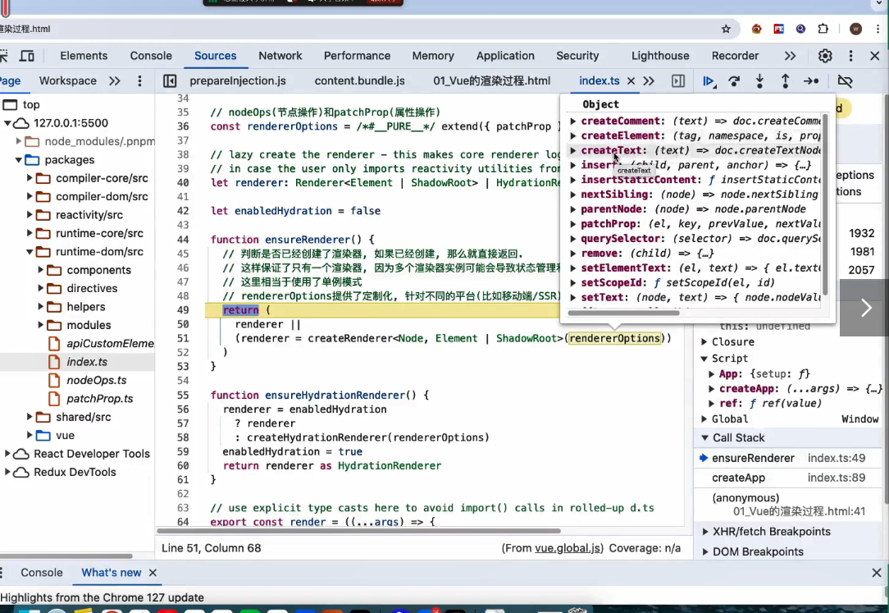
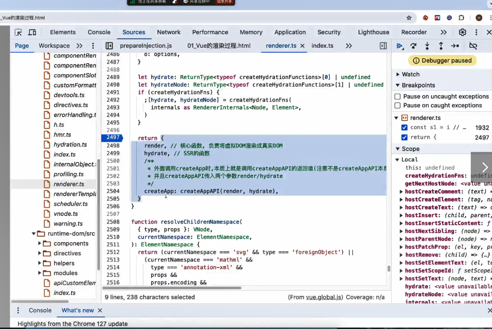
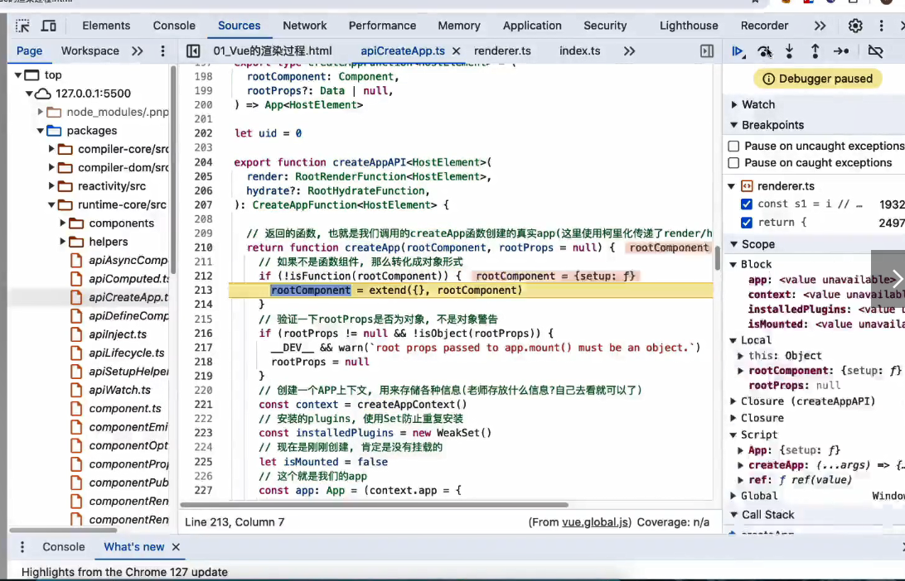

createApp
就是帮助我们创建一个渲染器
ensureRenderer实例化一个渲染器，渲染器就是把vue代码组件渲染到dom上的，返回一个渲染器以后
渲染器里面必然包含一个createApp的方法，并且会返回一个app对象
ensureRenderer创建一个渲染器的对象，方法createApp调用这个方法会返回一个app
判断是否已经创建了渲染器，如果已经创建了，那么就直接返回的
这样保证了只有一个渲染器，因为多个渲染器的实例可能会导致状态管理和渲染更新上的冲突或者重复
单例模式
rendererOptions提供了定制化，针对不同的平台，编写不同的renderer

再进到createRenderer->baseCreateRenderer
取出来各种各样的options

渲染器最终会返回，render核心函数，负责将虚拟dom渲染成为真实的dom,hydrate，ssr的核心函数，
createApp:createAppAPI(render,hydrate)，返回一个app
外部调用createApp的时候本质上就是调用createAppAPI的返回值，注意不是createAppAPI的本身

从app当中会拿到mount的函数
重写了mount的方法，当我们调用mount的时候，本质上就是重写了mount的方法
装饰着模式，对mount进行了增强
清空container的内容
container.innerHTML=''
//调用原来的app的mount的方法挂载组件上的
resolveRootNamespace这个函数的作用是检查给定的容器元素是否属于特殊的命名空间，如果是会以特殊的方式进行处理的
const proxy = mount(container,flase,resolveRootNameSpace(container))

