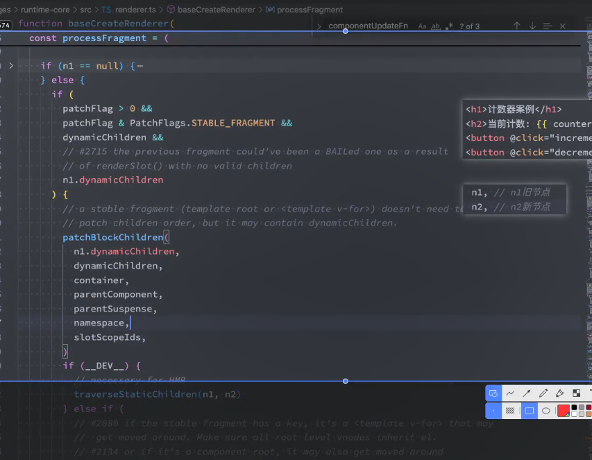
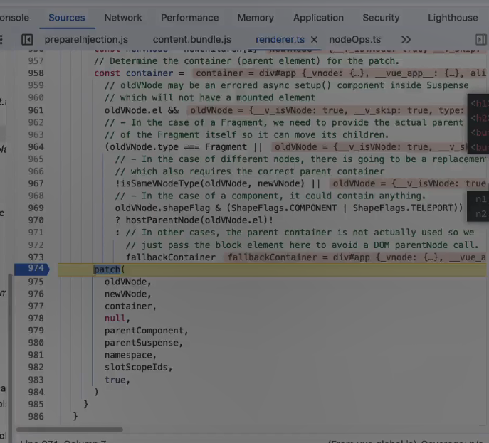

# diff算法
App组件-》VNode ,children虚拟dom,虚拟domtree,VDomTree ->渲染成为真实的dom
对比前后虚拟dom树，找出最小的差异，新的虚拟dom树和旧的虚拟dom树进行比较，找出不同的地方
避免不必要的dom更新：通过比较新旧虚拟dom树,diff算法只更新需要变更的部分
局部更新，patching方式仅仅更新这些部分
更高效的节点处理，diff算法通常使用一些优化技术vue3当中的最长递增子序列LIS算法，减少节点的移动操作次数
静态内容优化，编译阶段识别静态内容，diff算法能够再更新的时候跳过这些静态的内容的比较，进一步减少更新和渲染的开销
```js

  const setupRenderEffect: SetupRenderEffectFn = (
    instance,
    initialVNode,
    container,
    anchor,
    parentSuspense,
    namespace: ElementNamespace,
    optimized,
  ) => {
    const componentUpdateFn = () => {
      if (!instance.isMounted) {
        let vnodeHook: VNodeHook | null | undefined
        const { el, props } = initialVNode
        const { bm, m, parent, root, type } = instance
        const isAsyncWrapperVNode = isAsyncWrapper(initialVNode)

        toggleRecurse(instance, false)
        // beforeMount hook
        if (bm) {
          invokeArrayFns(bm)
        }
        // onVnodeBeforeMount
        if (
          !isAsyncWrapperVNode &&
          (vnodeHook = props && props.onVnodeBeforeMount)
        ) {
          invokeVNodeHook(vnodeHook, parent, initialVNode)
        }
        if (
          __COMPAT__ &&
          isCompatEnabled(DeprecationTypes.INSTANCE_EVENT_HOOKS, instance)
        ) {
          instance.emit('hook:beforeMount')
        }
        toggleRecurse(instance, true)

        if (el && hydrateNode) {
          // vnode has adopted host node - perform hydration instead of mount.
          const hydrateSubTree = () => {
            if (__DEV__) {
              startMeasure(instance, `render`)
            }
            instance.subTree = renderComponentRoot(instance)
            if (__DEV__) {
              endMeasure(instance, `render`)
            }
            if (__DEV__) {
              startMeasure(instance, `hydrate`)
            }
            hydrateNode!(
              el as Node,
              instance.subTree,
              instance,
              parentSuspense,
              null,
            )
            if (__DEV__) {
              endMeasure(instance, `hydrate`)
            }
          }

          if (
            isAsyncWrapperVNode &&
            (type as ComponentOptions).__asyncHydrate
          ) {
            ;(type as ComponentOptions).__asyncHydrate!(
              el as Element,
              instance,
              hydrateSubTree,
            )
          } else {
            hydrateSubTree()
          }
        } else {
          // custom element style injection
          if (root.ce) {
            root.ce._injectChildStyle(type)
          }

          if (__DEV__) {
            startMeasure(instance, `render`)
          }
          const subTree = (instance.subTree = renderComponentRoot(instance))
          if (__DEV__) {
            endMeasure(instance, `render`)
          }
          if (__DEV__) {
            startMeasure(instance, `patch`)
          }
          patch(
            null,
            subTree,
            container,
            anchor,
            instance,
            parentSuspense,
            namespace,
          )
          if (__DEV__) {
            endMeasure(instance, `patch`)
          }
          initialVNode.el = subTree.el
        }
        // mounted hook
        if (m) {
          queuePostRenderEffect(m, parentSuspense)
        }
        // onVnodeMounted
        if (
          !isAsyncWrapperVNode &&
          (vnodeHook = props && props.onVnodeMounted)
        ) {
          const scopedInitialVNode = initialVNode
          queuePostRenderEffect(
            () => invokeVNodeHook(vnodeHook!, parent, scopedInitialVNode),
            parentSuspense,
          )
        }
        if (
          __COMPAT__ &&
          isCompatEnabled(DeprecationTypes.INSTANCE_EVENT_HOOKS, instance)
        ) {
          queuePostRenderEffect(
            () => instance.emit('hook:mounted'),
            parentSuspense,
          )
        }

        // activated hook for keep-alive roots.
        // #1742 activated hook must be accessed after first render
        // since the hook may be injected by a child keep-alive
        if (
          initialVNode.shapeFlag & ShapeFlags.COMPONENT_SHOULD_KEEP_ALIVE ||
          (parent &&
            isAsyncWrapper(parent.vnode) &&
            parent.vnode.shapeFlag & ShapeFlags.COMPONENT_SHOULD_KEEP_ALIVE)
        ) {
          instance.a && queuePostRenderEffect(instance.a, parentSuspense)
          if (
            __COMPAT__ &&
            isCompatEnabled(DeprecationTypes.INSTANCE_EVENT_HOOKS, instance)
          ) {
            queuePostRenderEffect(
              () => instance.emit('hook:activated'),
              parentSuspense,
            )
          }
        }
        instance.isMounted = true

        if (__DEV__ || __FEATURE_PROD_DEVTOOLS__) {
          devtoolsComponentAdded(instance)
        }

        // #2458: deference mount-only object parameters to prevent memleaks
        initialVNode = container = anchor = null as any
      } else {
        let { next, bu, u, parent, vnode } = instance

        if (__FEATURE_SUSPENSE__) {
          const nonHydratedAsyncRoot = locateNonHydratedAsyncRoot(instance)
          // we are trying to update some async comp before hydration
          // this will cause crash because we don't know the root node yet
          if (nonHydratedAsyncRoot) {
            // only sync the properties and abort the rest of operations
            if (next) {
              next.el = vnode.el
              updateComponentPreRender(instance, next, optimized)
            }
            // and continue the rest of operations once the deps are resolved
            nonHydratedAsyncRoot.asyncDep!.then(() => {
              // the instance may be destroyed during the time period
              if (!instance.isUnmounted) {
                componentUpdateFn()
              }
            })
            return
          }
        }

        // updateComponent
        // This is triggered by mutation of component's own state (next: null)
        // OR parent calling processComponent (next: VNode)
        let originNext = next
        let vnodeHook: VNodeHook | null | undefined
        if (__DEV__) {
          pushWarningContext(next || instance.vnode)
        }

        // Disallow component effect recursion during pre-lifecycle hooks.
        toggleRecurse(instance, false)
        if (next) {
          next.el = vnode.el
          updateComponentPreRender(instance, next, optimized)
        } else {
          next = vnode
        }

        // beforeUpdate hook
        if (bu) {
          invokeArrayFns(bu)
        }
        // onVnodeBeforeUpdate
        if ((vnodeHook = next.props && next.props.onVnodeBeforeUpdate)) {
          invokeVNodeHook(vnodeHook, parent, next, vnode)
        }
        if (
          __COMPAT__ &&
          isCompatEnabled(DeprecationTypes.INSTANCE_EVENT_HOOKS, instance)
        ) {
          instance.emit('hook:beforeUpdate')
        }
        toggleRecurse(instance, true)

        // render
        if (__DEV__) {
          startMeasure(instance, `render`)
        }
        const nextTree = renderComponentRoot(instance)
        if (__DEV__) {
          endMeasure(instance, `render`)
        }
        const prevTree = instance.subTree
        instance.subTree = nextTree

        if (__DEV__) {
          startMeasure(instance, `patch`)
        }
        patch(
          prevTree,
          nextTree,
          // parent may have changed if it's in a teleport
          hostParentNode(prevTree.el!)!,
          // anchor may have changed if it's in a fragment
          getNextHostNode(prevTree),
          instance,
          parentSuspense,
          namespace,
        )
        if (__DEV__) {
          endMeasure(instance, `patch`)
        }
        next.el = nextTree.el
        if (originNext === null) {
          // self-triggered update. In case of HOC, update parent component
          // vnode el. HOC is indicated by parent instance's subTree pointing
          // to child component's vnode
          updateHOCHostEl(instance, nextTree.el)
        }
        // updated hook
        if (u) {
          queuePostRenderEffect(u, parentSuspense)
        }
        // onVnodeUpdated
        if ((vnodeHook = next.props && next.props.onVnodeUpdated)) {
          queuePostRenderEffect(
            () => invokeVNodeHook(vnodeHook!, parent, next!, vnode),
            parentSuspense,
          )
        }
        if (
          __COMPAT__ &&
          isCompatEnabled(DeprecationTypes.INSTANCE_EVENT_HOOKS, instance)
        ) {
          queuePostRenderEffect(
            () => instance.emit('hook:updated'),
            parentSuspense,
          )
        }

        if (__DEV__ || __FEATURE_PROD_DEVTOOLS__) {
          devtoolsComponentUpdated(instance)
        }

        if (__DEV__) {
          popWarningContext()
        }
      }
    }

    // create reactive effect for rendering
    instance.scope.on()
    const effect = (instance.effect = new ReactiveEffect(componentUpdateFn))
    instance.scope.off()

    const update = (instance.update = effect.run.bind(effect))
    const job: SchedulerJob = (instance.job = effect.runIfDirty.bind(effect))
    job.i = instance
    job.id = instance.uid
    effect.scheduler = () => queueJob(job)

    // allowRecurse
    // #1801, #2043 component render effects should allow recursive updates
    toggleRecurse(instance, true)

    if (__DEV__) {
      effect.onTrack = instance.rtc
        ? e => invokeArrayFns(instance.rtc!, e)
        : void 0
      effect.onTrigger = instance.rtg
        ? e => invokeArrayFns(instance.rtg!, e)
        : void 0
    }

    update()
  }

```

数据发生变化的时候执行调度，queueJob(update)
数据发生变化以后，effect调度函数
调用nextTree=renderComponentRoot(instance)拿到我们最新的数据，然后再调用patch
patch(prevTree,nextTree,instance实例保存的，)

keychilren,unkeychildren,
patchBlockChildren(n1.dynamicChildren,dynamicChildren,container,parentComponent,parentSuspense,namespace,slotScopeIds)
block编译
为了创建VNode数组，只有依赖动态数据的节点dynamicChildren:[]
patchFlag:有哪些东西发生了变化的，精准进行靶向的更新的，patchFlag记录具体变化的是什么，使用了位运算的方式
没有block和dynamicCHildren才会进行patchChildren:n1,n2,container,fragmentEndAnchor,parentComponent,parentSuspense,namespace,slotScopeIds,optimized
```js
 const patchBlockChildren: PatchBlockChildrenFn = (
    oldChildren,
    newChildren,
    fallbackContainer,
    parentComponent,
    parentSuspense,
    namespace: ElementNamespace,
    slotScopeIds,
  ) => {
    for (let i = 0; i < newChildren.length; i++) {
      const oldVNode = oldChildren[i]
      const newVNode = newChildren[i]
      // Determine the container (parent element) for the patch.
      const container =
        // oldVNode may be an errored async setup() component inside Suspense
        // which will not have a mounted element
        oldVNode.el &&
        // - In the case of a Fragment, we need to provide the actual parent
        // of the Fragment itself so it can move its children.
        (oldVNode.type === Fragment ||
          // - In the case of different nodes, there is going to be a replacement
          // which also requires the correct parent container
          !isSameVNodeType(oldVNode, newVNode) ||
          // - In the case of a component, it could contain anything.
          oldVNode.shapeFlag & (ShapeFlags.COMPONENT | ShapeFlags.TELEPORT))
          ? hostParentNode(oldVNode.el)!
          : // In other cases, the parent container is not actually used so we
            // just pass the block element here to avoid a DOM parentNode call.
            fallbackContainer
      patch(
        oldVNode,
        newVNode,
        container,
        null,
        parentComponent,
        parentSuspense,
        namespace,
        slotScopeIds,
        true,
      )
    }
  }
```

  ```js
if(n1===null) {

}else {
    if(patchFlag>0 && patchFlag&PatchFlags.STABLE_FRAGMENT&&dynamicChildren && n1.dynamicChildren)
}
patchElement 
旧节点复制给n2.el和el,这是因为初次创建的时候并没有实际的dom元素关联的
这个操作就是在重用n1的el不需要重新创建新的
```
const patchElement = (
    n1: VNode,
    n2: VNode,
    parentComponent: ComponentInternalInstance | null,
    parentSuspense: SuspenseBoundary | null,
    namespace: ElementNamespace,
    slotScopeIds: string[] | null,
    optimized: boolean,
  ) => {
    const el = (n2.el = n1.el!)
    if (__DEV__ || __FEATURE_PROD_DEVTOOLS__) {
      el.__vnode = n2
    }
    let { patchFlag, dynamicChildren, dirs } = n2
    // #1426 take the old vnode's patch flag into account since user may clone a
    // compiler-generated vnode, which de-opts to FULL_PROPS
    patchFlag |= n1.patchFlag & PatchFlags.FULL_PROPS
    const oldProps = n1.props || EMPTY_OBJ
    const newProps = n2.props || EMPTY_OBJ
    let vnodeHook: VNodeHook | undefined | null

    // disable recurse in beforeUpdate hooks
    parentComponent && toggleRecurse(parentComponent, false)
    if ((vnodeHook = newProps.onVnodeBeforeUpdate)) {
      invokeVNodeHook(vnodeHook, parentComponent, n2, n1)
    }
    if (dirs) {
      invokeDirectiveHook(n2, n1, parentComponent, 'beforeUpdate')
    }
    parentComponent && toggleRecurse(parentComponent, true)

    if (__DEV__ && isHmrUpdating) {
      // HMR updated, force full diff
      patchFlag = 0
      optimized = false
      dynamicChildren = null
    }

    // #9135 innerHTML / textContent unset needs to happen before possible
    // new children mount
    if (
      (oldProps.innerHTML && newProps.innerHTML == null) ||
      (oldProps.textContent && newProps.textContent == null)
    ) {
      hostSetElementText(el, '')
    }

    if (dynamicChildren) {
      patchBlockChildren(
        n1.dynamicChildren!,
        dynamicChildren,
        el,
        parentComponent,
        parentSuspense,
        resolveChildrenNamespace(n2, namespace),
        slotScopeIds,
      )
      if (__DEV__) {
        // necessary for HMR
        traverseStaticChildren(n1, n2)
      }
    } else if (!optimized) {
      // full diff
      patchChildren(
        n1,
        n2,
        el,
        null,
        parentComponent,
        parentSuspense,
        resolveChildrenNamespace(n2, namespace),
        slotScopeIds,
        false,
      )
    }

    if (patchFlag > 0) {
      // the presence of a patchFlag means this element's render code was
      // generated by the compiler and can take the fast path.
      // in this path old node and new node are guaranteed to have the same shape
      // (i.e. at the exact same position in the source template)
      if (patchFlag & PatchFlags.FULL_PROPS) {
        // element props contain dynamic keys, full diff needed
        patchProps(el, oldProps, newProps, parentComponent, namespace)
      } else {
        // class
        // this flag is matched when the element has dynamic class bindings.
        if (patchFlag & PatchFlags.CLASS) {
          if (oldProps.class !== newProps.class) {
            hostPatchProp(el, 'class', null, newProps.class, namespace)
          }
        }

        // style
        // this flag is matched when the element has dynamic style bindings
        if (patchFlag & PatchFlags.STYLE) {
          hostPatchProp(el, 'style', oldProps.style, newProps.style, namespace)
        }

        // props
        // This flag is matched when the element has dynamic prop/attr bindings
        // other than class and style. The keys of dynamic prop/attrs are saved for
        // faster iteration.
        // Note dynamic keys like :[foo]="bar" will cause this optimization to
        // bail out and go through a full diff because we need to unset the old key
        if (patchFlag & PatchFlags.PROPS) {
          // if the flag is present then dynamicProps must be non-null
          const propsToUpdate = n2.dynamicProps!
          for (let i = 0; i < propsToUpdate.length; i++) {
            const key = propsToUpdate[i]
            const prev = oldProps[key]
            const next = newProps[key]
            // #1471 force patch value
            if (next !== prev || key === 'value') {
              hostPatchProp(el, key, prev, next, namespace, parentComponent)
            }
          }
        }
      }

      // text
      // This flag is matched when the element has only dynamic text children.
      if (patchFlag & PatchFlags.TEXT) {
        if (n1.children !== n2.children) {
          hostSetElementText(el, n2.children as string)
        }
      }
    } else if (!optimized && dynamicChildren == null) {
      // unoptimized, full diff
      patchProps(el, oldProps, newProps, parentComponent, namespace)
    }

    if ((vnodeHook = newProps.onVnodeUpdated) || dirs) {
      queuePostRenderEffect(() => {
        vnodeHook && invokeVNodeHook(vnodeHook, parentComponent, n2, n1)
        dirs && invokeDirectiveHook(n2, n1, parentComponent, 'updated')
      }, parentSuspense)
    }
  }
  ```

  只有依赖动态数据的节点放到dynamicChildren当中去的
patch(prevTree,nextTree,hostParentNode,getNextHostNode,instance,parentSuspense,namespace)
