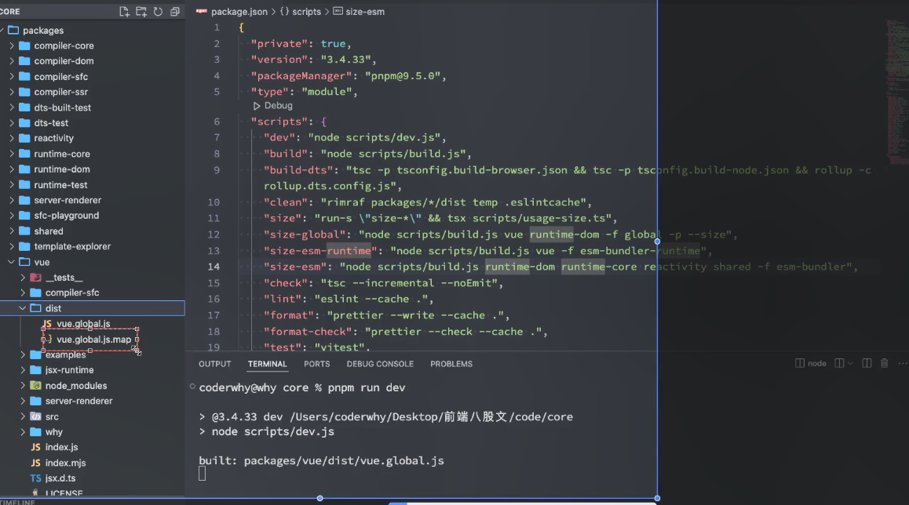
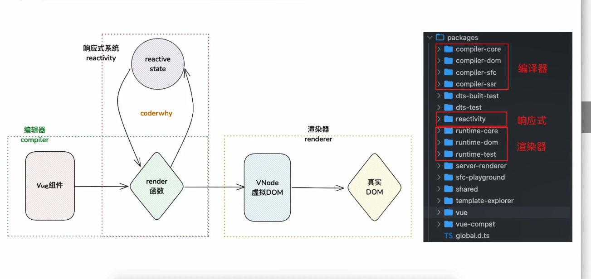
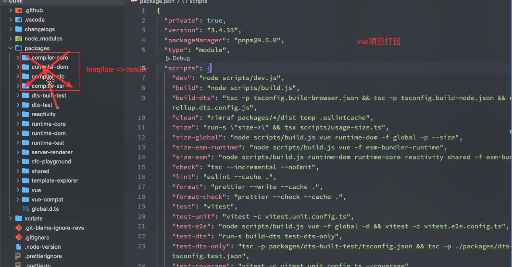
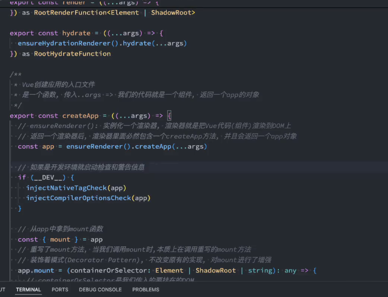

github.com/vuejs/core
pnpm install pnpm run dev
157


# vue的架构的分析
158
159
# vue3的整体架构

- 我们所编写的vue的组件，vue的组件会被转化成为render函数，render函数会生成虚拟dom,render函数的本质就是返回虚拟dom数据，vnode,虚拟dom会被渲染成为真实的dom树
- compiler编译器，render函数，vnode虚拟dom转换成为真实的dom渲染起renderer,
- ref,reactive,computed本质上就是dirty数据脏数据会重新执行的，使用这些数据，这些数据通过响应式原理收集依赖，多了一层封装而已，reactiveeffect,数据发生变化重新render就是update生成另外一个虚拟dom进行diff算法，
- 另外一个系统，render函数当中依赖于reactive重新执行render函数，响应式系统

- babel相似
- reactivity响应式系统
- runtimedom针对浏览器,runtime-core渲染器
160
161
createApp(App).mount('#app')
# vue的渲染过程
跟组件
<div>
<button @click="increment">+</button>
<button @click="decrement">-</button>

</div>
const {ref,createApp} =Vue
const App = {
    //跟组件
    setup(){
        const counter =ref(0)
        functiion increment() {
            counter.value++;
        }
        function decrement() {
            counter.value--;
        }
        return {
            counter ,
            increment,
            decrement

        }
    }
}
//创建全部的app调用它的mount方法
createApp(App).mount('#app')
162
# createApp的简单的创建过程
const app= createApp(App)
app.mount('#app')
runtime-core-渲染的内容
```bash

是一个函数，传入...args我们的代码就是一个组件，返回一个app的对象
export const createApp = ((...args) => {
ensureRendeer实例话一个渲染器，渲染器就是把vue代码组件渲染到dom上的
返回一个渲染器以后，渲染里面必然包含一个createApp的方法，并且会返回一个app对象

  const app = ensureRenderer().createApp(...args)

  if (__DEV__) {
    injectNativeTagCheck(app)
    injectCompilerOptionsCheck(app)
  }
/
  const { mount } = app
  app.mount = (containerOrSelector: Element | ShadowRoot | string): any => {
    const container = normalizeContainer(containerOrSelector)
    if (!container) return

    const component = app._component
    if (!isFunction(component) && !component.render && !component.template) {
      // __UNSAFE__
      // Reason: potential execution of JS expressions in in-DOM template.
      // The user must make sure the in-DOM template is trusted. If it's
      // rendered by the server, the template should not contain any user data.
      component.template = container.innerHTML
      // 2.x compat check
      if (__COMPAT__ && __DEV__ && container.nodeType === 1) {
        for (let i = 0; i < (container as Element).attributes.length; i++) {
          const attr = (container as Element).attributes[i]
          if (attr.name !== 'v-cloak' && /^(v-|:|@)/.test(attr.name)) {
            compatUtils.warnDeprecation(
              DeprecationTypes.GLOBAL_MOUNT_CONTAINER,
              null,
            )
            break
          }
        }
      }
    }

    // clear content before mounting
    if (container.nodeType === 1) {
      container.textContent = ''
    }
    const proxy = mount(container, false, resolveRootNamespace(container))
    if (container instanceof Element) {
      container.removeAttribute('v-cloak')
      container.setAttribute('data-v-app', '')
    }
    return proxy
  }

  return app
}) as CreateAppFunction<Element>

```

core当中的不仅仅可以渲染到浏览器根据虚拟dom可以浏览器，ssr服务器端，移动端还有vr,ar
虚拟dom渲染到平台上的，
