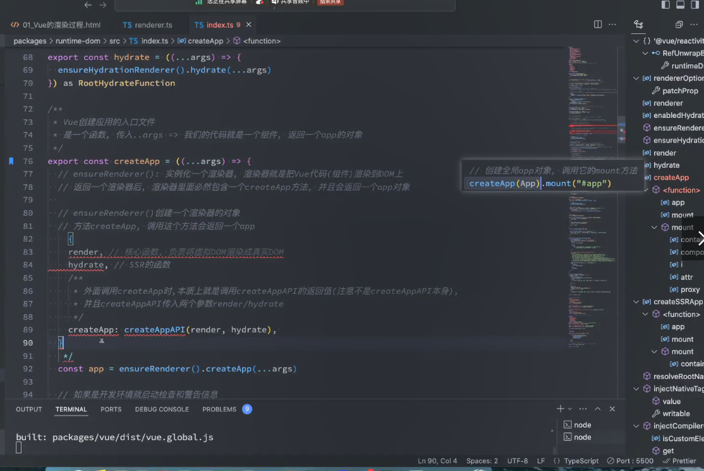
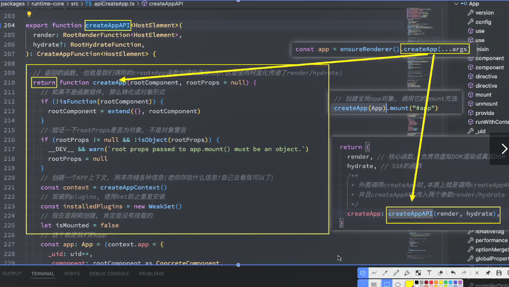
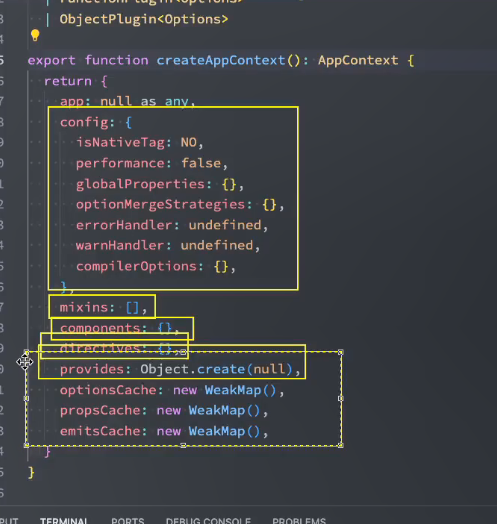
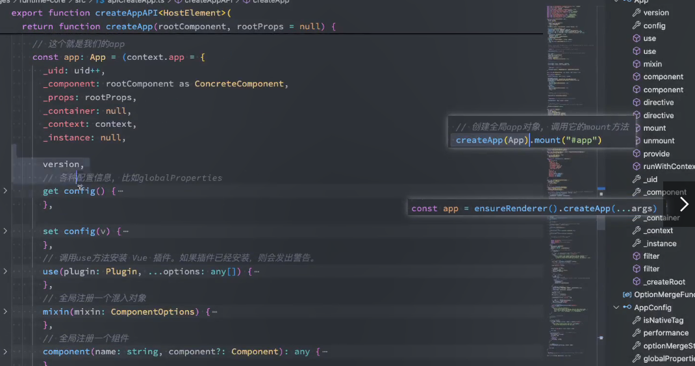
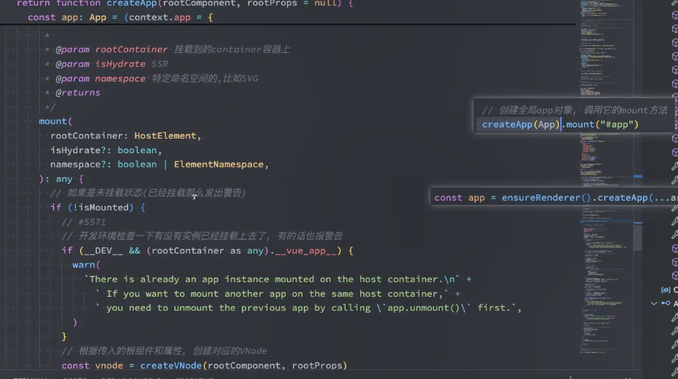
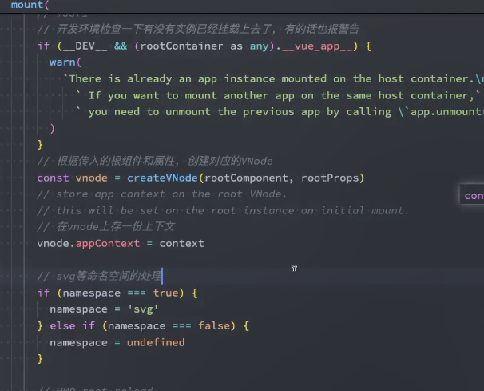
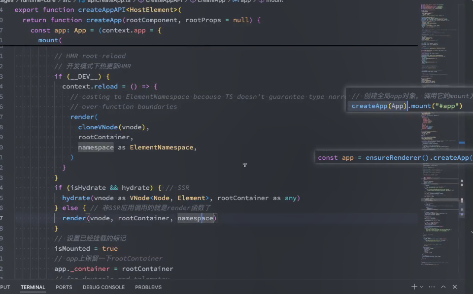

- ensureRenderer实例化一个渲染器，渲染器就是把vue代码组件渲染到dom上的
- 返回一个渲染器，渲染里面必然包含一个createApp的方法，并且会返回一个app对象
- //ensureRenderer创建一个渲染器的对象
- const app = ensureRenderer().createApp(...args)
- //返回渲染器的对象上有createApp调用这个方法会返回一个app
- nodeOps就是dom是如何操作的

- 按住这个
- nodeOps传入到createRender当中，
# batchProps

```bash
//nodeOps节点操作和batchProp属性操作
//patchProps对属性的操作,
//包括el,key,preValue,nextValue,namespace,parentComponent
const rendererOptions = /*@__PURE__*/ extend({ patchProp }, nodeOps);

// lazy create the renderer - this makes core renderer logic tree-shakable
// in case the user only imports reactivity utilities from Vue.
let renderer: Renderer<Element | ShadowRoot> | HydrationRenderer;

let enabledHydration = false;

function ensureRenderer() {
    //判断是否已经创建了渲染，会直接返回的
    //保证只有一个渲染器的，因为多个渲染器实例可能会导致状态管理和渲染更新上的冲突或者重复
    //相当于单例模式
    //rendererOptions提供了定制化，，针对不同的平台去编写不同的renderOptions
    //浏览器上就是dom操作，渲染起怎么操作的，vue实现跨平台是去定义renderOptions的，创建renderer的时候创建对应的options

  return (
    renderer ||
    (renderer = createRenderer<Node, Element | ShadowRoot>(rendererOptions))
  )
}


export const patchProp: DOMRendererOptions['patchProp'] = (
  el,
  key,
  prevValue,
  nextValue,
  namespace,
  parentComponent,
) => {
  const isSVG = namespace === 'svg'
  if (key === 'class') {
    patchClass(el, nextValue, isSVG)
  } else if (key === 'style') {
    patchStyle(el, prevValue, nextValue)
  } else if (isOn(key)) {
    // ignore v-model listeners
    if (!isModelListener(key)) {
      patchEvent(el, key, prevValue, nextValue, parentComponent)
    }
  } else if (
    key[0] === '.'
      ? ((key = key.slice(1)), true)
      : key[0] === '^'
        ? ((key = key.slice(1)), false)
        : shouldSetAsProp(el, key, nextValue, isSVG)
  ) {
    patchDOMProp(el, key, nextValue, parentComponent)
    // #6007 also set form state as attributes so they work with
    // <input type="reset"> or libs / extensions that expect attributes
    // #11163 custom elements may use value as an prop and set it as object
    if (
      !el.tagName.includes('-') &&
      (key === 'value' || key === 'checked' || key === 'selected')
    ) {
      patchAttr(el, key, nextValue, isSVG, parentComponent, key !== 'value')
    }
  } else if (
    // #11081 force set props for possible async custom element
    (el as VueElement)._isVueCE &&
    (/[A-Z]/.test(key) || !isString(nextValue))
  ) {
    patchDOMProp(el, camelize(key), nextValue, parentComponent, key)
  } else {
    // special case for <input v-model type="checkbox"> with
    // :true-value & :false-value
    // store value as dom properties since non-string values will be
    // stringified.
    if (key === 'true-value') {
      ;(el as any)._trueValue = nextValue
    } else if (key === 'false-value') {
      ;(el as any)._falseValue = nextValue
    }
    patchAttr(el, key, nextValue, isSVG, parentComponent)
  }
}
```
# nodeOps

```
export const nodeOps: Omit<RendererOptions<Node, Element>, 'patchProp'> = {
  insert: (child, parent, anchor) => {
    parent.insertBefore(child, anchor || null)
  },
//从父节点当中移除child
  remove: child => {
    const parent = child.parentNode
    if (parent) {
      parent.removeChild(child)
    }
  },
//创建元素createElement
  createElement: (tag, namespace, is, props): Element => {
    const el =
      namespace === 'svg'
        ? doc.createElementNS(svgNS, tag)
        : namespace === 'mathml'
          ? doc.createElementNS(mathmlNS, tag)
          : is
            ? doc.createElement(tag, { is })
            : doc.createElement(tag)

    if (tag === 'select' && props && props.multiple != null) {
      ;(el as HTMLSelectElement).setAttribute('multiple', props.multiple)
    }

    return el
  },
//创建文本
  createText: text => doc.createTextNode(text),
//创建一个注释节点
  createComment: text => doc.createComment(text),
//设置节点的文本值
  setText: (node, text) => {
    node.nodeValue = text
  },
//设置元素的文本内容
  setElementText: (el, text) => {
    el.textContent = text
  },
//返回节点的父节点
  parentNode: node => node.parentNode as Element | null,

  nextSibling: node => node.nextSibling,
//querySelector查找元素
  querySelector: selector => doc.querySelector(selector),
//设置元素的作用域，id,属性，组件的根元素
  setScopeId(el, id) {
    el.setAttribute(id, '')
  },

  // __UNSAFE__
  // Reason: innerHTML.
  // Static content here can only come from compiled templates.
  // As long as the user only uses trusted templates, this is safe.
  insertStaticContent(content, parent, anchor, namespace, start, end) {
    // <parent> before | first ... last | anchor </parent>
    const before = anchor ? anchor.previousSibling : parent.lastChild
    // #5308 can only take cached path if:
    // - has a single root node
    // - nextSibling info is still available
    if (start && (start === end || start.nextSibling)) {
      // cached
      while (true) {
        parent.insertBefore(start!.cloneNode(true), anchor)
        if (start === end || !(start = start!.nextSibling)) break
      }
    } else {
      // fresh insert
      templateContainer.innerHTML = unsafeToTrustedHTML(
        namespace === 'svg'
          ? `<svg>${content}</svg>`
          : namespace === 'mathml'
            ? `<math>${content}</math>`
            : content,
      ) as string

      const template = templateContainer.content
      if (namespace === 'svg' || namespace === 'mathml') {
        // remove outer svg/math wrapper
        const wrapper = template.firstChild!
        while (wrapper.firstChild) {
          template.appendChild(wrapper.firstChild)
        }
        template.removeChild(wrapper)
      }
      parent.insertBefore(template, anchor)
    }
    return [
      // first
      before ? before.nextSibling! : parent.firstChild!,
      // last
      anchor ? anchor.previousSibling! : parent.lastChild!,
    ]
  },
}

```

```bash
export function createRenderer<
  HostNode = RendererNode,
  HostElement = RendererElement,
>(options: RendererOptions<HostNode, HostElement>): Renderer<HostElement> {
  return baseCreateRenderer<HostNode, HostElement>(options)
}

// Separate API for creating hydration-enabled renderer.
// Hydration logic is only used when calling this function, making it
// tree-shakable.
export function createHydrationRenderer(
  options: RendererOptions<Node, Element>,
): HydrationRenderer {
  return baseCreateRenderer(options, createHydrationFunctions)
}

// overload 1: no hydration
function baseCreateRenderer<
  HostNode = RendererNode,
  HostElement = RendererElement,
>(options: RendererOptions<HostNode, HostElement>): Renderer<HostElement>

// overload 2: with hydration
function baseCreateRenderer(
  options: RendererOptions<Node, Element>,
  createHydrationFns: typeof createHydrationFunctions,
): HydrationRenderer

// implementation渲染器的真正实现

function baseCreateRenderer(
  options: RendererOptions,
  createHydrationFns?: typeof createHydrationFunctions,
): any {
  // compile-time feature flags check
  if (__ESM_BUNDLER__ && !__TEST__) {
    initFeatureFlags()
  }

  const target = getGlobalThis()
  target.__VUE__ = true
  if (__DEV__ || __FEATURE_PROD_DEVTOOLS__) {
    setDevtoolsHook(target.__VUE_DEVTOOLS_GLOBAL_HOOK__, target)
  }

```
- baseCreateRenderer,之后对方法做重载

- 这个方法是内部的方法
- 真正返回的对象是这样的
```bash
return {
    render,//核心的函数，负责将虚拟dom渲染成为真实的dom
    hydrate//ssr的函数
    createApp :createAppAPI(render,hydrate)
    //外面调用createApp的时候，本质上就是调用createAppAPI的返回值，注意不是createAppAPI本身的
    createApp: createAppAPI(render,hydrate)
}
```



- 调用ensureRenderer之后返回三个对象,render,hydrate,createApp:createAppAPI(render,hydrate)
//颗粒化


 

 







创建一个vnode 
```bash 

export function createAppAPI<HostElement>(
  render: RootRenderFunction<HostElement>,
  hydrate?: RootHydrateFunction,
): CreateAppFunction<HostElement> {
  return function createApp(rootComponent, rootProps = null) {
    if (!isFunction(rootComponent)) {
      rootComponent = extend({}, rootComponent)
    }

    if (rootProps != null && !isObject(rootProps)) {
      __DEV__ && warn(`root props passed to app.mount() must be an object.`)
      rootProps = null
    }

    const context = createAppContext()
    const installedPlugins = new WeakSet()
    const pluginCleanupFns: Array<() => any> = []

    let isMounted = false

    const app: App = (context.app = {
      _uid: uid++,
      _component: rootComponent as ConcreteComponent,
      _props: rootProps,
      _container: null,
      _context: context,
      _instance: null,

      version,

      get config() {
        return context.config
      },

      set config(v) {
        if (__DEV__) {
          warn(
            `app.config cannot be replaced. Modify individual options instead.`,
          )
        }
      },

      use(plugin: Plugin, ...options: any[]) {
        if (installedPlugins.has(plugin)) {
          __DEV__ && warn(`Plugin has already been applied to target app.`)
        } else if (plugin && isFunction(plugin.install)) {
          installedPlugins.add(plugin)
          plugin.install(app, ...options)
        } else if (isFunction(plugin)) {
          installedPlugins.add(plugin)
          plugin(app, ...options)
        } else if (__DEV__) {
          warn(
            `A plugin must either be a function or an object with an "install" ` +
              `function.`,
          )
        }
        return app
      },

      mixin(mixin: ComponentOptions) {
        if (__FEATURE_OPTIONS_API__) {
          if (!context.mixins.includes(mixin)) {
            context.mixins.push(mixin)
          } else if (__DEV__) {
            warn(
              'Mixin has already been applied to target app' +
                (mixin.name ? `: ${mixin.name}` : ''),
            )
          }
        } else if (__DEV__) {
          warn('Mixins are only available in builds supporting Options API')
        }
        return app
      },

      component(name: string, component?: Component): any {
        if (__DEV__) {
          validateComponentName(name, context.config)
        }
        if (!component) {
          return context.components[name]
        }
        if (__DEV__ && context.components[name]) {
          warn(`Component "${name}" has already been registered in target app.`)
        }
        context.components[name] = component
        return app
      },

      directive(name: string, directive?: Directive) {
        if (__DEV__) {
          validateDirectiveName(name)
        }

        if (!directive) {
          return context.directives[name] as any
        }
        if (__DEV__ && context.directives[name]) {
          warn(`Directive "${name}" has already been registered in target app.`)
        }
        context.directives[name] = directive
        return app
      },

      mount(
        rootContainer: HostElement,
        isHydrate?: boolean,
        namespace?: boolean | ElementNamespace,
      ): any {
        if (!isMounted) {
          // #5571
          if (__DEV__ && (rootContainer as any).__vue_app__) {
            warn(
              `There is already an app instance mounted on the host container.\n` +
                ` If you want to mount another app on the same host container,` +
                ` you need to unmount the previous app by calling \`app.unmount()\` first.`,
            )
          }
          const vnode = app._ceVNode || createVNode(rootComponent, rootProps)
          // store app context on the root VNode.
          // this will be set on the root instance on initial mount.
          vnode.appContext = context

          if (namespace === true) {
            namespace = 'svg'
          } else if (namespace === false) {
            namespace = undefined
          }

          // HMR root reload
          if (__DEV__) {
            context.reload = () => {
              // casting to ElementNamespace because TS doesn't guarantee type narrowing
              // over function boundaries
              render(
                cloneVNode(vnode),
                rootContainer,
                namespace as ElementNamespace,
              )
            }
          }
//ssr
          if (isHydrate && hydrate) {//ssr
            hydrate(vnode as VNode<Node, Element>, rootContainer as any)
          } else {
          //非ssr就是render函数了
            render(vnode, rootContainer, namespace)
          }
          isMounted = true
          app._container = rootContainer
          // for devtools and telemetry
          ;(rootContainer as any).__vue_app__ = app

          if (__DEV__ || __FEATURE_PROD_DEVTOOLS__) {
            app._instance = vnode.component
            devtoolsInitApp(app, version)
          }

          return getComponentPublicInstance(vnode.component!)
        } else if (__DEV__) {
          warn(
            `App has already been mounted.\n` +
              `If you want to remount the same app, move your app creation logic ` +
              `into a factory function and create fresh app instances for each ` +
              `mount - e.g. \`const createMyApp = () => createApp(App)\``,
          )
        }
      },

      onUnmount(cleanupFn: () => void) {
        if (__DEV__ && typeof cleanupFn !== 'function') {
          warn(
            `Expected function as first argument to app.onUnmount(), ` +
              `but got ${typeof cleanupFn}`,
          )
        }
        pluginCleanupFns.push(cleanupFn)
      },

      unmount() {
        if (isMounted) {
          callWithAsyncErrorHandling(
            pluginCleanupFns,
            app._instance,
            ErrorCodes.APP_UNMOUNT_CLEANUP,
          )
          render(null, app._container)
          if (__DEV__ || __FEATURE_PROD_DEVTOOLS__) {
            app._instance = null
            devtoolsUnmountApp(app)
          }
          delete app._container.__vue_app__
        } else if (__DEV__) {
          warn(`Cannot unmount an app that is not mounted.`)
        }
      },

      provide(key, value) {
        if (__DEV__ && (key as string | symbol) in context.provides) {
          warn(
            `App already provides property with key "${String(key)}". ` +
              `It will be overwritten with the new value.`,
          )
        }

        context.provides[key as string | symbol] = value

        return app
      },

      runWithContext(fn) {
        const lastApp = currentApp
        currentApp = app
        try {
          return fn()
        } finally {
          currentApp = lastApp
        }
      },
    })

    if (__COMPAT__) {
      installAppCompatProperties(app, context, render)
    }

    return app
  }
}

```
