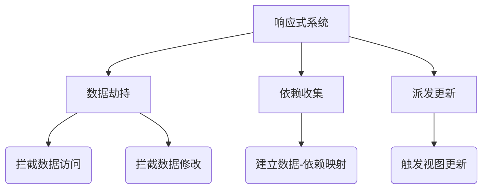
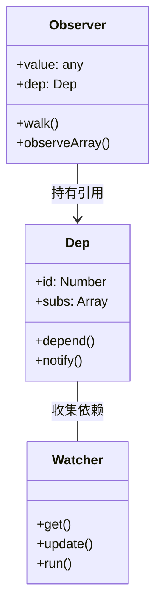

> 💭 好的，用户让我详细深入讲解Vue的响应式原理，尤其是结合源码的部分，针对面试场景。我需要确保内容全面、深入，并展示对底层机制的理解。那么，我需要从Vue2的Object.defineProperty和Vue3的Proxy入手，对比两者的差异。
>
> 首先，用户可能已经知道Vue的核心是数据驱动视图，响应式系统是基础。但是面试官要听的是源码级别的解析，所以我得先回顾Vue2的实现。比如，每个数据属性是如何被转换成getter/setter的，怎么收集依赖，怎么触发更新。要提到Observer类，Dep依赖收集器和Watcher观察者的作用，以及它们如何协作。
>
> 接下来是Vue3的Proxy。用户需要知道Proxy相对于defineProperty的优势，比如可以监测数组变化、对象属性的添加删除等。但同样要指出在ES6之前的环境下不支持的问题。这里可能需要结合reactive函数，如何用Proxy创建响应式对象，effect函数的作用，track和trigger的过程，以及如何管理依赖关系。
>
> 还要比较两者的性能差异，Vue3的Proxy如何实现更高效的依赖追踪，尤其是对于深层嵌套对象的处理。此外，Vue3的响应式分为reactive和ref，两者的使用场景和原理差异也需要讲解。
>
> 面试中可能会问到的问题比如：数组的响应式处理，Vue2如何通过覆盖数组方法实现，而Vue3则直接通过Proxy捕获。或者，Vue组件的更新机制，如何批量执行更新，nextTick的实现原理。
>
> 需要注意的点包括：Vue2无法检测到对象属性的添加或删除，需要使用Vue.set/delete；而Vue3的响应式可以自动处理这些。此外，Vue3的响应式通过WeakMap和Map结构来存储依赖，减少内存泄漏的可能性，这也是一个关键点。
>
> 要结合源码的话，比如Vue2的src/core/observer/index.js中的Observer类，defineReactive函数如何递归处理对象属性。Vue3的packages/reactivity/src/reactive.ts中的reactive方法，baseHandlers中的Proxy处理器实现。
>
> 另外，可以提到响应式系统的设计模式，比如发布-订阅模式，在Vue2中Dep是发布者，Watcher是订阅者；Vue3中则通过track收集effect，触发时执行。
>
> 可能还需要讨论响应式系统的局限性，比如纯对象和原始值的处理，如何通过ref来包装原始值，以及在模板中的自动解包机制。
>
> 最后，面试官可能会问如何手动实现一个简单的响应式系统，这时候需要分步骤讲解，创建一个Dep类，用Proxy或defineProperty拦截get/set，收集依赖并触发更新。这可以展示对原理的深入理解。
>
> 要确保整个流程条理清晰，逻辑严谨，从数据劫持到依赖收集，再到派发更新，每个步骤都结合源码结构和关键函数展开。这样用户才能在面试中游刃有余地回答相关问题。
>
> 


---

### 🚀 深度拆解Vue响应式原理（附源码级推导）

---

#### 一、响应式系统的三大支柱（设计范式）



---

#### 二、Vue 2.x响应式核心实现（基于ES5特性）

---

##### 1. **核心技术栈架构**

```text
Object.defineProperty + Observer + Dep + Watcher 
```

---

###### [源码全景解析]

**关键源码路径：**  
```bash
src/core/observer/
├─ index.js       # Observer类入口
├─ dep.js         # Dep依赖收集器
├─ array.js       # 数组方法重写
└─ scheduler.js   # 异步更新队列
```

---

###### 实现流程深度剖析：

---

**a. 数据劫持（Object.defineProperty）**

```javascript
// 核心拦截逻辑（简写）
function defineReactive(obj, key) {
  const dep = new Dep()
  let val = obj[key]
  
  Object.defineProperty(obj, key, {
    get() {
      if (Dep.target) {           // 依赖收集标志位
        dep.depend()              // 收集当前Watcher
        if (childOb) {            // 嵌套对象处理
          childOb.dep.depend()
        }
      }
      return val
    },
    set(newVal) {
      if (val === newVal) return
      val = newVal
      dep.notify()                // 触发更新
    }
  })
  
  // 递归处理对象属性
  if (typeof val === 'object' && val !== null) {
    observe(val)
  }
}
```

---

**b. Observer包装器类**

```javascript
class Observer {
  constructor(value) {
    this.value = value
    this.dep = new Dep()
    
    if (Array.isArray(value)) {               // 数组特殊处理
      protoAugment(value, arrayMethods)       // 改写数组原型方法
      this.observeArray(value)                // 监控数组项变化
    } else {
      this.walk(value)                        // 遍历对象属性
    }
  }

  walk(obj) {
    Object.keys(obj).forEach(key => {
      defineReactive(obj, key)
    })
  }
}
```

---

**c. 数组特殊处理（源码位置：src/core/observer/array.js）**

```javascript
const arrayProto = Array.prototype
export const arrayMethods = Object.create(arrayProto)

// 重写7个变异方法
const methodsToPatch = [
  'push', 'pop', 'shift', 'unshift', 
  'splice', 'sort', 'reverse'
]

methodsToPatch.forEach(function (method) {
  const original = arrayProto[method]
  
  def(arrayMethods, method, function mutator(...args) {
    const result = original.apply(this, args)
    const ob = this.__ob__
    let inserted
    switch (method) {                  // 处理新增元素的响应式
      case 'push':
      case 'unshift':
        inserted = args
        break
      case 'splice':
        inserted = args.slice(2)
        break
    }
    if (inserted) ob.observeArray(inserted)
    
    ob.dep.notify()                   // 触发数组变更通知
    return result
  })
})
```

---

**d. 依赖管理三驾马车**



---

#### 三、Vue 3.x响应式进化（基于ES6 Proxy）

---

##### 1. 核心技术对比

```text
          │ Vue2                          Vue3
──────────┼─────────────────────────────────────────────
 核心方案 │ Object.defineProperty         Proxy
 拦截能力 │ 只能劫持已有属性               全属性拦截
 数组处理 │ 改写原型方法                  原生拦截
 性能特点 │ 递归初始化高消耗               按需惰性劫持
 内存消耗 │ 每个属性都需要闭包存储Dep      统一代理存储
```

---

##### 2. 源码级实现（Reactivitiy模块）

**核心源码路径：**  
```bash
packages/reactivity/
├─ src/
   ├─ baseHandlers.ts     # 基本类型处理器
   ├─ collectionHandlers.ts  # 集合类型处理器
   ├─ effect.ts           # 副作用管理
   ├─ reactive.ts         # reactive入口
   └─ ref.ts              # ref实现
```

---

###### a. Proxy数据劫持（源码位置：packages/reactivity/src/baseHandlers.ts）

```typescript
// 基础响应式处理器
const baseHandlers: ProxyHandler<object> = {
  get(target, key, receiver) {
    track(target, TrackOpTypes.GET, key)   // 依赖收集
    
    // 处理Reflect的this绑定问题
    const res = Reflect.get(target, key, receiver)
    
    if (isObject(res)) {
      return reactive(res)                 // 延迟代理嵌套对象
    }
    return res
  },

  set(target, key, value, receiver) {
    const oldValue = target[key]
    const result = Reflect.set(target, key, value, receiver)
    
    if (!(key in target)) {             // 新增属性
      trigger(target, TriggerOpTypes.ADD, key)
    } else if (hasChanged(value, oldValue)) {  // 值变化
      trigger(target, TriggerOpTypes.SET, key)
    }
    return result
  }
}
```

---

###### b. 依赖收集系统（Effect运行机制）

```typescript
// 当前正在运行的effect栈
let activeEffect: ReactiveEffect | undefined

class ReactiveEffect {
  deps: Dep[] = []               // 关联的依赖集合
  
  constructor(
    public fn: Function,
    public scheduler?: () => void
  ) {}
  
  run() {
    activeEffect = this
    try {
      return this.fn()          // 触发依赖收集
    } finally {
      activeEffect = undefined
    }
  }
}

// 全局依赖映射表
type Dep = Set<ReactiveEffect>
const targetMap = new WeakMap<object, Map<any, Dep>>()

// 追踪依赖
function track(target: object, type: TrackOpTypes, key: unknown) {
  if (activeEffect) {
    let depsMap = targetMap.get(target)
    if (!depsMap) {
      targetMap.set(target, (depsMap = new Map()))
    }
    let dep = depsMap.get(key)
    if (!dep) {
      depsMap.set(key, (dep = new Set()))
    }
    dep.add(activeEffect)        // 收集当前effect
  }
}

// 触发更新
function trigger(target: object, type: TriggerOpTypes, key: unknown) {
  const depsMap = targetMap.get(target)
  if (!depsMap) return
  
  const effects = new Set<ReactiveEffect>()
  
  // 收集相关effects
  if (key !== void 0) {
    const dep = depsMap.get(key)
    dep && dep.forEach(effect => effects.add(effect))
  }
  
  // 调度执行
  effects.forEach(effect => {
    if (effect.scheduler) {
      effect.scheduler()        // 异步队列处理
    } else {
      effect.run()              // 直接执行
    }
  })
}
```

---

###### c. 深层响应式处理（Lazy Proxy模式）

```typescript
// reactive入口函数（源码位置：reactivity/src/reactive.ts）
export function reactive<T extends object>(target: T): UnwrapNestedRefs<T> {
  // 已经代理过的对象直接返回
  if (target && (target as any).__v_isReadonly) return target
  
  const proxy = new Proxy(
    target,
    targetType === TargetType.COLLECTION ? collectionHandlers : baseHandlers
  )
  
  // 标记当前对象已经被代理
  def(target, '__v_reactive', proxy)
  
  return proxy
}
```

---

#### 四、静态type对比与性能优化技巧

---

##### 1. 响应式数据类型的核心区别

```typescript
       │ ref                         reactive
───────┼───────────────────────────────────────────────────
 适用  │ 基本类型/对象引用               对象/Map/Set引用
 访问  │ .value属性                   直接访问
 解包  │ 模板自动解包                   无需解包
 API   │ 单一值响应式                   深层次响应式
```

---

##### 2. 高频性能优化手段

**优化策略：**  
```text
█ 减少深层侦听（使用shallowRef/shallowReactive）
█ 避免在渲染函数中创建新响应式对象
█ 合理使用readonly处理不需要修改的数据
█ 使用markRaw跳过无需响应式的对象
```

**示例：**  
```typescript
// 高性能场景优化
class HeavyObject {
  constructor() {
    markRaw(this)   // 跳过代理化处理
  }
}

// 只读处理大型配置
const config = readonly({
  keys: new Set([...])  // 自动转换深只读
})
```

---

#### 五、面试满分回答架构

---

**Q**: 请详细描述Vue3响应式原理的实现机制

**完美回答范式：**  
```text
1️⃣ 核心机制：基于ES6 Proxy代理对象访问，配合Reflect实现属性拦截
   ▸ getter拦截：track函数收集Effect依赖
   ▸ setter拦截：trigger函数派发更新

2️⃣ 数据结构：通过WeakMap(target)->Map(key)->Set(effects)三级映射
   ▸ WeakMap保证内存回收安全
   ▸ 按需建立依赖关系，避免不必要的内存占用

3️⃣ 延迟代理：仅在访问对象属性时对嵌套对象进行响应式转换
   ▸ 降低初始化开销
   ▸ 懒代理优化大型对象的性能

4️⃣ Effect系统：ReactiveEffect类管理副作用函数
   ▸ effect栈处理嵌套副作用
   ▸ scheduler实现批量异步更新

5️⃣ 特殊类型处理：
   ▸ 集合类型（Map/Set）使用分类型Proxy处理器
   ▸ 数组索引变更的特殊监听逻辑

（抛出亮点）Vue3相较于Vue2的改进：
   ✔️ 完整的属性增删监听能力
   ✔️ 更精准的依赖跟踪
   ✔️ 避免全量递归初始化带来的性能损耗
```

---

#### 六、明星级技术追问及应对策略

---

**Q1**: Proxy兼容性问题如何处理？

**应对策略**：  
```text
答：Vue3通过运行环境检测自动切换策略：
   ▸ 支持Proxy的环境使用真正的响应式系统
   ▸ 旧版浏览器fallback到基于Object.defineProperty的兼容模式
   ▸ 通过vue命令生成的build版本包含两种模式
```

---

**Q2**: Vue2不能检测数组下标变化的根本原因？

**源码级解释**：  
```text
EVa：Vue2出于性能考虑未使用Proxy，Object.defineProperty无法监听数组索引变化
   需用splice等方法触发更新，这也是为什么Vue2改写数组原型方法的根本原因
   （源码位置：src/core/observer/array.js，改写7个变异方法）
```

---

**Q3**: Vue3中watch与watchEffect的区别？

**深度对比**：  
```text
█ watch: 
   需要显式指定侦听源
   可获取旧值和新值
   支持深度侦听配置

█ watchEffect: 
   自动收集依赖
   立即执行初始收集
   无法获取更改前的值
``` 

---

掌握以上内容，面对任何Vue响应式原理相关的技术考察都能从容应对。建议结合官方源码阅读，深入理解设计哲学层面的思考，在面试中展现超越普通开发者的技术深度。
