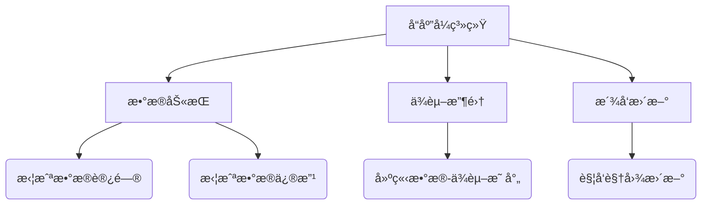
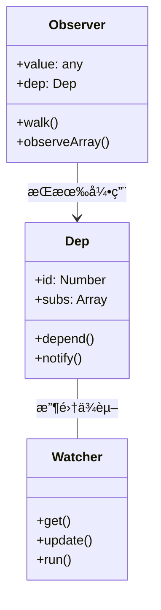

> 💭 好的，用户让我详细深入讲解Vueçš„å“应å¼åŸç†ï¼Œå°¤å…¶æ˜¯ç»“åˆæºç çš„部分，针对é¢è¯•åœºæ™¯ã€‚我需è¦ç¡®ä¿å†…容全é¢ã€æ·±å…¥ï¼Œå¹¶å±•ç¤ºå¯¹åº•å±‚机制的ç†è§£ã€‚那么，我需è¦ä»Vue2çš„Object.definePropertyå’ŒVue3çš„Proxy入手，对比两者的差异。
>
> 首先，用户å¯èƒ½å·²ç»çŸ¥é“Vue的核心是数æ®é©±åŠ¨è§†å›¾ï¼Œå“应å¼ç³»ç»Ÿæ˜¯åŸºç¡€ã€‚但是é¢è¯•å®˜è¦å¬çš„是æºç çº§åˆ«çš„解æ，所以我得先å›é¡¾Vue2çš„å®ç°ã€‚比如，æ¯ä¸ªæ•°æ®å±æ€§æ˜¯å¦‚何被转æ¢æˆgetter/setter的，æ€ä¹ˆæ”¶é›†ä¾èµ–，æ€ä¹ˆè§¦å‘更新。è¦æ到Observer类，Depä¾èµ–收集器和Watcher观察者的作用，以åŠå®ƒä»¬å¦‚何å作。
>
> æ¥ä¸‹æ¥æ˜¯Vue3çš„Proxy。用户需è¦çŸ¥é“Proxy相对äºdefineProperty的优势，比如å¯ä»¥ç›‘测数组å˜åŒ–ã€å¯¹è±¡å±æ€§çš„添加删除等。但åŒæ ·è¦æŒ‡å‡ºåœ¨ES6之å‰çš„ç¯å¢ƒä¸‹ä¸æ”¯æŒçš„问题。这里å¯èƒ½éœ€è¦ç»“åˆreactive函数，如何用Proxy创建å“应å¼å¯¹è±¡ï¼Œeffect函数的作用，trackå’Œtrigger的过程，以åŠå¦‚何管ç†ä¾èµ–关系。
>
> 还è¦æ¯”较两者的性能差异，Vue3çš„Proxy如何å®ç°æ›´é«˜æ•ˆçš„ä¾èµ–追踪，尤其是对äºæ·±å±‚嵌套对象的处ç†ã€‚此外，Vue3çš„å“应å¼åˆ†ä¸ºreactiveå’Œref，两者的使用场景和åŸç†å·®å¼‚也需è¦è®²è§£ã€‚
>
> é¢è¯•ä¸­å¯èƒ½ä¼šé—®åˆ°çš„问题比如：数组的å“应å¼å¤„ç†ï¼ŒVue2如何通过覆盖数组方法å®ç°ï¼Œè€ŒVue3则直æ¥é€šè¿‡Proxyæ•è·ã€‚或者，Vue组件的更新机制，如何批é‡æ‰§è¡Œæ›´æ–°ï¼ŒnextTickçš„å®ç°åŸç†ã€‚
>
> 需è¦æ³¨æ„的点包括：Vue2无法检测到对象å±æ€§çš„添加或删除，需è¦ä½¿ç”¨Vue.set/delete；而Vue3çš„å“应å¼å¯ä»¥è‡ªåŠ¨å¤„ç†è¿™äº›ã€‚此外，Vue3çš„å“应å¼é€šè¿‡WeakMapå’ŒMap结æ„æ¥å­˜å‚¨ä¾èµ–，å‡å°‘内存泄æ¼çš„å¯èƒ½æ€§ï¼Œè¿™ä¹Ÿæ˜¯ä¸€ä¸ªå…³é”®ç‚¹ã€‚
>
> è¦ç»“åˆæºç çš„è¯ï¼Œæ¯”如Vue2çš„src/core/observer/index.js中的Observer类，defineReactive函数如何递归处ç†å¯¹è±¡å±æ€§ã€‚Vue3çš„packages/reactivity/src/reactive.ts中的reactive方法，baseHandlers中的Proxy处ç†å™¨å®ç°ã€‚
>
> å¦å¤–，å¯ä»¥æ到å“应å¼ç³»ç»Ÿçš„设计模å¼ï¼Œæ¯”如å‘布-订阅模å¼ï¼Œåœ¨Vue2中Dep是å‘布者，Watcher是订阅者；Vue3中则通过track收集effect，触å‘时执行。
>
> å¯èƒ½è¿˜éœ€è¦è®¨è®ºå“应å¼ç³»ç»Ÿçš„å±€é™æ€§ï¼Œæ¯”如纯对象和åŸå§‹å€¼çš„处ç†ï¼Œå¦‚何通过refæ¥åŒ…装åŸå§‹å€¼ï¼Œä»¥åŠåœ¨æ¨¡æ¿ä¸­çš„自动解包机制。
>
> 最å，é¢è¯•å®˜å¯èƒ½ä¼šé—®å¦‚何手动å®ç°ä¸€ä¸ªç®€å•çš„å“应å¼ç³»ç»Ÿï¼Œè¿™æ—¶å€™éœ€è¦åˆ†æ­¥éª¤è®²è§£ï¼Œåˆ›å»ºä¸€ä¸ªDep类，用Proxy或defineProperty拦截get/set，收集ä¾èµ–并触å‘更新。这å¯ä»¥å±•ç¤ºå¯¹åŸç†çš„深入ç†è§£ã€‚
>
> è¦ç¡®ä¿æ•´ä¸ªæµç¨‹æ¡ç†æ¸…晰，逻辑严谨，ä»æ•°æ®åŠ«æŒåˆ°ä¾èµ–收集，å†åˆ°æ´¾å‘更新，æ¯ä¸ªæ­¥éª¤éƒ½ç»“åˆæºç ç»“æ„和关键函数展开。这样用户æ‰èƒ½åœ¨é¢è¯•ä¸­æ¸¸åˆƒæœ‰ä½™åœ°å›ç­”相关问题。
>
> 


---

### 🚀 深度拆解Vueå“应å¼åŸç†ï¼ˆé™„æºç çº§æ¨å¯¼ï¼‰

---

#### 一ã€å“应å¼ç³»ç»Ÿçš„三大支柱（设计范å¼ï¼‰



---

#### 二ã€Vue 2.xå“应å¼æ ¸å¿ƒå®ç°ï¼ˆåŸºäºES5特性）

---

##### 1. **核心技术栈æ¶æ„**

```text
Object.defineProperty + Observer + Dep + Watcher 
```

---

###### [æºç å…¨æ™¯è§£æ]

**关键æºç è·¯å¾„：**  
```bash
src/core/observer/
├─ index.js       # Observer类入å£
├─ dep.js         # Depä¾èµ–收集器
├─ array.js       # 数组方法é‡å†™
└─ scheduler.js   # 异步更新队列
```

---

###### å®ç°æµç¨‹æ·±åº¦å‰–æ：

---

**a. æ•°æ®åŠ«æŒï¼ˆObject.defineProperty）**

```javascript
// 核心拦截逻辑（简写）
function defineReactive(obj, key) {
  const dep = new Dep()
  let val = obj[key]
  
  Object.defineProperty(obj, key, {
    get() {
      if (Dep.target) {           // ä¾èµ–收集标志ä½
        dep.depend()              // 收集当å‰Watcher
        if (childOb) {            // 嵌套对象处ç†
          childOb.dep.depend()
        }
      }
      return val
    },
    set(newVal) {
      if (val === newVal) return
      val = newVal
      dep.notify()                // 触å‘æ›´æ–°
    }
  })
  
  // 递归处ç†å¯¹è±¡å±æ€§
  if (typeof val === 'object' && val !== null) {
    observe(val)
  }
}
```

---

**b. Observer包装器类**

```javascript
class Observer {
  constructor(value) {
    this.value = value
    this.dep = new Dep()
    
    if (Array.isArray(value)) {               // 数组特殊处ç†
      protoAugment(value, arrayMethods)       // 改写数组åŸå‹æ–¹æ³•
      this.observeArray(value)                // 监æ§æ•°ç»„项å˜åŒ–
    } else {
      this.walk(value)                        // éå†å¯¹è±¡å±æ€§
    }
  }

  walk(obj) {
    Object.keys(obj).forEach(key => {
      defineReactive(obj, key)
    })
  }
}
```

---

**c. 数组特殊处ç†ï¼ˆæºç ä½ç½®ï¼šsrc/core/observer/array.js）**

```javascript
const arrayProto = Array.prototype
export const arrayMethods = Object.create(arrayProto)

// é‡å†™7个å˜å¼‚方法
const methodsToPatch = [
  'push', 'pop', 'shift', 'unshift', 
  'splice', 'sort', 'reverse'
]

methodsToPatch.forEach(function (method) {
  const original = arrayProto[method]
  
  def(arrayMethods, method, function mutator(...args) {
    const result = original.apply(this, args)
    const ob = this.__ob__
    let inserted
    switch (method) {                  // 处ç†æ–°å¢å…ƒç´ çš„å“应å¼
      case 'push':
      case 'unshift':
        inserted = args
        break
      case 'splice':
        inserted = args.slice(2)
        break
    }
    if (inserted) ob.observeArray(inserted)
    
    ob.dep.notify()                   // 触å‘数组å˜æ›´é€šçŸ¥
    return result
  })
})
```

---

**d. ä¾èµ–管ç†ä¸‰é©¾é©¬è½¦**



---

#### 三ã€Vue 3.xå“应å¼è¿›åŒ–（基äºES6 Proxy）

---

##### 1. 核心技术对比

```text
          │ Vue2                          Vue3
──────────┼─────────────────────────────────────────────
 核心方案 │ Object.defineProperty         Proxy
 拦截能力 │ åªèƒ½åŠ«æŒå·²æœ‰å±æ€§               å…¨å±æ€§æ‹¦æˆª
 æ•°ç»„å¤„ç† â”‚ 改写åŸå‹æ–¹æ³•                  åŸç”Ÿæ‹¦æˆª
 性能特点 │ 递归åˆå§‹åŒ–高消耗               按需惰性劫æŒ
 内存消耗 │ æ¯ä¸ªå±æ€§éƒ½éœ€è¦é—­åŒ…存储Dep      统一代ç†å­˜å‚¨
```

---

##### 2. æºç çº§å®ç°ï¼ˆReactivitiy模å—）

**核心æºç è·¯å¾„：**  
```bash
packages/reactivity/
├─ src/
   ├─ baseHandlers.ts     # 基本类å‹å¤„ç†å™¨
   ├─ collectionHandlers.ts  # 集åˆç±»å‹å¤„ç†å™¨
   ├─ effect.ts           # 副作用管ç†
   ├─ reactive.ts         # reactiveå…¥å£
   └─ ref.ts              # refå®ç°
```

---

###### a. Proxyæ•°æ®åŠ«æŒï¼ˆæºç ä½ç½®ï¼špackages/reactivity/src/baseHandlers.ts）

```typescript
// 基础å“应å¼å¤„ç†å™¨
const baseHandlers: ProxyHandler<object> = {
  get(target, key, receiver) {
    track(target, TrackOpTypes.GET, key)   // ä¾èµ–收集
    
    // 处ç†Reflectçš„this绑定问题
    const res = Reflect.get(target, key, receiver)
    
    if (isObject(res)) {
      return reactive(res)                 // 延迟代ç†åµŒå¥—对象
    }
    return res
  },

  set(target, key, value, receiver) {
    const oldValue = target[key]
    const result = Reflect.set(target, key, value, receiver)
    
    if (!(key in target)) {             // æ–°å¢å±æ€§
      trigger(target, TriggerOpTypes.ADD, key)
    } else if (hasChanged(value, oldValue)) {  // 值å˜åŒ–
      trigger(target, TriggerOpTypes.SET, key)
    }
    return result
  }
}
```

---

###### b. ä¾èµ–收集系统（Effectè¿è¡Œæœºåˆ¶ï¼‰

```typescript
// 当å‰æ­£åœ¨è¿è¡Œçš„effectæ ˆ
let activeEffect: ReactiveEffect | undefined

class ReactiveEffect {
  deps: Dep[] = []               // å…³è”çš„ä¾èµ–集åˆ
  
  constructor(
    public fn: Function,
    public scheduler?: () => void
  ) {}
  
  run() {
    activeEffect = this
    try {
      return this.fn()          // 触å‘ä¾èµ–收集
    } finally {
      activeEffect = undefined
    }
  }
}

// 全局ä¾èµ–映射表
type Dep = Set<ReactiveEffect>
const targetMap = new WeakMap<object, Map<any, Dep>>()

// 追踪ä¾èµ–
function track(target: object, type: TrackOpTypes, key: unknown) {
  if (activeEffect) {
    let depsMap = targetMap.get(target)
    if (!depsMap) {
      targetMap.set(target, (depsMap = new Map()))
    }
    let dep = depsMap.get(key)
    if (!dep) {
      depsMap.set(key, (dep = new Set()))
    }
    dep.add(activeEffect)        // 收集当å‰effect
  }
}

// 触å‘æ›´æ–°
function trigger(target: object, type: TriggerOpTypes, key: unknown) {
  const depsMap = targetMap.get(target)
  if (!depsMap) return
  
  const effects = new Set<ReactiveEffect>()
  
  // 收集相关effects
  if (key !== void 0) {
    const dep = depsMap.get(key)
    dep && dep.forEach(effect => effects.add(effect))
  }
  
  // 调度执行
  effects.forEach(effect => {
    if (effect.scheduler) {
      effect.scheduler()        // 异步队列处ç†
    } else {
      effect.run()              // ç›´æ¥æ‰§è¡Œ
    }
  })
}
```

---

###### c. 深层å“应å¼å¤„ç†ï¼ˆLazy Proxy模å¼ï¼‰

```typescript
// reactiveå…¥å£å‡½æ•°ï¼ˆæºç ä½ç½®ï¼šreactivity/src/reactive.ts）
export function reactive<T extends object>(target: T): UnwrapNestedRefs<T> {
  // å·²ç»ä»£ç†è¿‡çš„对象直æ¥è¿”å›
  if (target && (target as any).__v_isReadonly) return target
  
  const proxy = new Proxy(
    target,
    targetType === TargetType.COLLECTION ? collectionHandlers : baseHandlers
  )
  
  // 标记当å‰å¯¹è±¡å·²ç»è¢«ä»£ç†
  def(target, '__v_reactive', proxy)
  
  return proxy
}
```

---

#### å››ã€é™æ€type对比ä¸æ€§èƒ½ä¼˜åŒ–技巧

---

##### 1. å“应å¼æ•°æ®ç±»å‹çš„核心区别

```typescript
       │ ref                         reactive
───────┼───────────────────────────────────────────────────
 适用  │ 基本类å‹/对象引用               对象/Map/Set引用
 访问  │ .valueå±æ€§                   ç›´æ¥è®¿é—®
 解包  │ 模æ¿è‡ªåŠ¨è§£åŒ…                   无需解包
 API   │ å•ä¸€å€¼å“åº”å¼                   深层次å“应å¼
```

---

##### 2. 高频性能优化手段

**优化策略：**  
```text
â–ˆ å‡å°‘深层侦å¬ï¼ˆä½¿ç”¨shallowRef/shallowReactive）
â–ˆ é¿å…在渲染函数中创建新å“应å¼å¯¹è±¡
â–ˆ åˆç†ä½¿ç”¨readonly处ç†ä¸éœ€è¦ä¿®æ”¹çš„æ•°æ®
â–ˆ 使用markRaw跳过无需å“应å¼çš„对象
```

**示例：**  
```typescript
// 高性能场景优化
class HeavyObject {
  constructor() {
    markRaw(this)   // 跳过代ç†åŒ–处ç†
  }
}

// åªè¯»å¤„ç†å¤§å‹é…ç½®
const config = readonly({
  keys: new Set([...])  // 自动转æ¢æ·±åªè¯»
})
```

---

#### 五ã€é¢è¯•æ»¡åˆ†å›ç­”æ¶æ„

---

**Q**: 请详细æè¿°Vue3å“应å¼åŸç†çš„å®ç°æœºåˆ¶

**完ç¾å›ç­”范å¼ï¼š**  
```text
1ï¸âƒ£ 核心机制：基äºES6 Proxy代ç†å¯¹è±¡è®¿é—®ï¼Œé…åˆReflectå®ç°å±æ€§æ‹¦æˆª
   â–¸ getter拦截：track函数收集Effectä¾èµ–
   â–¸ setter拦截：trigger函数派å‘æ›´æ–°

2ï¸âƒ£ æ•°æ®ç»“æ„：通过WeakMap(target)->Map(key)->Set(effects)三级映射
   â–¸ WeakMapä¿è¯å†…å­˜å›æ”¶å®‰å…¨
   â–¸ 按需建立ä¾èµ–关系，é¿å…ä¸å¿…è¦çš„内存å ç”¨

3ï¸âƒ£ 延迟代ç†ï¼šä»…在访问对象å±æ€§æ—¶å¯¹åµŒå¥—对象进行å“应å¼è½¬æ¢
   â–¸ é™ä½åˆå§‹åŒ–开销
   â–¸ 懒代ç†ä¼˜åŒ–大å‹å¯¹è±¡çš„性能

4ï¸âƒ£ Effect系统：ReactiveEffect类管ç†å‰¯ä½œç”¨å‡½æ•°
   â–¸ effect栈处ç†åµŒå¥—副作用
   â–¸ schedulerå®ç°æ‰¹é‡å¼‚步更新

5ï¸âƒ£ 特殊类å‹å¤„ç†ï¼š
   â–¸ 集åˆç±»å‹ï¼ˆMap/Set）使用分类å‹Proxy处ç†å™¨
   â–¸ 数组索引å˜æ›´çš„特殊监å¬é€»è¾‘

（抛出亮点）Vue3相较äºVue2的改进：
   âœ”ï¸ å®Œæ•´çš„å±æ€§å¢åˆ ç›‘å¬èƒ½åŠ›
   âœ”ï¸ æ›´ç²¾å‡†çš„ä¾èµ–跟踪
   âœ”ï¸ é¿å…å…¨é‡é€’å½’åˆå§‹åŒ–带æ¥çš„性能æŸè€—
```

---

#### å…­ã€æ˜æ˜Ÿçº§æŠ€æœ¯è¿½é—®åŠåº”对策略

---

**Q1**: Proxy兼容性问题如何处ç†ï¼Ÿ

**应对策略**：  
```text
答：Vue3通过è¿è¡Œç¯å¢ƒæ£€æµ‹è‡ªåŠ¨åˆ‡æ¢ç­–略：
   â–¸ 支æŒProxyçš„ç¯å¢ƒä½¿ç”¨çœŸæ­£çš„å“应å¼ç³»ç»Ÿ
   â–¸ 旧版æµè§ˆå™¨fallback到基äºObject.defineProperty的兼容模å¼
   â–¸ 通过vue命令生æˆçš„build版本包å«ä¸¤ç§æ¨¡å¼
```

---

**Q2**: Vue2ä¸èƒ½æ£€æµ‹æ•°ç»„下标å˜åŒ–的根本åŸå› ï¼Ÿ

**æºç çº§è§£é‡Š**：  
```text
EVa：Vue2出äºæ€§èƒ½è€ƒè™‘未使用Proxy，Object.defineProperty无法监å¬æ•°ç»„索引å˜åŒ–
   需用splice等方法触å‘更新，这也是为什么Vue2改写数组åŸå‹æ–¹æ³•çš„根本åŸå› 
   （æºç ä½ç½®ï¼šsrc/core/observer/array.js，改写7个å˜å¼‚方法）
```

---

**Q3**: Vue3中watchä¸watchEffect的区别？

**深度对比**：  
```text
â–ˆ watch: 
   需è¦æ˜¾å¼æŒ‡å®šä¾¦å¬æº
   å¯è·å–旧值和新值
   支æŒæ·±åº¦ä¾¦å¬é…ç½®

â–ˆ watchEffect: 
   自动收集ä¾èµ–
   ç«‹å³æ‰§è¡Œåˆå§‹æ”¶é›†
   无法è·å–更改å‰çš„值
``` 

---

æŒæ¡ä»¥ä¸Šå†…容，é¢å¯¹ä»»ä½•Vueå“应å¼åŸç†ç›¸å…³çš„技术考察都能ä»å®¹åº”对。建议结åˆå®˜æ–¹æºç é˜…读，深入ç†è§£è®¾è®¡å“²å­¦å±‚é¢çš„æ€è€ƒï¼Œåœ¨é¢è¯•ä¸­å±•ç°è¶…越普通开å‘者的技术深度。
