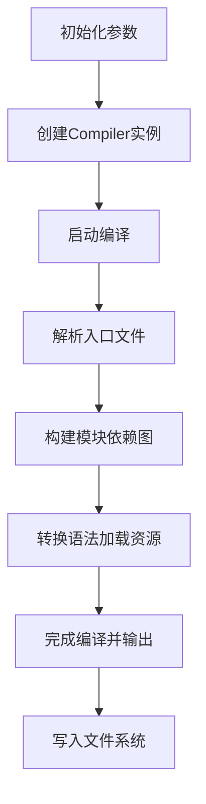
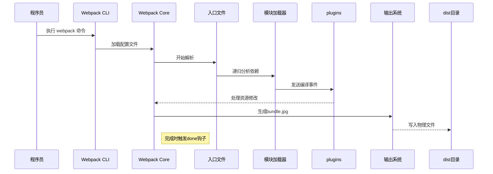

> 💭 好的，我需要详细解释Webpack的配置方式和编译过程。用户之前问了Express和Koa，说明他们可能在学前端或全栈开发，现在需要了解构建工具。考虑到Webpack的复杂性，我需要从基础开始，确保用户能理解核心概念。
>
> 首先，用户可能对Webpack有一些模糊的认识，但需要系统的梳理。我应该先介绍Webpack的核心功能，比如模块化打包、代码分割、加载器和插件。然后讲解配置方式，包括入口、出口、加载器、插件等基本配置项，可能还要提到模式（development/production）的区别。
>
> 用户可能对如何新建一个Webpack配置文件感兴趣，需要示例说明，比如webpack.config.js的结构。然后解释各个配置项的作用，比如入口文件的指定，输出路径和文件名的配置，加载器的链式调用，插件的使用等。
>
> 编译过程部分可能需要分步骤讲解，从读取配置、解析入口模块、构建依赖图、转换代码、处理插件到生成输出文件。要强调Webpack如何通过依赖图来管理所有模块，以及如何利用加载器处理不同类型的文件，如CSS、图片等。
>
> 另外，用户可能对常见配置场景感兴趣，比如处理CSS、SCSS，使用Babel转译JavaScript，处理图片和字体文件，代码分割、懒加载等。需要举一些实际的配置例子，比如如何配置css-loader和style-loader，设置Babel的presets和plugins等。
>
> 还要提到的点包括开发环境和生产环境的配置差异，比如开发服务器（webpack-dev-server）、热更新（HMR）、source maps、生产环境下的代码压缩（TerserPlugin）、CSS提取（MiniCssExtractPlugin）等。此外，可能涉及如何优化构建速度，比如缓存、并行处理等。
>
> 用户可能也存在一些常见的困惑，比如如何解决模块找不到的问题，如何处理第三方库的兼容性，或者如何优化打包后的文件大小。在回答中可以穿插这些问题的解决方法，比如使用alias配置路径别名，externals排除某些库，代码分割和Tree Shaking等。
>
> 最后，可以简要比较Webpack与其他构建工具（如Rollup、Parcel）的异同，帮助用户理解不同工具的适用场景。同时，推荐一些学习资源和最佳实践，如官方文档、常用插件列表，社区的最佳配置示例等。
>
> 需要确保解释清晰，结构层次分明，结合示例代码加深理解。还要注意术语的准确性，比如entry、loader、plugin、chunk、bundle等，避免混淆。
>
> 


---

### Webpack 深度解析：构建原理与配置指南

作为现代前端工程的核心构建工具，Webpack 以**模块化打包**为核心能力，配合**插件化架构**实现了复杂的项目构建流程。以下是其关键工作机制与配置细节：

---

#### 一、基础配置骨架

1. **安装与初始化**  
```bash
npm init -y
npm install webpack webpack-cli --save-dev
```

2. **基准配置文件** (webpack.config.js)  
```javascript
const path = require('path');

module.exports = {
  entry: './src/index.js',        // 入口起点
  output: {                       // 输出配置
    path: path.resolve(__dirname, 'dist'),
    filename: 'bundle.[contenthash].js'
  },
  mode: 'production',             // 构建模式
  module: {                       // 加载器配置
    rules: [
      { test: /\.css$/, use: ['style-loader', 'css-loader'] }
    ]
  },
  plugins: [ /* 插件配置 */ ]      // 扩展功能
};
```

---

#### 二、核心配置项详解

1. **入口起点策略**  
支持多入口打包方案：
```javascript
entry: {
  app: './src/app.js',
  admin: './src/admin.js'
}
```

2. **输出动态配置**  
```javascript
output: {
  filename: '[name].[chunkhash].js', // 动态命名
  path: path.resolve(__dirname, 'dist'),
  publicPath: '/assets/'            // CDN路径
}
```

3. **模块加载器流程**  
关键加载器配置示例：
```javascript
{
  test: /\.scss$/,
  use: [
    'style-loader',                 // 插入CSS到DOM
    {
      loader: 'css-loader',         // 解析CSS依赖
      options: { modules: true }    // 启用CSS模块化
    },
    'sass-loader'                   // 编译SASS
  ]
}
```

4. **插件机制对比**  

| 插件名称               | 功能描述                        | 典型配置示例                     |
|-------------------------|---------------------------------|----------------------------------|
| HtmlWebpackPlugin       | 自动生成HTML入口文件            | 注入所有bundle引用               |
| MiniCssExtractPlugin    | 提取CSS为独立文件               | 配合loader使用实现样式分离       |
| CleanWebpackPlugin      | 清空构建目录                    | 防止旧文件残留                   |
| DefinePlugin            | 定义全局环境变量                | 注入API密钥的空白占位符          |

---

#### 三、构建流程全解析

1. **编译级联过程**  


2. **模块解析细节**  
- 路径解析策略  
```javascript
resolve: {
  extensions: ['.js', '.jsx'],     // 自动扩展后缀
  alias: {
    '@components': path.resolve(__dirname, 'src/components/')
  }
}
```

- 外部依赖排除  
```javascript
externals: {
  jquery: 'jQuery'                // 避免打包外部库
}
```

---

#### 四、高阶优化方案

1. **代码分割策略**  
```javascript
optimization: {
  splitChunks: {
    chunks: 'all',                // 切割所有类型的chunk
    cacheGroups: {
      vendors: {
        test: /[\\/]node_modules[\\/]/,
        priority: -10             // 抽取第三方库代码
      }
    }
  }
}
```

2. **缓存加速配置**  
```javascript
module: {
  rules: [{
    test: /\.js$/,
    use: [{
      loader: 'babel-loader',
      options: {
        cacheDirectory: true     // 开启babel编译缓存
      }
    }]
  }]
}
```

3. **构建分析工具链**  
使用 webpack-bundle-analyzer 进行体积优化：
```javascript
const BundleAnalyzerPlugin = require('webpack-bundle-analyzer').BundleAnalyzerPlugin;

plugins: [
  new BundleAnalyzerPlugin({
    analyzerMode: 'static'       // 生成HTML报告文件
  })
]
```

---

#### 五、环境差异化配置

1. **开发模式专有配置**  
```javascript
devServer: {
  contentBase: './dist',        // 静态资源目录
  compress: true,               // 启用gzip压缩
  port: 3000,
  hot: true,                    // 热模块替换
  historyApiFallback: true      // SPA路由支持
}
```

2. **生产环境强化配置**  
```javascript
const TerserPlugin = require('terser-webpack-plugin');

optimization: {
  minimize: true,
  minimizer: [
    new TerserPlugin({          // 代码压缩工具
      parallel: true,           // 启用多进程
      extractComments: false    // 移除注释
    })
  ]
}
```

---

#### 六、构建流程图解



---

#### 七、技术选型对比

| **特性**          | **Webpack**                 | **Rollup**                  | **Vite**                    |
|--------------------|-----------------------------|-----------------------------|-----------------------------|
| **打包理念**      | 应用级模块打包              | 库级模块打包                | ESM即时编译                |
| **构建速度**      | 中等（需全量打包）          | 快（简单项目）              | 极快（按需编译）           |
| **代码分割**      | 支持完善                    | 需手动配置                  | 原生支持                   |
| **HMR体验**       | 通过插件实现                | 需额外配置                  | 毫秒级响应                 |
| **生态规模**      | 最大（插件丰富的）          | 针对库优化                  | 逐渐增长的                  |
| **学习曲线**      | 陡峭（需系统学习）          | 中等                        | 平缓（开发友好）           |

---

### 实践指南

**基础工作流搭建**：
1. 安装各环境依赖 (`npm install`)
2. 配置核心规则 (针对JS/CSS/图片等)
3. 设置开发服务器与生产优化
4. 添加构建脚本命令 (`"build": "webpack"`)

**常见问题处理**：
- **模块加载失败** → 检查文件路径和loader链顺序
- **生产环境打包过慢** → 启用缓存/并行处理/升级版本
- **样式不生效** → 检查loader插入顺序是否正确
- **第三方库兼容问题** → 配置Babel转换或调整polyfill策略

**进阶方向建议**：
1. 学习编写自定义插件拓展功能
2. 探索微前端架构中的Webpack联邦模块
3. 掌握Tree Shaking与作用域提升原理
4. 优化复杂项目的二次编译速度

通过系统掌握Webpack的模块化思想与构建流程，开发者能更高效地构建现代化前端应用架构。
