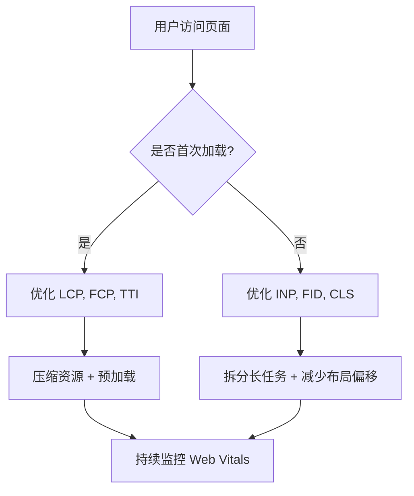

> 💭 嗯，用户现在问的是“详细说一下性能指标”。之前我们讨论了requestAnimationFrame，现在可能他们想进一步了解如何量化或评估动画或网页性能的表现。性能指标这个话题其实挺广的，我得先确定用户想要知道哪些方面的指标。
>
> 首先，用户可能是前端开发者，需要优化网页性能，所以需要了解常见的性能指标比如加载时间、渲染性能等。或者是移动端开发，关注应用的流畅度。也可能是测试人员，需要知道如何衡量系统性能。
>
> 考虑性能指标的不同层面，比如Web性能的核心指标（如LCP、FID、CLS），或者是更底层的像FPS、CPU使用率、内存占用等。此外，还有网络相关的指标，如TTFB、DNS查询时间等。
>
> 这个时候可能需要将指标分类，比如加载性能、交互性能、渲染性能、资源使用效率等方面。每个类别下举出具体的指标，解释它们的作用和理想值。
>
> 也可能用户需要知道如何测量这些指标，比如使用浏览器开发者工具、Lighthouse、WebPageTest等工具。或者如何通过代码进行性能监控，比如使用Performance API。
>
> 还要注意不同场景下的关注点不同，比如对于动画，FPS（帧率）是关键指标；对于网页加载，LCP可能更重要。另外，像首次内容绘制（FCP）、可交互时间（TTI）这些都可能需要详细说明。
>
> 可能用户也有一些误解，认为性能指标只有加载时间，而忽略了响应速度或流畅度。所以需要强调不同指标的重要性。
>
> 另外，需要提供每个指标的定义、测量方式、优化方法。例如，CLS（累积布局偏移）是怎么计算的，如何避免布局偏移；FPS如何通过浏览器的帧率面板来监测，以及如何通过优化代码和减少重绘来提高帧率。
>
> 还有，实时性能监控和长期性能追踪的区别，可能用户想了解在生产环境中如何持续跟踪这些指标，使用RUM（真实用户监控）工具。
>
> 还要考虑移动端和桌面端的性能差异，比如移动设备上资源受限，内存和CPU的影响更大，所以相关指标可能有不同的阈值。
>
> 最后，是否需要给出具体的例子或最佳实践，比如优化图片、减少JavaScript执行时间、使用Web Workers等，这些如何影响各个性能指标。
>
> 总之，我需要结构清晰地将性能指标分类，详细解释每个指标的定义、重要性、测量方法及优化建议，帮助用户全面理解和应用这些指标来提升他们的项目性能。
>
> 


### **Web 性能指标深度解析**  
性能指标是衡量网页、应用或系统运行效率的核心数据，直接决定用户体验。以下从 **关键指标定义、测量工具、优化方法、行业阈值** 多维度详细展开。

---

### **一、加载性能指标**  
主要衡量页面从请求到完全呈现的速度。

#### **1. LCP (Largest Contentful Paint)**  
- **定义**：视口内最大内容元素（如图片、文本块）的渲染时间。  
- **意义**：反映用户感知的“主要内容加载完成”时间。  
- **标准**：≤ 2.5s（良好）；＞4s（差）。  
- **优化**：  
  - 图片懒加载 + 响应式格式（WebP/AVIF）。  
  - 预加载关键资源（`<link rel="preload">`）。  
  - 优化服务器响应时间（CDN/Edge缓存）。

#### **2. FCP (First Contentful Paint)**  
- **定义**：浏览器首次渲染任何文本、图像或非空白 Canvas 的时间。  
- **意义**：用户感知“页面开始加载”的时刻。  
- **工具**：Chrome DevTools 的 Lighthouse 面板。  

#### **3. TTI (Time to Interactive)**  
- **定义**：页面完全可交互的时间（主线程空闲，事件响应延迟＜50ms）。  
- **测量**：通过 `web-vitals` 库自动捕获：  
  ```javascript
  import { getTTI } from 'web-vitals';
  getTTI(console.log);
  ```

---

### **二、交互性能指标**  
衡量用户操作（点击、滚动等）的响应速度。

#### **1. FID (First Input Delay)**  
- **定义**：用户第一次与页面交互（点击、输入）到浏览器响应的延迟。  
- **阈值**：≤ 100ms（优秀）；＞300ms（失败）。  
- **根源**：长任务（Long Tasks）阻塞主线程。  
- **优化**：  
  - 拆分长任务（使用 `setTimeout` 或 `requestIdleCallback`）。  
  - 减少第三方脚本的同步加载。  

#### **2. INP (Interaction to Next Paint)**  
- **定义**：页面所有用户交互（点击、键盘输入等）的延迟百分位数。  
- **作用**：Chrome 2024 年将替代 FID，更全面反映交互性能。  

---

### **三、视觉稳定性指标**  
衡量页面布局的意外偏移程度。

#### **1. CLS (Cumulative Layout Shift)**  
- **定义**：页面生命周期内所有意外布局偏移的总分（偏移距离 * 影响范围）。  
- **例子**：未设置尺寸的图片加载后挤占下方内容。  
- **优化**：  
  - 为图片、视频固定宽高（或使用 `aspect-ratio` CSS）。  
  - 避免在现有内容上方动态插入元素。  

#### **2. Layout Shift 事件捕获**  
```javascript
new PerformanceObserver((list) => {
  for (const entry of list.getEntries()) {
    console.log('Layout shift:', entry.value);
  }
}).observe({ type: 'layout-shift', buffered: true });
```

---

### **四、渲染性能指标**  
衡量浏览器渲染管线的效率，直接影响动画流畅度。

#### **1. FPS (Frames Per Second)**  
- **定义**：每秒渲染的帧数，60 FPS 为理想值（每帧耗时约 16.67ms）。  
- **测量**：  
  - Chrome DevTools → Performance 面板 → 录制时查看 FPS 曲线。  
  - 代码监控：  
    ```javascript
    let frameCount = 0;
    requestAnimationFrame(function loop() {
      frameCount++;
      requestAnimationFrame(loop);
    });
    // 每秒重置计数器计算 FPS
    setInterval(() => console.log('FPS:', frameCount), 1000);
    ```

#### **2. 关键渲染路径耗时**  
- **布局抖动（Layout Thrashing）**：强制同步回流（如循环中读写 `offsetHeight`）。  
- **优化手段**：  
  - 批量 DOM 操作（使用 Document Fragment）。  
  - 使用 CSS `transform` 和 `opacity` 触发 GPU 加速（避免重排）。

---

### **五、资源效率指标**  
衡量内存、CPU、网络等资源使用是否合理。

#### **1. 内存泄漏检测**  
- **现象**：页面长时间运行后内存持续增长，导致卡顿或崩溃。  
- **工具**：  
  - Chrome DevTools → Memory 面板 → 拍摄堆快照对比。  
  - `performance.memory` API（仅限 Chrome）：  
    ```javascript
    setInterval(() => {
      const memory = performance.memory;
      console.log(`Used JS Heap: ${memory.usedJSHeapSize / 1024 / 1024} MB`);
    }, 5000);
    ```

#### **2. CPU 占用率**  
- **标准**：复杂交互（如游戏）单线程 CPU 使用率 ≤ 50%。  
- **极端案例**：  
  - 未节流的 `mousemove` 事件中执行复杂计算 → CPU 100%。  
  - 优化：使用 Web Workers 将计算移出主线程。  

---

### **六、性能测量工具对比**  

| **工具**               | **适用场景**                     | **关键能力**                          |  
|-------------------------|----------------------------------|---------------------------------------|  
| **Lighthouse**          | 网页加载性能自动化审计           | 生成 LCP、CLS、FID 等 Web Vitals 数据 |  
| **Chrome DevTools**     | 实时调试渲染、内存、网络问题     | 分析长任务、强制布局、内存泄漏        |  
| **WebPageTest**         | 多地域、设备、网络条件测试       | 生成视频回放和瀑布图                 |  
| **Sentry/New Relic**    | 生产环境真实用户性能监控（RUM）  | 追踪 INP、CLS、异常错误               |  

---

### **七、性能优化标准流程图**  


---

### **八、总结**  
- **核心指标优先级**：LCP、FID、CLS 是 Google 定义的 “Core Web Vitals”，直接影响 SEO 排名。  
- **黄金法则**：  
  - **加载速度**：确保 LCP ≤ 2.5s，TTFB ≤ 800ms。  
  - **交互响应**：FID ≤ 100ms，INP ≤ 200ms。  
  - **视觉稳定**：CLS ≤ 0.1。  
- **优化不是玄学**：通过工具定位瓶颈 → 量化指标 → 验证改进效果。
