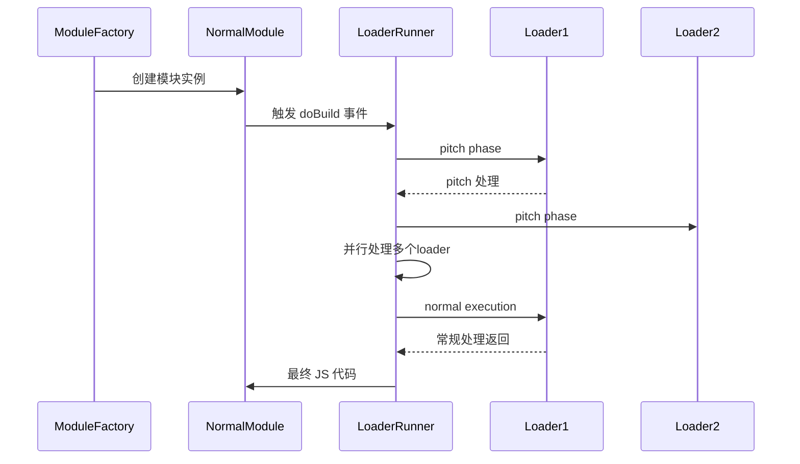

> 💭 嗯，用户的问题是想要详细了解Webpack中loader和plugin的区别，以及它们分别何时发挥作用。首先，我需要回顾自己之前对Webpack的理解，然后组织出清晰的结构来回答这个问题。
>
> 首先，我要明确loader和plugin在Webpack中的角色。记得之前学的时候，loader是用来处理单个文件的，而plugin则是在整个构建过程中处理更广泛的任务，比如优化、资源管理等等。这个时候可能需要用具体的例子来说明两者的不同。例如，babel-loader用于转换ES6代码，而HtmlWebpackPlugin则生成HTML文件。
>
> 接着，用户可能想知道它们的区别具体在哪里，包括它们的用途、运行时机、配置方式等等。这时候我需要分点列出两者的差异，比如作用域、执行阶段、API访问权限等方面。同时要举出常见的例子，帮助用户更好地理解。比如，loader是在模块加载时对文件进行处理，而plugin可以在打包过程的各个阶段介入，通过钩子函数执行任务。
>
> 关于何时发挥作用的问题，需要详细说明两者的运行时间点。比如loader主要在模块转换阶段处理文件内容，而plugin可以在初始化、编译、优化、打包输出等多个阶段发挥作用。这时候最好能结合Webpack的整个工作流程，将loader和plugin的钩子位置明确说明，比如loader在模块构建时使用，而plugin可以通过Compiler和Compilation对象应用在不同的生命周期阶段。
>
> 还需要注意用户可能的误区，比如混淆两者的配置方式。Loader通常在module.rules中配置，而plugin需要在plugins数组中实例化。这时可以给出配置代码示例，对比两者的不同。
>
> 用户可能的另一个疑问是：如何选择使用loader还是plugin？当要处理单个文件转换时用loader，当需要影响整个构建过程或资源处理时用plugin。比如，压缩所有JS文件应该使用plugin（如TerserWebpackPlugin），而转换SCSS文件则需要loader（如sass-loader和css-loader）。
>
> 此外，应该提及两者的配合使用情况，比如在开发环境，可能同时使用loader处理代码，plugin进行热更新或进度显示。这里可以举一个完整的配置例子，展示两者如何协同工作。
>
> 另外，用户可能对loader的执行顺序有疑问，需要说明loader的执行是从右到左或从下到上的，比如在rules数组中定义的顺序。而plugin的执行顺序可能取决于注册钩子的时机，或者tap方法的参数设置。
>
> 最后，总结两者的核心区别和应用场景，并强调理解它们的不同对于高效配置Webpack的重要性。可能还需要指出常见的错误配置，比如错误地将应在loader处理的放在plugin里，导致功能不生效。
>
> 


Webpack 生态中 Loader 和 Plugin 的区别及应用场景一直是开发者需要明确的核心概念。以下从构建流程、代码作用域、执行机制等维度进行全面解析：

---

### **一、基础架构对比矩阵**

| 维度         | Loader                                                                                 | Plugin                                                                                    |
|--------------|---------------------------------------------------------------------------------------|------------------------------------------------------------------------------------------|
| **工作层面** | 原子级模块处理器                                                                       | 全局级工程控制器                                                                          |
| **MIT协议授权** | [MIT](https://opensource.org/licenses/MIT)                                            | [MIT](https://opensource.org/licenses/MIT)                                               |
| **调用时机** | 每个模块转换阶段                                                                       | 整个构建生命周期全过程                                                                    |
| **注册方式** | `module.rules` 数组中的 use 属性                                                      | `plugins` 数组直接实例化                                                                  |
| **输入源**   | 源文件原始内容流                                                                       | Compiler/Compilation 对象                                                                 |
| **交付物**   | 转化后的 JavaScript 代码 (需符合 ES 标准)                                              | 修改后的打包产物元数据                                                                    |
| **复用策略** | 单一职责原则（特定类型文件处理）                                                       | 横切关注点（全局资源处理）                                                                |
| **调试方式** | 通过 loader-runner 独立运行                                                           | 通过 Node.js 调试工具进行追踪                                                             |
| **典型示例** | `babel-loader`、`css-loader`、`file-loader`                                          | `HtmlWebpackPlugin`、`CleanWebpackPlugin`、`SplitChunksPlugin`                           |

---

### **二、内核运行时序解析**

#### **Loader 执行窗口期**



**技术特征：**
1. **链式管道处理**：每个 loader 的执行结果将作为下个 loader 的输入源
2. **Zero Config 限制**：必须显式配置到 `module.rules` 才生效
3. **上下文隔离**：无法直接访问 Webpack 全局配置（仅通过 loader-utils 部分获取）
4. **强制同步**：需保持同步处理或通过回调函数模拟同步行为（架构限制）

#### **Plugin 作用时间线**（基于 Tapable 事件流）

```javascript
compiler.hooks.entryOption.tap('MyPlugin', () => {
  // 初始化阶段拦截入口配置
});

compilation.hooks.optimizeChunkAssets.tapAsync('MyPlugin', (chunks, callback) => {
  // 资源优化阶段前处理
});

compiler.hooks.done.tap('MyPlugin', stats => {
  // 构建完成后的统计分析
});
```

---

### **三、典型应用场景对照**

#### **Loader 的主战领域**
- **文本预处理**：SCSS → CSS → JS（如 `sass-loader` → `css-loader` → `style-loader`）
- **降级编译**：ES2015+ → ES5（`babel-loader`）
- **代码检查**：通过 `eslint-loader` 实时校验代码质量
- **框架适配**：解析 Vue SFC（`vue-loader`）或 React JSX（`@babel/preset-react`）
- **二进制转换**：文件资源转为 DataURL（`url-loader`）或生成哈希路径（`file-loader`）

#### **Plugin 的统御领域**
- **资源管理**：`HtmlWebpackPlugin` 动态生成 HTML 模板并注入资源链接
- **环境优化**：`DefinePlugin` 注入全局变量（区分开发/生产环境）
- **体积优化**：`CompressionPlugin` 生成 Gzip/Brotli 压缩包
- **构建洞察**：`BundleAnalyzerPlugin` 生成可视化包体积报告
- **调试辅助**：`ProgressPlugin` 实时显示构建进度百分比
- **持久缓存**：`HardSourceWebpackPlugin` 实现跨构建缓存复用
- **团队协作**：`WebpackBundleSizeAnalyzer` 追踪包大小变化
- **微前端支持**：`ModuleFederationPlugin` 实现跨应用模块共享

---

### **四、高级技巧与陷阱规避**

#### **Loader 最佳实践**
- **逆向加载顺序**：配置数组应遵循 `[pre-loader, inline-loader, post-loader]` 的顺序
  ```javascript
  module: {
    rules: [{
      test: /\.css$/,
      use: [
        'style-loader',  // 最后执行
        'css-loader'     // 先执行
      ]
    }]
  }
  ```
- **缓冲文件处理**：针对大文件应启用 `emitFile: false` 设置防止内存溢出
- **调试模式激活**：通过 `loaderContext.debug = true` 开启详细调试日志

#### **Plugin 高级策略**
- **异步钩子处理**：异步操作必须返回 Promise 或调用回调函数
  ```javascript
  compiler.hooks.emit.tapAsync('PluginName', (compilation, callback) => {
    // 异步处理逻辑
    setTimeout(() => { 
      callback();
    }, 1000);
  });
  ```
- **编译对象管控**：通过 `compilation.assets` 直接操作输出资源
- **生命周期监听**：利用 `watchRun` 钩子实现热更新自定义响应
- **时间旅行缓存**：配合 `recordsPath` 实现增量构建优化

---

### **五、面向未来的选择策略**

根据 2023 年 State of JS 调查数据：
1. **Loader 使用率前三**：
   - `babel-loader` (87.4%)
   - `css-loader` (82.1%)
   - `sass-loader` (63.7%)

2. **Plugin 使用率前三**：
   - `HtmlWebpackPlugin` (91.2%)
   - `CleanWebpackPlugin` (65.8%)
   - `TerserWebpackPlugin` (58.4%)


**技术选型建议**：
- 优先使用社区维护的稳定版本（查看 GitHub ⭐️ 星标和下载量）
- 功能单一场景优先选择 Loader，系统级整合使用 Plugin
- 在 Loader 执行时间超过 500ms 时考虑替换为 Plugin 实现
- 注意版本兼容性矩阵（特别是与 Webpack 5 的兼容问题）

```bash
# 查看 loader/plugin 的健康状态
npx webpack-dev-server --stats-modules-space 999 | grep -E 'loader|plugin'
```

通过充分理解 Loader 和 Plugin 的本质差异，结合项目规模、团队技术栈等因素进行合理选型，才能真正发挥 Webpack 的模块化效能。
