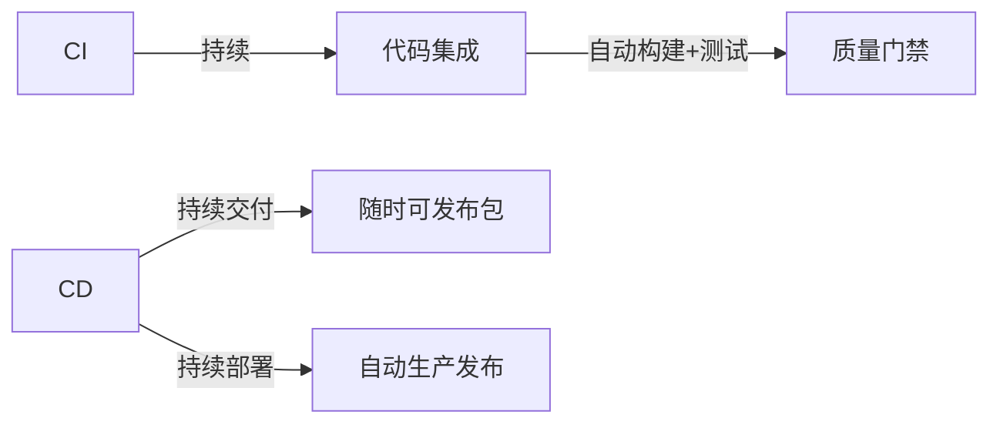
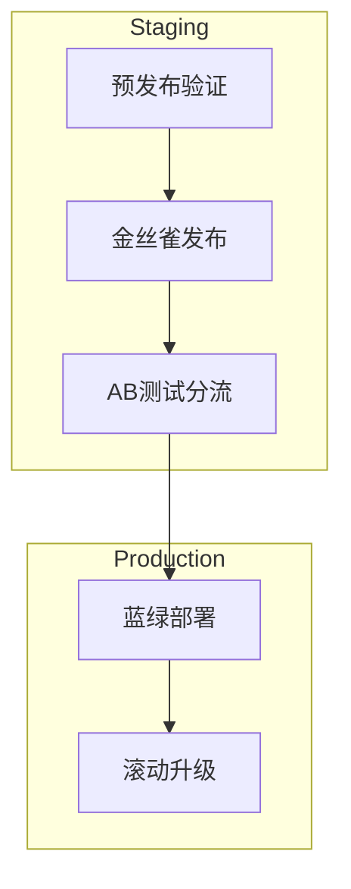

> 💭 嗯，用户问我对CICD的理解。首先，CICD是持续集成和持续交付/部署的缩写。我需要简要解释每个部分是什么，以及它们如何协同工作。可能需要从定义开始，然后讲它们的作用，比如自动化构建、测试和部署。
>
> 用户在求职环境中可能想了解我的理论基础，或者想知道我在实际项目中的经验。所以，最好是结合理论和实际例子。比如，持续集成如何通过自动运行测试减少集成问题，持续交付如何确保随时可以发布，持续部署如何自动上线。
>
> 还要区分持续交付和持续部署的不同，CD有时候会被混淆。持续交付是指代码经过测试可以随时部署，但需要手动触发，而持续部署是自动部署到生产环境。需要明确这两个概念的区别。
>
> 另外，用户可能想知道CICD带来的好处，比如加快发布速度，提高软件质量，减少人工错误。还有相关的工具，比如Jenkins、GitLab CI、GitHub Actions、Travis CI等，可以提到其中几个，说明它们的用途。
>
> 也许用户也关心如何实施CICD，可能需要讲一下最佳实践，比如版本控制、自动化测试、代码审查等。也可以提到流水线（Pipeline）的概念，代码从提交到部署经过哪些阶段，比如构建、测试、部署到测试环境、用户验收测试、生产部署等。
>
> 要注意用户可能的深度，如果是技术面试，可能会深入问一些细节，比如如何解决集成中的冲突，如何处理测试失败的情况，回滚策略等等。但用户现在只是一般性询问，所以不用太深入，保持全面即可。
>
> 不过用户提供的例子回答结构很清晰，分为概念定义、流程、好处、工具和优化这几个部分。我需要按照类似结构来组织内容，确保每个部分解释清楚，不遗漏关键点。
>
> 还要考虑是否提到相关的DevOps文化，因为CICD通常是DevOps的一部分，强调开发和运维的合作。但可能不需要展开太多，除非用户问到。这里保持聚焦在CICD本身。
>
> 需要确认CICD的关键组成部分：自动化测试、版本控制集成、构建自动化、部署自动化、监控和反馈。这些都是重要环节，可以分别阐述它们的作用。
>
> 可能还需要提到一些挑战，比如测试覆盖率不足会影响CICD效果，或者需要维护复杂的流水线配置。但用户的问题主要是问理解，可能不需要讲挑战，除非被问到，但例子中没有提到挑战，所以可以省略。
>
> 总结下来，我需要分点解释CI、CD（持续交付和部署），强调自动化、快速反馈和频繁交付。给出实际应用的例子，比如每当代码提交到仓库就触发构建和测试，通过后自动部署到测试环境，最后手动或自动部署生产。
>
> 


对于CICD（持续集成/持续交付与部署）的理解，可以从其核心目标、工作流程、技术价值及实现方式展开：

---

### **一、核心维度解析**

#### **1. 概念分层**


#### **2. 复合价值**
| 维度          | CI                    | CD                  |
|--------------|-----------------------|---------------------|
| **目标定位**  | 开发阶段的代码质量防线   | 交付环节的流程加速    |
| **风险窗口**  | 缩短集成问题暴露周期     | 降低发布操作失误率    |
| **度量指标**  | 构建成功率 >99%        | 部署频率升至天/小时级 |

---

### **二、技术闭环实现**

#### **1. CI核心链路**
```javascript
// 以Git Hook触发的CI流程示例
git push origin feature → 
  触发Webhook → 
    CI服务器拉取代码 → 
      并行执行:
        - 单元测试（Jest/Mocha）
        - 静态检查（ESLint/SonarQube）
        - 构建制品（Docker Image） →
          质量关卡：
            if(测试通过) → 合并到主分支
            else → 实时通知开发者
```

#### **2. CD分级策略**


---

### **三、技术栈选型方案**

#### **1. 基础设施矩阵**
| 类型          | 代表性工具               | 适用场景                 |
|--------------|-------------------------|------------------------|
| **SaaS平台**  | GitHub Actions          | 开源项目/轻量级部署       |
| **自建服务**  | Jenkins+Blue Ocean      | 企业级复杂流水线          |
| **云原生**    | ArgoCD + Tekton         | Kubernetes环境         |
| **混合架构**  | GitLab CI + Ansible     | 传统服务器+云混合部署     |

#### **2. Pipeline设计范式**
```yaml
# GitHub Actions多环境部署示例
jobs:
  build:
    runs-on: ubuntu-latest
    steps:
      - uses: actions/checkout@v4
      - run: npm ci && npm test
      - name: Build Docker
        uses: docker/build-push-action@v3
        with:
          tags: ${{ env.REGISTRY }}/app:${{ github.sha }}
  
  deploy-staging:
    needs: build
    runs-on: self-hosted
    environment: staging
    steps:
      - uses: Azure/k8s-deploy@v1
        with:
          manifests: ./k8s/*
  
  canary-prod:
    if: github.ref == 'refs/heads/main'
    needs: deploy-staging
    environment: production
    uses: ./.github/workflows/canary.yml
```

---

### **四、效能优化实践**

#### **1. 瓶颈突破策略**
```python
# 分布式缓存加速示例（Python）
from cachetools import TTLCache

class BuildCache:
    def __init__(self):
        self.cache = TTLCache(maxsize=1000, ttl=3600)
    
    def get_cache_key(self, deps):
        return hash(frozenset(deps.items()))
    
    def cached_build(self, dependencies):
        key = self.get_cache_key(dependencies)
        if key in self.cache:
            return self.cache[key]
        # 执行真实构建流程...
```

#### **2. 度量指标体系**
| 指标类型        | 监控方法                | 健康阈值           |
|----------------|-----------------------|--------------------|
| **构建耗时**    | Prometheus+Grafana    | <5分钟（95分位）   |
| **流水线吞吐**  | Elasticsearch日志分析 | >20次/天/项目      |
| **失败追溯**    | Sentry异常追踪         | MTTR <1小时        |

---

### **五、演进方向**
1. **混沌工程注入**：在CD环节模拟网络分区等故障
2. **AI辅助优化**：通过历史数据预测构建失败风险
3. **策略即代码**：采用OPA（Open Policy Agent）实现部署策略控制

通过这种立体化的实现方式，CICD最终成为现代软件工程的**核心中枢系统**，既控制质量风险又驱动业务敏捷。
