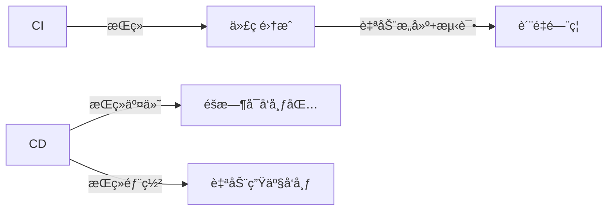
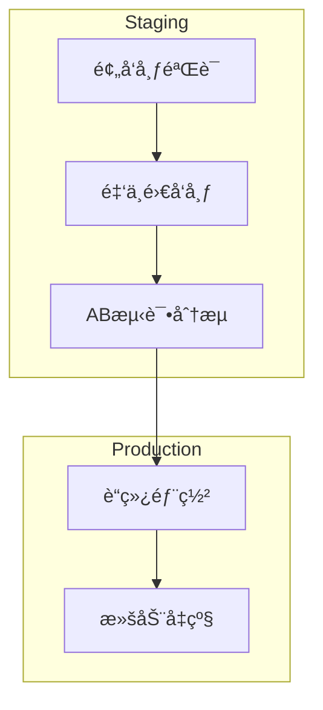

> 💭 嗯，用户问我对CICDçš„ç†è§£ã€‚首先，CICD是æŒç»­é›†æˆå’ŒæŒç»­äº¤ä»˜/部署的缩写。我需è¦ç®€è¦è§£é‡Šæ¯ä¸ªéƒ¨åˆ†æ˜¯ä»€ä¹ˆï¼Œä»¥åŠå®ƒä»¬å¦‚何ååŒå·¥ä½œã€‚å¯èƒ½éœ€è¦ä»å®šä¹‰å¼€å§‹ï¼Œç„¶å讲它们的作用，比如自动化æ„建ã€æµ‹è¯•å’Œéƒ¨ç½²ã€‚
>
> 用户在求èŒç¯å¢ƒä¸­å¯èƒ½æƒ³äº†è§£æˆ‘çš„ç†è®ºåŸºç¡€ï¼Œæˆ–者想知é“我在å®é™…项目中的ç»éªŒã€‚所以，最好是结åˆç†è®ºå’Œå®é™…例å­ã€‚比如，æŒç»­é›†æˆå¦‚何通过自动è¿è¡Œæµ‹è¯•å‡å°‘集æˆé—®é¢˜ï¼ŒæŒç»­äº¤ä»˜å¦‚何确ä¿éšæ—¶å¯ä»¥å‘布，æŒç»­éƒ¨ç½²å¦‚何自动上线。
>
> 还è¦åŒºåˆ†æŒç»­äº¤ä»˜å’ŒæŒç»­éƒ¨ç½²çš„ä¸åŒï¼ŒCD有时候会被混淆。æŒç»­äº¤ä»˜æ˜¯æŒ‡ä»£ç ç»è¿‡æµ‹è¯•å¯ä»¥éšæ—¶éƒ¨ç½²ï¼Œä½†éœ€è¦æ‰‹åŠ¨è§¦å‘，而æŒç»­éƒ¨ç½²æ˜¯è‡ªåŠ¨éƒ¨ç½²åˆ°ç”Ÿäº§ç¯å¢ƒã€‚需è¦æ˜ç¡®è¿™ä¸¤ä¸ªæ¦‚念的区别。
>
> å¦å¤–，用户å¯èƒ½æƒ³çŸ¥é“CICD带æ¥çš„好处，比如加快å‘布速度，æ高软件质é‡ï¼Œå‡å°‘人工错误。还有相关的工具，比如Jenkinsã€GitLab CIã€GitHub Actionsã€Travis CI等，å¯ä»¥æ到其中几个，说æ˜å®ƒä»¬çš„用途。
>
> 也许用户也关心如何å®æ–½CICD，å¯èƒ½éœ€è¦è®²ä¸€ä¸‹æœ€ä½³å®è·µï¼Œæ¯”如版本æ§åˆ¶ã€è‡ªåŠ¨åŒ–测试ã€ä»£ç å®¡æŸ¥ç­‰ã€‚也å¯ä»¥æ到æµæ°´çº¿ï¼ˆPipeline）的概念，代ç ä»æ交到部署ç»è¿‡å“ªäº›é˜¶æ®µï¼Œæ¯”如æ„建ã€æµ‹è¯•ã€éƒ¨ç½²åˆ°æµ‹è¯•ç¯å¢ƒã€ç”¨æˆ·éªŒæ”¶æµ‹è¯•ã€ç”Ÿäº§éƒ¨ç½²ç­‰ã€‚
>
> è¦æ³¨æ„用户å¯èƒ½çš„深度，如æœæ˜¯æŠ€æœ¯é¢è¯•ï¼Œå¯èƒ½ä¼šæ·±å…¥é—®ä¸€äº›ç»†èŠ‚，比如如何解决集æˆä¸­çš„冲çªï¼Œå¦‚何处ç†æµ‹è¯•å¤±è´¥çš„情况，å›æ»šç­–略等等。但用户ç°åœ¨åªæ˜¯ä¸€èˆ¬æ€§è¯¢é—®ï¼Œæ‰€ä»¥ä¸ç”¨å¤ªæ·±å…¥ï¼Œä¿æŒå…¨é¢å³å¯ã€‚
>
> ä¸è¿‡ç”¨æˆ·æ供的例å­å›ç­”结æ„很清晰，分为概念定义ã€æµç¨‹ã€å¥½å¤„ã€å·¥å…·å’Œä¼˜åŒ–这几个部分。我需è¦æŒ‰ç…§ç±»ä¼¼ç»“æ„æ¥ç»„织内容，确ä¿æ¯ä¸ªéƒ¨åˆ†è§£é‡Šæ¸…楚，ä¸é—æ¼å…³é”®ç‚¹ã€‚
>
> 还è¦è€ƒè™‘是å¦æ到相关的DevOps文化，因为CICD通常是DevOps的一部分，强调开å‘å’Œè¿ç»´çš„åˆä½œã€‚但å¯èƒ½ä¸éœ€è¦å±•å¼€å¤ªå¤šï¼Œé™¤é用户问到。这里ä¿æŒèšç„¦åœ¨CICD本身。
>
> 需è¦ç¡®è®¤CICD的关键组æˆéƒ¨åˆ†ï¼šè‡ªåŠ¨åŒ–测试ã€ç‰ˆæœ¬æ§åˆ¶é›†æˆã€æ„建自动化ã€éƒ¨ç½²è‡ªåŠ¨åŒ–ã€ç›‘æ§å’Œå馈。这些都是é‡è¦ç¯èŠ‚，å¯ä»¥åˆ†åˆ«é˜è¿°å®ƒä»¬çš„作用。
>
> å¯èƒ½è¿˜éœ€è¦æ到一些挑战，比如测试覆盖ç‡ä¸è¶³ä¼šå½±å“CICD效æœï¼Œæˆ–者需è¦ç»´æŠ¤å¤æ‚çš„æµæ°´çº¿é…置。但用户的问题主è¦æ˜¯é—®ç†è§£ï¼Œå¯èƒ½ä¸éœ€è¦è®²æŒ‘战，除é被问到，但例å­ä¸­æ²¡æœ‰æ到挑战，所以å¯ä»¥çœç•¥ã€‚
>
> 总结下æ¥ï¼Œæˆ‘需è¦åˆ†ç‚¹è§£é‡ŠCIã€CD（æŒç»­äº¤ä»˜å’Œéƒ¨ç½²ï¼‰ï¼Œå¼ºè°ƒè‡ªåŠ¨åŒ–ã€å¿«é€Ÿå馈和频ç¹äº¤ä»˜ã€‚给出å®é™…应用的例å­ï¼Œæ¯”如æ¯å½“代ç æ交到仓库就触å‘æ„建和测试，通过å自动部署到测试ç¯å¢ƒï¼Œæœ€å手动或自动部署生产。
>
> 


对äºCICD（æŒç»­é›†æˆ/æŒç»­äº¤ä»˜ä¸éƒ¨ç½²ï¼‰çš„ç†è§£ï¼Œå¯ä»¥ä»å…¶æ ¸å¿ƒç›®æ ‡ã€å·¥ä½œæµç¨‹ã€æŠ€æœ¯ä»·å€¼åŠå®ç°æ–¹å¼å±•å¼€ï¼š

---

### **一ã€æ ¸å¿ƒç»´åº¦è§£æ**

#### **1. 概念分层**


#### **2. å¤åˆä»·å€¼**
| 维度          | CI                    | CD                  |
|--------------|-----------------------|---------------------|
| **目标定ä½**  | å¼€å‘阶段的代ç è´¨é‡é˜²çº¿   | 交付ç¯èŠ‚çš„æµç¨‹åŠ é€Ÿ    |
| **é£é™©çª—å£**  | 缩短集æˆé—®é¢˜æš´éœ²å‘¨æœŸ     | é™ä½å‘布æ“ä½œå¤±è¯¯ç‡    |
| **度é‡æŒ‡æ ‡**  | æ„建æˆåŠŸç‡ >99%        | 部署频ç‡å‡è‡³å¤©/å°æ—¶çº§ |

---

### **二ã€æŠ€æœ¯é—­ç¯å®ç°**

#### **1. CI核心链路**
```javascript
// 以Git Hook触å‘çš„CIæµç¨‹ç¤ºä¾‹
git push origin feature → 
  触å‘Webhook → 
    CIæœåŠ¡å™¨æ‹‰å–ä»£ç  â†’ 
      并行执行:
        - å•å…ƒæµ‹è¯•ï¼ˆJest/Mocha）
        - é™æ€æ£€æŸ¥ï¼ˆESLint/SonarQube）
        - æ„建制å“（Docker Image） →
          è´¨é‡å…³å¡ï¼š
            if(测试通过) → åˆå¹¶åˆ°ä¸»åˆ†æ”¯
            else → å®æ—¶é€šçŸ¥å¼€å‘者
```

#### **2. CD分级策略**


---

### **三ã€æŠ€æœ¯æ ˆé€‰å‹æ–¹æ¡ˆ**

#### **1. 基础设施矩阵**
| ç±»å‹          | 代表性工具               | 适用场景                 |
|--------------|-------------------------|------------------------|
| **SaaSå¹³å°**  | GitHub Actions          | å¼€æºé¡¹ç›®/è½»é‡çº§éƒ¨ç½²       |
| **自建æœåŠ¡**  | Jenkins+Blue Ocean      | ä¼ä¸šçº§å¤æ‚æµæ°´çº¿          |
| **云åŸç”Ÿ**    | ArgoCD + Tekton         | Kubernetesç¯å¢ƒ         |
| **æ··åˆæ¶æ„**  | GitLab CI + Ansible     | 传统æœåŠ¡å™¨+云混åˆéƒ¨ç½²     |

#### **2. Pipeline设计范å¼**
```yaml
# GitHub Actions多ç¯å¢ƒéƒ¨ç½²ç¤ºä¾‹
jobs:
  build:
    runs-on: ubuntu-latest
    steps:
      - uses: actions/checkout@v4
      - run: npm ci && npm test
      - name: Build Docker
        uses: docker/build-push-action@v3
        with:
          tags: ${{ env.REGISTRY }}/app:${{ github.sha }}
  
  deploy-staging:
    needs: build
    runs-on: self-hosted
    environment: staging
    steps:
      - uses: Azure/k8s-deploy@v1
        with:
          manifests: ./k8s/*
  
  canary-prod:
    if: github.ref == 'refs/heads/main'
    needs: deploy-staging
    environment: production
    uses: ./.github/workflows/canary.yml
```

---

### **å››ã€æ•ˆèƒ½ä¼˜åŒ–å®è·µ**

#### **1. 瓶颈çªç ´ç­–ç•¥**
```python
# 分布å¼ç¼“存加速示例（Python）
from cachetools import TTLCache

class BuildCache:
    def __init__(self):
        self.cache = TTLCache(maxsize=1000, ttl=3600)
    
    def get_cache_key(self, deps):
        return hash(frozenset(deps.items()))
    
    def cached_build(self, dependencies):
        key = self.get_cache_key(dependencies)
        if key in self.cache:
            return self.cache[key]
        # 执行真å®æ„建æµç¨‹...
```

#### **2. 度é‡æŒ‡æ ‡ä½“ç³»**
| æŒ‡æ ‡ç±»å‹        | 监æ§æ–¹æ³•                | å¥åº·é˜ˆå€¼           |
|----------------|-----------------------|--------------------|
| **æ„建耗时**    | Prometheus+Grafana    | <5分钟（95分ä½ï¼‰   |
| **æµæ°´çº¿åå**  | Elasticsearch日志分æ | >20次/天/项目      |
| **失败追溯**    | Sentry异常追踪         | MTTR <1å°æ—¶        |

---

### **五ã€æ¼”进方å‘**
1. **混沌工程注入**：在CDç¯èŠ‚模拟网络分区等故障
2. **AI辅助优化**：通过å†å²æ•°æ®é¢„测æ„建失败é£é™©
3. **ç­–ç•¥å³ä»£ç **：采用OPA（Open Policy Agent）å®ç°éƒ¨ç½²ç­–ç•¥æ§åˆ¶

通过这ç§ç«‹ä½“化的å®ç°æ–¹å¼ï¼ŒCICD最终æˆä¸ºç°ä»£è½¯ä»¶å·¥ç¨‹çš„**核心中æ¢ç³»ç»Ÿ**，既æ§åˆ¶è´¨é‡é£é™©åˆé©±åŠ¨ä¸šåŠ¡æ•æ·ã€‚
