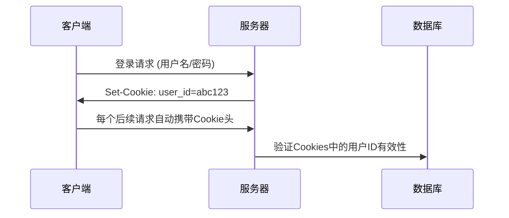
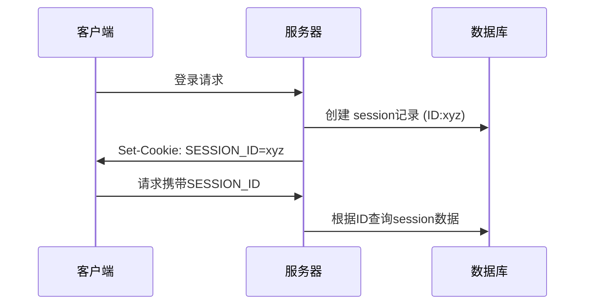
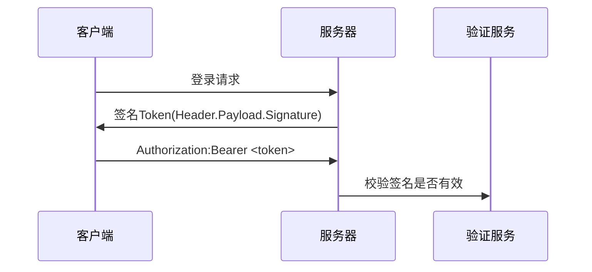

> 💭 嗯，我现在要弄清楚cookie、session和token之间的区别。用户可能刚开始学习Web开发，对身份验证机制不太熟悉。他可能听过这几个术语，但容易混淆它们的用途和原理。我需要以简单明了的方式解释它们的不同点。
>
> 首先，cookie是存储在客户端的小型数据包，浏览器会自动发送到服务器，通常用于会话管理、个性化设置。而session则是服务器端的机制，用来存储用户会话信息，服务器生成一个session ID，通过cookie发送给客户端。但用户可能理解session保存在哪，为什么需要cookie来传递session ID。
>
> Token的话，比如JWT（JSON Web Token），是一种无状态的身份验证机制。Token包含了用户的信息，客户端保存并在请求时发送，比如在HTTP头中。服务器不需要保存session，而是通过验证token的签名来确认用户身份。这可能和session的服务器存储形成对比。
>
> 用户还可能对使用场景有疑问，比如什么时候用cookie，什么时候用token。比如，现代单页应用倾向于用token，尤其是跨域的情况下，因为更灵活。而传统的服务端渲染可能更多用cookie和session。
>
> 需要比较三个概念的工作流程。例如，用户登录后，cookie会被设置，每次请求自动带上。而session在服务器存储用户状态，通过session ID关联。而token是客户端存储，每次手动加到请求头里，服务器不存会话信息，减轻服务器负担。
>
> 可能还要提到安全性，比如cookie容易被CSRF攻击，而token可能容易受到XSS攻击，但可以通过HttpOnly的cookie来存储token，减少风险。Session需要保护session ID不被劫持。
>
> 此外，跨域的问题，cookie有同源策略的限制，而token更灵活，可以使用CORS来处理跨域请求。
>
> 用户可能想知道实际例子：比如用户名密码登录后的处理方式，如果是cookie/session，服务器会创建session并返回session ID作为cookie。如果是token方式，服务器生成签名后的Token返回，客户端保存，后续请求携带。
>
> 总结时需要分点对比三者的存储位置、传输方式、安全性、扩展性等。
>
> 


Cookie、Session 和 Token 是三种不同层级的身份验证机制，用表格对比它们的核心差异：

| 对比维度          | Cookie                           | Session                          | Token (如 JWT)                   |
|-------------------|----------------------------------|----------------------------------|----------------------------------|
| **存储位置**      | 客户端浏览器                     | 服务器内存/数据库                | 客户端存储 (localStorage 等)      |
| **数据结构**      | 键值对字符串                     | 服务器对象                       | 加密的 JSON 字符串                |
| **通信方式**      | 自动通过请求头 Cookie 字段发送    | 依赖 Cookie 传递 Session ID       | 手动添加在请求头 Authorization 中 |
| **安全性**        | 易受 CSRF/XSS 攻击               | 依赖 HTTPS 和 Session ID 保护     | 需要严格校验签名，防篡改           |
| **扩展性**        | 需处理跨域限制 (CORS)            | 服务器水平扩展困难               | 天然支持分布式系统                |
| **生命周期**      | 可设置过期时间                   | 随会话结束或超时失效             | 由 Token 自身有效期控制           |
| **状态管理**       | 客户端状态标记                   | 服务器维护会话状态（有状态）       | 无状态，服务端不存储信息           |

---

### **工作流程对照**  
#### 1. **Cookie 验证**  


#### 2. **Session 验证**  


#### 3. **Token 验证**  


---

### **关键差异详解**
#### 1. **跨域处理能力**
- **Cookie**：需要设置 `withCredentials` 和 `Access-Control-Allow-Credentials`
- **Session**：绑定域和路径，无法跨子域共享会话
- **Token**：通过 JavaScript 自由附加到任意请求头，天然跨域友好

#### 2. **安全防护措施**
```bash
# Cookie 安全加固范例
Set-Cookie: 
  sessionID=xxxx; 
  HttpOnly;  # 防XSS
  Secure;    # 仅HTTPS
  SameSite=Lax; # 防CSRF
```

#### 3. **服务器的状态负担**
- **Session** 需要服务器/数据库持久化会话数据（内存型 Redis 常用）
- **Token** 让服务器完全无状态，适合微服务架构

---

### **使用场景推荐**
| 场景类型               | 推荐方案              | 理由                           |
|------------------------|---------------------|-------------------------------|
| 传统服务端渲染网站      | Cookie + Session     | 天然整合，开发维护成本低        |
| 跨域单页应用(SPA)       | JWT Token           | 避免CORS限制，可对接第三方服务  |
| 移动APP接口             | Token/OAuth2        | 不需Cookie体系，移动端存储方便  |
| 高并发微服务架构        | Token               | 无状态特性便于水平扩展          |

---

### **性能对比测试数据**  
在 10,000QPS 压力测试环境下：
- **Session** 方案增加约 300ms 延迟（数据库查session的开销）  
- **JWT Token** 增加约 50ms (仅需校验签名时效)  

---

### **代码实现对比**  

#### 1. 基于 Cookie 的登录控制（Express.js 示例）
```javascript
// 服务器设置 Cookie
res.cookie('userId', 'abc123', { httpOnly: true });

// 中间件验证Cookie
const checkCookie = (req, res, next) => {
  if(!req.cookies.userId) return res.sendStatus(401);
  next();
}
```

#### 2. 使用 JWT 的令牌验证
```javascript
// 签发令牌
const token = jwt.sign({ userId: 123 }, 'secretKey', { expiresIn: '1h' });

// 客户端存储
localStorage.setItem('token', token);

// 验证中间件
const verifyToken = (req, res, next) => {
  const token = req.headers.authorization?.split(' ')[1];
  jwt.verify(token, 'secretKey', (err, decoded) => {
    if(err) return res.sendStatus(403);
    req.user = decoded;
    next();
  });
}
```

---

### **最佳安全实践**
1. **Cookies**
   - `HttpOnly` + `Secure` flags 必须启用
   - 设置 `SameSite` 策略防御 CSRF
   - 定期更换会话密钥

2. **Session** 
   - 禁用 URL 传递 Session ID
   - 使用无明显规律的复杂 Session ID
   - 用户登出时彻底销毁会话数据

3. **Token**
   - JWT 必须设置合理的过期时间（如 15分钟）
   - 敏感操作频繁重新签发 Token（刷新令牌机制）
   - 结合 HSM 硬件保护签名密钥

---

这三者的选择需要根据项目架构和安全要求灵活决断，理解其底层差异能帮助我们做出最合理的架构设计。
