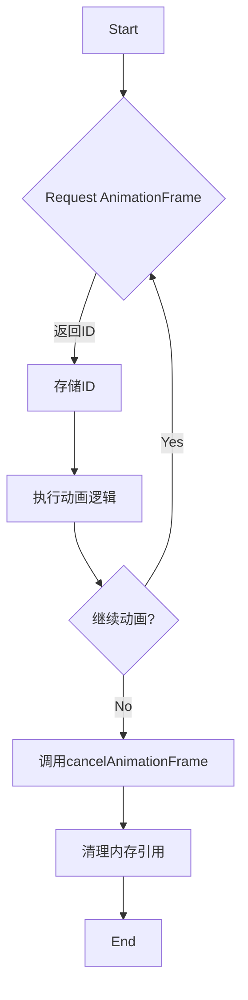

> 💭 好的，我现在需要回答用户的问题：“实现动画 requestAnimationFrame 怎么取消”。用户之前在讨论React Hooks的限制，现在转而问如何取消requestAnimationFrame，可能是他们在使用Hooks处理动画时遇到了取消动画帧的问题。
>
> 首先，我需要回忆requestAnimationFrame的基础知识。这个API用于在下一次浏览器重绘之前执行动画帧，通常返回一个id，用于取消请求。要取消的话，需要用cancelAnimationFrame(id)。所以，基本用法是存储返回的id，并在需要取消时调用cancel方法。
>
> 但用户可能是在React组件中使用requestAnimationFrame，尤其是在函数组件中使用Hooks的情况下，所以需要结合React的生命周期来处理取消操作。例如，在函数组件中，可能需要在组件卸载或者某个状态变化时取消动画帧，以避免内存泄漏或状态更新后的错误执行。
>
> 在类组件中，通常在componentWillUnmount中使用cancelAnimationFrame，但在函数组件中，需要使用useEffect的清理函数。这可能是在React Hooks中常见的问题，如何在useEffect中正确地开始和取消动画循环。
>
> 用户可能遇到的场景是：在useEffect中启动了一个动画循环，但是在组件卸载后，动画帧的回调可能仍然试图执行，导致错误或者内存泄漏。需要确保在组件卸载时或者依赖项变化时取消正在进行的动画。
>
> 因此，正确的做法是将requestAnimationFrame返回的id保存在一个变量中，然后在useEffect的清理函数中调用cancelAnimationFrame。但是，由于React Hooks的闭包特性，直接在useEffect中存储id可能会有问题，因为清理函数可能捕获的是旧的id。因此，可能需要使用useRef来存储当前的id，以确保清理函数能够访问到最新的值。
>
> 另外，动画循环通常是递归调用requestAnimationFrame，所以需要在取消时停止这个递归过程。例如，用一个标志变量（如isRunning）或者ref来跟踪动画是否应该继续运行，这样可以避免在取消后仍然执行回调。
>
> 还有一个可能的问题是，当依赖项变化时，useEffect会重新执行，这时需要取消之前的动画并启动新的。这需要在useEffect的清理函数中正确处理取消操作，同时确保新的effect能正确启动新的动画循环。
>
> 可能的代码结构是：
>
> useEffect(() => {
>
>   let animationId;
>
>   const animate = () => {
>
>     // 动画逻辑
>
>     animationId = requestAnimationFrame(animate);
>
>   };
>
>   animate();
>
>   return () => {
>
>     cancelAnimationFrame(animationId);
>
>   };
>
> }, [dependencies]);
>
> 但这里潜在的问题是，当effect重新执行时（比如依赖项变化），清理函数运行的是上一次effect中的animationId，而这个id可能在当前effect已经被覆盖。不过实际上，每次effect运行都会生成一个新的animationId，并且清理函数会在下一次effect运行前取消之前的那一次请求，这应该是正确的。
>
> 不过，另一种更稳妥的方式是使用ref来保存animationId，尤其是在动画循环过程中可能需要动态取消的情况下。例如：
>
> const animationRef = useRef();
>
> useEffect(() => {
>
>   const animate = () => {
>
>     // 动画逻辑
>
>     animationRef.current = requestAnimationFrame(animate);
>
>   };
>
>   animate();
>
>   return () => {
>
>     cancelAnimationFrame(animationRef.current);
>
>   };
>
> }, []);
>
> 不过需要注意，当依赖项数组为空时，effect只运行一次，但当组件卸载时会取消动画。这种情况下，如果在动画过程中有状态变化需要停止动画，可能需要额外的处理，比如使用一个state变量控制动画是否继续。
>
> 还可能遇到的问题是，在React 18的严格模式下，useEffect可能被调用两次，导致动画被意外启动两次，所以需要通过清理函数彻底取消之前的效果。这也强调了在清理函数中正确取消的重要性。
>
> 总结，用户的问题需要在React组件中正确利用cancelAnimationFrame和useEffect的清理函数来取消动画循环，确保在组件卸载或依赖变化时停止动画，避免内存泄漏和错误。
>
> 


在 JavaScript 中取消通过 `requestAnimationFrame` 启动的动画，需用到 `cancelAnimationFrame`，这是与前者配套的 API。以下是精细化操作指南和实际场景示例：

---

### 一、基础取消流程 -- *适用于简单场景*
典型的启停控制结构，适用于一次性动画：

```javascript
let animationId;

// 启动动画循环
function startAnimation() {
  function animate() {
    // ... 动画逻辑 ...
    animationId = requestAnimationFrame(animate); // 递归调用
  }
  animationId = requestAnimationFrame(animate);
}

// 终止动画
function stopAnimation() {
  cancelAnimationFrame(animationId);
}
```

**注意**：全局变量 `animationId` 可能引发多实例冲突，在复杂场景需优化结构。

---

### 二、React Hooks 场景 -- *结合组件生命周期*
在 React 函数组件中，通过 `useRef` + `useEffect` 实现精准控制：

```jsx
import { useEffect, useRef } from 'react';

function AnimatedComponent() {
  const animationRef = useRef(null);
  
  useEffect(() => {
    const animate = (timestamp) => {
      // 三维模型旋转示例
      mesh.rotation.x += 0.01;
      mesh.rotation.y += 0.01;
      renderer.render(scene, camera);
      
      animationRef.current = requestAnimationFrame(animate);
    };
    
    animationRef.current = requestAnimationFrame(animate);
    
    // 清除函数：卸载或依赖变更时触发
    return () => {
      if (animationRef.current !== null) {
        cancelAnimationFrame(animationRef.current);
        console.log('动画资源已回收'); // 调试输出
      }
    };
  }, []); // 空依赖：只在挂载时启动

  return <canvas id="gl-context" />;
}
```

**关键点**：
1. `useRef` 保持动画 ID 持久化
2. 清理函数确保内存回收
3. 严格模式下可能双调用 useEffect，需保证幂等性

---

### 三、多维控制方案 -- *应对复杂交互*
对于需要动态启停的场景（如游戏暂停、性能节流），采用 **状态机模式**：

```javascript
const animationControl = {
  id: null,
  isActive: false,

  start(callback) {
    if (this.isActive) return;
    
    this.isActive = true;
    const loop = (timestamp) => {
      if (!this.isActive) return;
      
      callback(timestamp); // 执行绘制逻辑
      this.id = requestAnimationFrame(loop);
    };
    this.id = requestAnimationFrame(loop);
  },

  stop() {
    this.isActive = false;
    if (this.id !== null) {
      cancelAnimationFrame(this.id);
      this.id = null;
    }
    console.log('动画线程安全终止');
  }
};

// 使用示例
animationControl.start((t) => {
  particleSystem.update(t * 0.001);
  renderer.draw();
});

// 适时调用停止
animationControl.stop();
```

**优势**：
1. 双重保护机制：标志位 + ID 取消
2. 兼容高频次启停操作
3. 便于扩展节流/防抖逻辑

---

### 四、性能优化技巧 -- *避免内存泄漏*
在长时间运行的单页应用中，需注意：

1. **Chrome DevTools 检测**  
   在 Performance 面板中筛选 "Animation Frame Fired" 事件，确认取消后无残留：

   

2. **DOM 移除时自动回收**  
   现代浏览器自动取消关联的 rAF，但显式管理仍是规范做法：

   ```javascript
   const element = document.getElementById('widget');
   element.addEventListener('DOMNodeRemoved', () => {
     cancelAnimationFrame(linkedAnimationId);
   });
   ```

---

### 五、跨框架通用方案 -- *以 Vue 3 为例*
虽然在前端框架中有封装的动画库，直接操控 rAF 时仍需遵循同样规则：

```vue
<script setup>
import { onMounted, onUnmounted, ref } from 'vue';

const count = ref(0);
let animationId = null;

const animate = () => {
  count.value = (count.value + 1) % 360;
  element.style.transform = `rotate(${count.value}deg)`;
  animationId = requestAnimationFrame(animate);
};

onMounted(() => {
  animationId = requestAnimationFrame(animate);
});

onUnmounted(() => {
  if (animationId) {
    cancelAnimationFrame(animationId);
    animationId = null; // 防止野指针
  }
});
</script>

<template>
  <div ref="element" class="spinner"></div>
</template>
```

---

**终极流程图：动画生命周期管控**  


通过系统化取消机制，可确保：
- 用户切换页面时 GPU 资源立即释放
- 复杂动画系统中不同部件的独立管控
- 流畅的浏览器重绘表现
