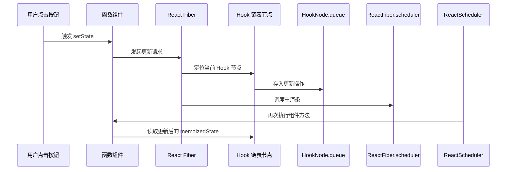

> 💭 嗯，用户问的是React中的`useState`如何记住上次的状态，这需要深入理解Hooks的工作原理。作为刚开始学习React的人，他可能之前学过类组件的state管理，现在转向函数组件，对Hook机制感到好奇。要回答这个问题，我需要解释闭包和Fiber架构的作用。
>
> 首先，用户的疑问可能在于函数组件每次渲染都是重新执行整个函数，为什么`useState`不会重置状态。要澄清这点，需要提到React在背后维护了一个组件状态对应的存储结构，可能是通过闭包或者某个全局对象来跟踪每个组件的状态。
>
> 然后，考虑到用户可能不了解Fiber架构和Hook链表的结构。需要说明React Hooks在每个组件渲染时如何关联到对应的状态节点。比如，每个Hook都有一个对应的“记忆单元”链表，按顺序存储，这样即使函数重新运行，也能找到之前的状态。
>
> 接下来，用户可能想知道Hooks的规则，比如为什么不能在条件语句或循环中使用Hooks。这时需要联系Hook的顺序重要性，因为React依赖于调用顺序来正确匹配状态。否则，顺序错乱会导致状态错位。
>
> 另外，用户可能对闭包的概念不太熟悉，需要适当解释闭包如何在函数组件中帮助保存变量引用到外部的作用域。比如，`useState`返回的状态和设置函数能够访问到当前的闭包环境，确保状态更新时能正确获取到最新的值，而不是旧的闭包。
>
> 可能会存在疑惑，为什么每次调用`useState`得到的是最新的状态，即使函数组件已经重新渲染。这里需要提到状态更新队列和调度机制，在每次渲染时，React都会根据当前的state值来决定新的渲染结果。
>
> 需要进一步说明，当调用设置状态的函数时，React会安排重新渲染，并在下一次渲染时，将最新的状态传递给组件函数，从而更新UI。这种机制使得函数组件能够在多次执行间保持状态的持续性。
>
> 还有可能涉及到`useState`与类组件`setState`的不同，比如是否合并状态更新等。但用户的问题主要围绕状态记忆，所以可能需要简单对比，但不需要深入。
>
> 最后，需要总结闭包、Fiber架构中的Hook链表以及渲染顺序这三个关键点，让用户有一个全面的理解，明白React如何通过内部机制确保函数组件的状态持久化。
>
> 


React 的 `useState` 通过**闭包 + 链表存储结构**实现状态记忆功能，下面是具体实现机制的深度分析：

---

### **一、终极答案**
`useState` 的记忆能力主要通过以下三点实现：  
1. **闭包隔离性**：每个组件实例在 Fiber 架构中对应独立闭包域  
2. **Hook 链持久化**：所有 Hook 以链表形式绑定到对应 Fiber 节点  
3. **声明顺序锁定**：严格依赖 Hook 的调用顺序进行状态寻址  

---

### **二、实现原理图解**
#### 1. **Fiber 架构中的闭包实践**
```javascript
// React 内部维护的全局存储（伪代码）
const fiberNode = {
  memoizedState: null, // 当前 Fiber 对应的 Hook 链表
  // ...其他属性
}

function updateState(initial) {
  const hook = {
    memoizedState: initial,   // 当前 Hook 记录的状态值
    queue: null,              // 更新队列（存放 setState 的参数）
    next: null                // 指向下一个 Hook 的指针
  }
  
  return [hook.memoizedState, dispatchAction.bind(null, hook.queue)]
}
```

---

### **三、状态记忆实现机制**
#### 1. **闭包与 Fiber 节点绑定**
```javascript
// React 为每个组件创建独立的上下文（简化模型）
function renderComponent(Component) {
  const fiber = createFiber() // 创建或复用 Fiber 节点
  const instance = Component()
  fiber.memoizedState = currentHookLinst // 保存 Hook 链表
  return instance
}
```

#### 2. **Hook 链表的持久化存储**
```text
组件首次渲染时:
 Fiber.memoizedState → Hook1 → Hook2 → Hook3 → null
  
组件更新时:
 严格按照顺序访问同一 Hook 链表（order-sensitive） 
```

---

### **四、状态更新的运作流程**


---

### **五、关键技术难点解决方案**
#### 1. **闭包时效性问题**
*传统闭包陷阱示例：*
```javascript
// 错误示例（遗留闭包问题）
function buggyComponent() {
  const [count, setCount] = useState(0)
  
  useEffect(() => {
    setInterval(() => {
      console.log(count)  // 永远打印初始值0
    }, 1000)
  }, [])
}
```

*React 的解决方案：*
```typescript
// Hook 的 memoziedState 始终指向最新值
function dispatchAction(queue, action) {
  const update = {
    action,              // 新的状态值或函数
    next: null
  }
  // 将更新加入队列
  enqueueUpdate(queue, update)
  // 触发重渲染（重新调用组件函数）
  scheduleWork()
}
```

---

### **六、性能优化保障机制**
#### 1. **批量更新（Batching）**
```javascript
// React 18 自动批处理示例
function handleClick() {
  setCount(c => c + 1)
  setFlag(f => !f)
  // 仅触发单次重渲染
}
```

#### 2. **惰性初始化（Lazy Initialization）**
```javascript
// 只需在初始化阶段执行的昂贵计算
const [state] = useState(() => {
  const initValue = computeExpensiveValue()
  return initValue
})
```

---

### **七、对比类组件的实现差异**
| 维度         | 类组件                   | 函数组件               |
|--------------|-------------------------|-----------------------|
| **存储方式** | this.state 对象         | Hook 链表             |
| **更新触发** | 合并多个 setState       | 队列逐个处理          |
| **闭包敏感** | 需处理回调中的 this 绑定 | 天然封闭（通过闭包） |

---

### **八、实际调试观察方法**
```javascript
// 通过 DevTools 查看组件内部结构
function DebugComponent() {
  const [state] = useState(42)
  console.log('当前 Hook 链:', 
    React.__SECRET_INTERNALS_DO_NOT_USE_OR_YOU_WILL_BE_FIRED
      .ReactCurrentOwner.current.memoizedState)
  return <div>{state}</div>
}
```

---

掌握这个实现原理可以更好应对以下场景：
1. 优化复杂 Hook 调序导致的 bug
2. 理解严格 Hook 规则（如不能条件判断中使用）
3. 开发自定义 Hook 时的性能调优
