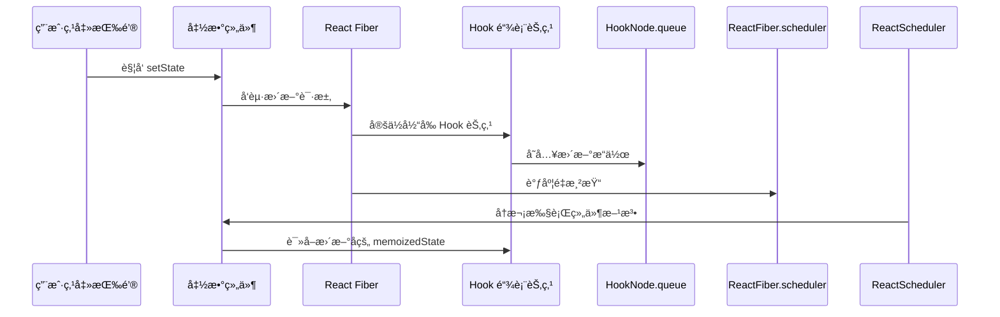

> 💭 嗯，用户问的是React中的`useState`如何记ä½ä¸Šæ¬¡çš„状æ€ï¼Œè¿™éœ€è¦æ·±å…¥ç†è§£Hooks的工作åŸç†ã€‚作为刚开始学习React的人，他å¯èƒ½ä¹‹å‰å­¦è¿‡ç±»ç»„件的state管ç†ï¼Œç°åœ¨è½¬å‘函数组件，对Hook机制感到好奇。è¦å›ç­”这个问题，我需è¦è§£é‡Šé—­åŒ…å’ŒFiberæ¶æ„的作用。
>
> 首先，用户的疑问å¯èƒ½åœ¨äºå‡½æ•°ç»„件æ¯æ¬¡æ¸²æŸ“都是é‡æ–°æ‰§è¡Œæ•´ä¸ªå‡½æ•°ï¼Œä¸ºä»€ä¹ˆ`useState`ä¸ä¼šé‡ç½®çŠ¶æ€ã€‚è¦æ¾„清这点，需è¦æ到React在背å维护了一个组件状æ€å¯¹åº”的存储结æ„，å¯èƒ½æ˜¯é€šè¿‡é—­åŒ…或者æŸä¸ªå…¨å±€å¯¹è±¡æ¥è·Ÿè¸ªæ¯ä¸ªç»„件的状æ€ã€‚
>
> 然å，考虑到用户å¯èƒ½ä¸äº†è§£Fiberæ¶æ„å’ŒHook链表的结æ„。需è¦è¯´æ˜React Hooks在æ¯ä¸ªç»„件渲染时如何关è”到对应的状æ€èŠ‚点。比如，æ¯ä¸ªHook都有一个对应的“记忆å•å…ƒâ€é“¾è¡¨ï¼ŒæŒ‰é¡ºåºå­˜å‚¨ï¼Œè¿™æ ·å³ä½¿å‡½æ•°é‡æ–°è¿è¡Œï¼Œä¹Ÿèƒ½æ‰¾åˆ°ä¹‹å‰çš„状æ€ã€‚
>
> æ¥ä¸‹æ¥ï¼Œç”¨æˆ·å¯èƒ½æƒ³çŸ¥é“Hooks的规则，比如为什么ä¸èƒ½åœ¨æ¡ä»¶è¯­å¥æˆ–循ç¯ä¸­ä½¿ç”¨Hooks。这时需è¦è”ç³»Hook的顺åºé‡è¦æ€§ï¼Œå› ä¸ºReactä¾èµ–äºè°ƒç”¨é¡ºåºæ¥æ­£ç¡®åŒ¹é…状æ€ã€‚å¦åˆ™ï¼Œé¡ºåºé”™ä¹±ä¼šå¯¼è‡´çŠ¶æ€é”™ä½ã€‚
>
> å¦å¤–，用户å¯èƒ½å¯¹é—­åŒ…的概念ä¸å¤ªç†Ÿæ‚‰ï¼Œéœ€è¦é€‚当解释闭包如何在函数组件中帮助ä¿å­˜å˜é‡å¼•ç”¨åˆ°å¤–部的作用域。比如，`useState`è¿”å›çš„状æ€å’Œè®¾ç½®å‡½æ•°èƒ½å¤Ÿè®¿é—®åˆ°å½“å‰çš„闭包ç¯å¢ƒï¼Œç¡®ä¿çŠ¶æ€æ›´æ–°æ—¶èƒ½æ­£ç¡®è·å–到最新的值，而ä¸æ˜¯æ—§çš„闭包。
>
> å¯èƒ½ä¼šå­˜åœ¨ç–‘惑，为什么æ¯æ¬¡è°ƒç”¨`useState`得到的是最新的状æ€ï¼Œå³ä½¿å‡½æ•°ç»„件已ç»é‡æ–°æ¸²æŸ“。这里需è¦æ到状æ€æ›´æ–°é˜Ÿåˆ—和调度机制，在æ¯æ¬¡æ¸²æŸ“时，React都会根æ®å½“å‰çš„state值æ¥å†³å®šæ–°çš„渲染结æœã€‚
>
> 需è¦è¿›ä¸€æ­¥è¯´æ˜ï¼Œå½“调用设置状æ€çš„函数时，React会安æ’é‡æ–°æ¸²æŸ“，并在下一次渲染时，将最新的状æ€ä¼ é€’给组件函数，ä»è€Œæ›´æ–°UI。这ç§æœºåˆ¶ä½¿å¾—函数组件能够在多次执行间ä¿æŒçŠ¶æ€çš„æŒç»­æ€§ã€‚
>
> 还有å¯èƒ½æ¶‰åŠåˆ°`useState`ä¸ç±»ç»„件`setState`çš„ä¸åŒï¼Œæ¯”如是å¦åˆå¹¶çŠ¶æ€æ›´æ–°ç­‰ã€‚但用户的问题主è¦å›´ç»•çŠ¶æ€è®°å¿†ï¼Œæ‰€ä»¥å¯èƒ½éœ€è¦ç®€å•å¯¹æ¯”，但ä¸éœ€è¦æ·±å…¥ã€‚
>
> 最å，需è¦æ€»ç»“闭包ã€Fiberæ¶æ„中的Hook链表以åŠæ¸²æŸ“顺åºè¿™ä¸‰ä¸ªå…³é”®ç‚¹ï¼Œè®©ç”¨æˆ·æœ‰ä¸€ä¸ªå…¨é¢çš„ç†è§£ï¼Œæ˜ç™½React如何通过内部机制确ä¿å‡½æ•°ç»„件的状æ€æŒä¹…化。
>
> 


React çš„ `useState` 通过**闭包 + 链表存储结æ„**å®ç°çŠ¶æ€è®°å¿†åŠŸèƒ½ï¼Œä¸‹é¢æ˜¯å…·ä½“å®ç°æœºåˆ¶çš„深度分æ：

---

### **一ã€ç»ˆæ答案**
`useState` 的记忆能力主è¦é€šè¿‡ä»¥ä¸‹ä¸‰ç‚¹å®ç°ï¼š  
1. **闭包隔离性**：æ¯ä¸ªç»„件å®ä¾‹åœ¨ Fiber æ¶æ„中对应独立闭包域  
2. **Hook 链æŒä¹…化**：所有 Hook 以链表形å¼ç»‘定到对应 Fiber 节点  
3. **声æ˜é¡ºåºé”定**：严格ä¾èµ– Hook 的调用顺åºè¿›è¡ŒçŠ¶æ€å¯»å€  

---

### **二ã€å®ç°åŸç†å›¾è§£**
#### 1. **Fiber æ¶æ„中的闭包å®è·µ**
```javascript
// React 内部维护的全局存储（伪代ç ï¼‰
const fiberNode = {
  memoizedState: null, // å½“å‰ Fiber 对应的 Hook 链表
  // ...其他å±æ€§
}

function updateState(initial) {
  const hook = {
    memoizedState: initial,   // å½“å‰ Hook 记录的状æ€å€¼
    queue: null,              // 更新队列（存放 setState çš„å‚数）
    next: null                // 指å‘下一个 Hook 的指针
  }
  
  return [hook.memoizedState, dispatchAction.bind(null, hook.queue)]
}
```

---

### **三ã€çŠ¶æ€è®°å¿†å®ç°æœºåˆ¶**
#### 1. **é—­åŒ…ä¸ Fiber 节点绑定**
```javascript
// React 为æ¯ä¸ªç»„件创建独立的上下文（简化模å‹ï¼‰
function renderComponent(Component) {
  const fiber = createFiber() // 创建或å¤ç”¨ Fiber 节点
  const instance = Component()
  fiber.memoizedState = currentHookLinst // ä¿å­˜ Hook 链表
  return instance
}
```

#### 2. **Hook 链表的æŒä¹…化存储**
```text
组件首次渲染时:
 Fiber.memoizedState → Hook1 → Hook2 → Hook3 → null
  
组件更新时:
 严格按照顺åºè®¿é—®åŒä¸€ Hook 链表（order-sensitive） 
```

---

### **å››ã€çŠ¶æ€æ›´æ–°çš„è¿ä½œæµç¨‹**


---

### **五ã€å…³é”®æŠ€æœ¯éš¾ç‚¹è§£å†³æ–¹æ¡ˆ**
#### 1. **闭包时效性问题**
*传统闭包陷阱示例：*
```javascript
// 错误示例（é—留闭包问题）
function buggyComponent() {
  const [count, setCount] = useState(0)
  
  useEffect(() => {
    setInterval(() => {
      console.log(count)  // 永远打å°åˆå§‹å€¼0
    }, 1000)
  }, [])
}
```

*React 的解决方案：*
```typescript
// Hook çš„ memoziedState 始终指å‘最新值
function dispatchAction(queue, action) {
  const update = {
    action,              // 新的状æ€å€¼æˆ–函数
    next: null
  }
  // 将更新加入队列
  enqueueUpdate(queue, update)
  // 触å‘é‡æ¸²æŸ“（é‡æ–°è°ƒç”¨ç»„件函数）
  scheduleWork()
}
```

---

### **å…­ã€æ€§èƒ½ä¼˜åŒ–ä¿éšœæœºåˆ¶**
#### 1. **批é‡æ›´æ–°ï¼ˆBatching）**
```javascript
// React 18 自动批处ç†ç¤ºä¾‹
function handleClick() {
  setCount(c => c + 1)
  setFlag(f => !f)
  // 仅触å‘å•æ¬¡é‡æ¸²æŸ“
}
```

#### 2. **惰性åˆå§‹åŒ–（Lazy Initialization）**
```javascript
// åªéœ€åœ¨åˆå§‹åŒ–阶段执行的昂贵计算
const [state] = useState(() => {
  const initValue = computeExpensiveValue()
  return initValue
})
```

---

### **七ã€å¯¹æ¯”类组件的å®ç°å·®å¼‚**
| 维度         | 类组件                   | 函数组件               |
|--------------|-------------------------|-----------------------|
| **存储方å¼** | this.state 对象         | Hook 链表             |
| **更新触å‘** | åˆå¹¶å¤šä¸ª setState       | 队列é€ä¸ªå¤„ç†          |
| **闭包æ•æ„Ÿ** | 需处ç†å›è°ƒä¸­çš„ this 绑定 | 天然å°é—­ï¼ˆé€šè¿‡é—­åŒ…） |

---

### **å…«ã€å®é™…调试观察方法**
```javascript
// 通过 DevTools 查看组件内部结æ„
function DebugComponent() {
  const [state] = useState(42)
  console.log('å½“å‰ Hook 链:', 
    React.__SECRET_INTERNALS_DO_NOT_USE_OR_YOU_WILL_BE_FIRED
      .ReactCurrentOwner.current.memoizedState)
  return <div>{state}</div>
}
```

---

æŒæ¡è¿™ä¸ªå®ç°åŸç†å¯ä»¥æ›´å¥½åº”对以下场景：
1. 优化å¤æ‚ Hook è°ƒåºå¯¼è‡´çš„ bug
2. ç†è§£ä¸¥æ ¼ Hook 规则（如ä¸èƒ½æ¡ä»¶åˆ¤æ–­ä¸­ä½¿ç”¨ï¼‰
3. å¼€å‘自定义 Hook 时的性能调优
