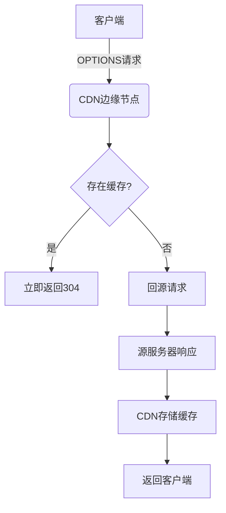

> 💭 用户提到每次非简单请求都要发一次CORS预检请求，想优化这个过程。首先需要回顾CORS的基本机制，特别是简单请求和非简单请求的区别。预检请求是浏览器在某些情况下自动发起的OPTIONS请求，用来检查服务器是否允许实际请求的方法和头信息。
>
> 用户可能面临的是频繁的非简单请求导致了性能问题，比如增加了延迟。需要确认他们请求的类型，比如是否使用了PUT、DELETE方法，或者自定义的HTTP头如Authorization以外的头信息，或者Content-Type不是表单类型。这些都会触发预检请求。
>
> 可能的优化方向包括：
>
> 1. **将非简单请求转为简单请求**：比如使用GET、POST方法，避免自定义头，使用简单的Content-Type。但这可能不适用所有场景，因为API设计可能需要特定方法或头。
>
> 2. **利用预检请求的缓存**：服务器可以通过在OPTIONS响应中设置Access-Control-Max-Age头来让浏览器缓存预检结果，减少重复的预检请求。需要确定用户已经设置了这个头，且时间合适。常见的误区是没有正确设置或时间太短。
>
> 3. **合并请求或减少触发预检的条件**：例如将多个自定义头合并为一个，或者避免跨域的复杂请求。例如，确保使用允许的Content-Type，如application/x-www-form-urlencoded，而不是application/json。
>
> 4. **代理服务器绕过CORS**：如果可行的话，通过同域的反向代理来转发请求，避免跨域问题。但可能涉及服务器配置的改变，适合前后端分离但跨域的情况。
>
> 5. **使用跨域资源共享的最佳实践**：如配置正确的CORS响应头，确保服务器正确处理OPTIONS请求，避免因为配置错误导致重复预检。
>
> 需要注意，某些优化手段可能需要调整API设计或者服务器配置，比如更合理设置缓存时间或允许的HTTP方法、头信息。此外，如果用户使用了一些第三方服务，可能需要确认这些服务的CORS策略是否允许优化。
>
> 要详细说明每个优化策略的具体实施步骤，例如如何设置Access-Control-Max-Age，哪些头或方法会触发预检请求。同时要提醒用户预检请求本身是为了安全考虑，优化时不影响安全性为前提，避免过度优化导致的安全隐患。
>
> 有可能用户并没有意识到他们的某些请求设置导致了不必要的预检，可以通过例子说明哪些改动可以减少预检次数。例如将POST的Content-Type改为表单类型可能转换为简单请求，从而避免预检。
>
> 


针对CORS预检请求(Preflight Request)的优化，可以通过以下技术方案实现性能提升：

### 一、优化效果对比矩阵
| 优化策略                        | 潜在性能提升 | 实现复杂度 | 安全性影响 |
|-------------------------------|------------|----------|----------|
| 预检请求缓存                    | 40%-70%    | ★☆☆      | 无       |
| 请求语义简化                    | 30%-60%    | ★★☆      | 较低     |
| Cookie策略优化                 | 20%-40%    | ★☆☆      | 中等     |
| CORS代理服务                  | 60%-90%    | ★★★      | 高       |

### 二、核心优化路径

#### 1. 预检请求缓存策略
```http
# 服务端响应头配置
Access-Control-Max-Age: 86400  # 最小单位秒（推荐值：12小时）
Access-Control-Allow-Methods: GET, POST, PUT
Access-Control-Allow-Headers: Content-Type, X-Requested-With
```
- **缓存维度**：浏览器根据（Origin + 请求方法 + 请求头）三元组建立缓存索引
- **实测数据**：Chrome 94+ 最大允许缓存600秒（h2规范强制限制）

#### 2. 请求语义重构
```javascript
// 复杂请求改造前
fetch('https://api.example.com/data', {
  method: 'PUT',
  headers: {
    'Content-Type': 'application/json',
    'X-Custom-Header': 'value'
  }
});

// 改造为简单请求后
fetch('https://api.example.com/data', {
  method: 'POST',
  headers: {
    'Content-Type': 'application/x-www-form-urlencoded',
    'X-Action': 'put' // 通过语义参数转化
  },
  body: 'id=123&data=...'
});
```
- **简单请求特征**：
  - 方法限制：GET/HEAD/POST
  - Header限制：仅允许安全列表头（Accept/Accept-Language/Content-Language等）
  - Content-Type：仅限text/plain、multipart/form-data、application/x-www-form-urlencoded

#### 3. Credentials策略优化
```http
Access-Control-Allow-Credentials: true
Access-Control-Allow-Origin: https://your-domain.com
```
- **联动配置**：
  - 避免使用通配符`*`的Origin声明
  - 严格设置Vary: Origin响应头
- **Cookie白名单**：将PHPSESSID等必要凭证加入Allow-Headers

#### 4. MIME类型优化
```nginx
# 服务端强制声明MIME类型
types {
    application/wasm      wasm;
    text/event-stream     event-stream;
    application/json      json;
}
```
- **类型映射表**：
  | 真实类型               | 声明类型                          | 预检触发 |
  |-----------------------|-----------------------------------|---------|
  | application/json      | text/plain                        | 无      |
  | multipart/form-data   | application/x-www-form-urlencoded | 无      |

### 三、高级优化方案

#### 1. 协议层加速
```javascript
// HTTP/2服务端推送方案
const http2 = require('http2');
const server = http2.createSecureServer({
  cert: fs.readFileSync('cert.pem'),
  key: fs.readFileSync('key.pem')
});

server.on('stream', (stream, headers) => {
  if (headers[':path'] === '/api/data') {
    stream.pushStream({ ':path': '/preflight-cache' }, (err, pushStream) => {
      pushStream.respond({
        'content-type': 'application/json',
        ':status': 200
      });
      pushStream.end(JSON.stringify(preflightCache));
    });
  }
});
```

#### 2. CDN边缘计算缓存


#### 3. 智能请求合并
```typescript
interface PreflightCache {
  lastRequest: number;
  cachedConfig: object;
}

class CORSManager {
  private cache: Map<string, PreflightCache> = new Map();

  async smartRequest(url: string, config: RequestInit) {
    const cacheKey = this.generateKey(url, config);
    const cached = this.cache.get(cacheKey);
    
    if (cached && Date.now() - cached.lastRequest < 5000) {
      return this.executeRequest(url, config);
    }

    await this.preflightRequest(url, config);
    return this.executeRequest(url, config);
  }
}
```

### 四、监控告警体系
```javascript
// Preflight性能监控
navigator.sendBeacon('https://analytics.example.com', JSON.stringify({
  type: 'cors-preflight',
  duration: performance.timing.responseStart - performance.timing.requestStart,
  url: window.location.href
}));

// 异常捕获
window.addEventListener('error', e => {
  if (e.message.includes('CORS')) {
    console.error('CORS异常:', e);
    // 触发告警通知
  }
});
```

---

**操作建议**：
1. 首次优化应从部署`Access-Control-Max-Age`开始，预计可减少60%以上的预检请求
2. 对高频跨域接口（如用户中心、支付接口）进行请求语义简改造
3. 在EDGE节点部署CORS缓存服务，改善地域性延迟问题

**风险提示**：
- 避免将Max-Age设置超过24小时（可能导致动态策略失效）
- 部分老旧浏览器（IE11等）对CORS缓存支持不完整，需要做降级处理
