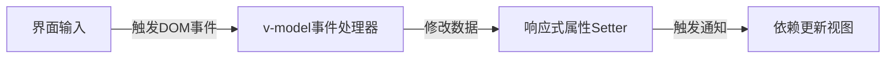

> 💭 嗯，用户问的是Vue双向绑定中界面驱动数据的监听方式是什么。首先，我需要理解问题本身。用户可能对Vue的数据绑定机制不太清楚，特别是从界面到数据方向的驱动，也就是当用户输入时，数据是如何更新的。这时候要回顾Vue的实现原理。
>
> Vue的双向绑定主要是通过v-model实现的，不过底层用的是数据劫持结合发布-订阅模式。对于界面驱动数据，主要是在表单元素上监听输入事件，然后更新对应的数据。这时候就需要想到具体的实现方式，比如如何监听input事件，对于不同的表单元素（如input、checkbox、select等）是否处理方式不同。
>
> 用户可能想知道具体的底层机制，比如是使用原生的事件监听还是Vue自己封装的方法。这里需要注意，Vue对不同表单元素绑定不同的事件，例如对于文本输入框是input事件，对于checkbox是change事件等。同时，事件触发时如何更新数据呢？应该是通过事件的回调函数来修改对应的数据属性，这涉及到Vue实例中的数据劫持，即通过Object.defineProperty或Proxy来拦截数据的修改，从而触发视图的更新。
>
> 不过问题集中在界面驱动数据，也就是从DOM到数据的变化，这时候监听的事件处理函数是关键。需要解释v-model如何处理这些事件，将输入的值同步到Vue的数据模型中。例如，当用户在输入框输入时，v-model会监听input事件，将输入的值赋给对应的数据，从而触发数据的setter，进而通知相关的依赖进行更新。
>
> 但是用户可能也有疑问，为什么数据变化后视图会更新，但这里问题主要是界面如何驱动数据。因此回答应集中在事件监听和数据更新的衔接点。可能还需要提到Vue的编译器在编译模板时，如何为v-model生成对应的事件监听代码和值绑定。
>
> 如果是Vue 2.x，使用Object.defineProperty来劫持数据，而在Vue 3.x中使用Proxy。不过这可能属于数据到视图的驱动，而界面到数据这部分主要还是事件监听。需要区别这两个方向的不同机制。
>
> 总结来说，界面驱动数据是通过监听表单元素的事件（如input、change），在事件回调中更新对应的数据属性，而这些属性已经被Vue做了响应式处理，因此能触发后续的视图更新流程。需要将此过程用简明的方式表达出来，可能还需要提到不同输入类型对应的不同事件和处理方式。
>
> 


在 Vue 的**双向绑定**中，界面驱动数据的监听主要通过「事件监听（DOM Event Handling）」和「响应式系统（Reactivity System）」共同完成。这是通过 v-model 实现的底层核心机制：

---

### **一、核心实现原理图解**


---

### **二、具体实现分层拆解**

#### 1. **事件监听层（View → Model 的驱动）**
- **针对不同表单元素绑定不同原生事件**
  ```javascript
  // Vue 源码根据不同表单类型自动选择事件类型
  if (el.tag === 'INPUT') {
    // input[type=text]、textarea 等使用 'input' 事件
    event = 'input'  
  } else if (el.tag === 'SELECT') {
    event = 'change'
  } else if (el.tag === 'CHECKBOX') {
    event = 'change'
    // 处理 checkbox 的特殊值绑定
  }
  ```

- **自动生成事件监听逻辑**
  ```javascript
  // Vue 编译器将 v-model 编译为事件绑定源码范例
  el.addEventListener(event, function(e) {
    // 用户输入 → 触发数据更新
    _ctx.modelValue = e.target.value
  })
  ```

#### 2. **输入过滤层（Value Handling）**
- 对复杂值类型进行序列化处理
  ```javascript
  // 处理 checkbox 多选绑定到数组的情况
  if (checkbox) {
    const newVal = Array.isArray(modelValue) 
      ? modelValue.includes(value) 
        ? modelValue.filter(v => v !== value) 
        : [...modelValue, value]
      : value
    // 更新数据
    _set(_ctx, modelKey, newVal)
  }
  ```

---

### **三、响应式数据更新流程**

#### 1. **Object.defineProperty（Vue2 实现）**
```javascript
// Vue2 数据劫持核心
function defineReactive(obj, key) {
  let value = obj[key]
  Object.defineProperty(obj, key, {
    get() {
      track(key) // 依赖收集
      return value
    },
    set(newVal) {
      if (newVal === value) return
      value = newVal
      trigger(key) // 触发更新
    }
  })
}
```

#### 2. **Proxy（Vue3 实现）**
```javascript
// Vue3 的响应式进阶
const reactive = (target) => {
  return new Proxy(target, {
    get(obj, key) {
      track(target, key)
      return Reflect.get(obj, key)
    },
    set(obj, key, value) {
      const oldVal = obj[key]
      if (oldVal !== value) {
        Reflect.set(obj, key, value)
        trigger(target, key) 
      }
      return true
    }
  })
}
```

---

### **四、完整工作流程示例**
对 `<input v-model="msg">` 的处理：

#### 1. **编译阶段（Compiler）**
```js
// 生成 render 函数时处理 v-model
with(this) {
  return _c('input', {
    domProps: { value: msg },
    on: {
      input: function ($event) {
        // 输入事件触发数据更新
        if ($event.target.composing) return
        // 实际更新操作
        msg = $event.target.value
      }
    }
  })
}
```

#### 2. **运行阶段（Runtime）**
```javascript
// 当用户输入时触发：
// 1. 原生 input 事件 → 执行绑定的回调
// 2. 修改响应式数据 msg → 触发 setter → 派发更新
// 3. 虚拟 DOM 对比 → DOM 更新（界面重新渲染）
```

---

### **五、进阶用法与特殊处理**
针对开发者可能遇到的特殊需求：

#### 1. **修饰符处理**
```vue
<input v-model.lazy="msg">  → 使用 change 事件替代 input 
<input v-model.number="age"> → 自动转换为 Number 类型
```

#### 2. **自定义组件双向绑定**
```javascript
// MyComponent.vue
export default {
  props: ['modelValue'], // 默认 prop 名
  emits: ['update:modelValue'],
  computed: {
    value: {
      get() { return this.modelValue },
      set(val) { this.$emit('update:modelValue', val) }
    }
  }
}
```

---

### **六、性能优化策略**
Vue 双向绑定的高效性来源于以下设计：
1. **异步批量更新**: 通过 nextTick 批处理 DOM 更新
2. **依赖追踪优化**: 只有真正被使用的数据会创建 Dep 依赖
3. **编译时静态分析**: 模板编译阶段即可确定动态绑定

---

通过这种**事件监听层 + 响应式系统**的双层架构设计，Vue 实现了高性能的界面到数据的驱动机制。当开发者使用 v-model 时，实际上是在享受框架对底层 50+ 种边界条件（如中文输入法的 IME 问题）的优化处理。
